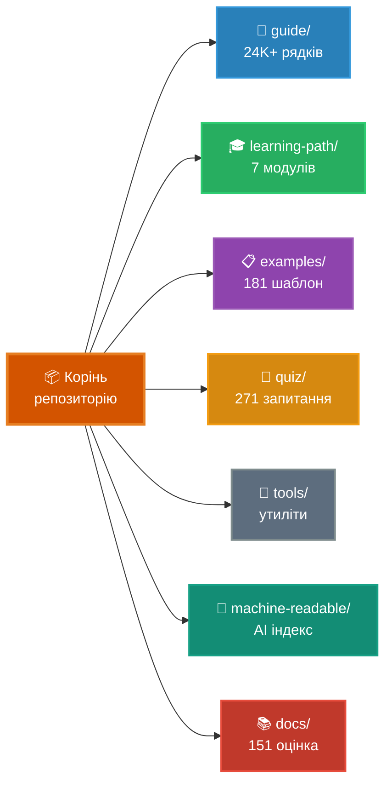

# Повний посібник з Claude Code (Claude Code Ultimate Guide)

<!-- Website CTA -->
<p align="center">
  <a href="https://florianbruniaux.github.io/claude-code-ultimate-guide-landing/"></a>
</p>

<!-- Stats -->
<p align="center">
  <a href="https://github.com/FlorianBruniaux/claude-code-ultimate-guide/stargazers"></a>
  <a href="./CHANGELOG.md"></a>
  <a href="./quiz/"></a>
  <a href="./examples/"></a>
</p>

<!-- Features -->
<p align="center">
  <a href="./guide/security/security-hardening.md"></a>
  <a href="./mcp-server/"></a>
</p>

<!-- Downloads -->
<p align="center">
  <a href="https://github.com/FlorianBruniaux/claude-code-ultimate-guide/releases/latest/download/guide-export.pdf"></a>
  <a href="https://github.com/FlorianBruniaux/claude-code-ultimate-guide/releases/latest/download/guide-export.epub"></a>
</p>

<!-- Meta -->
<p align="center">
  <a href="https://github.com/hesreallyhim/awesome-claude-code"></a>
  <a href="https://creativecommons.org/licenses/by-sa/4.0/"></a>
  <a href="https://skills.palebluedot.live/owner/FlorianBruniaux"></a>
  <a href="https://zread.ai/FlorianBruniaux/claude-code-ultimate-guide"></a>
</p>

> **6 місяців щоденної практики**, зібрані в посібник, який вчить вас ЧОМУ, а не просто що. Від основних концепцій до безпеки у продакшені — ви навчитеся проектувати власні агентні воркфлоу замість копіпасту конфігів.

> **Якщо цей посібник допоміг вам, [поставте йому зірочку ⭐](https://github.com/FlorianBruniaux/claude-code-ultimate-guide/stargazers)** — це допомагає іншим знайти його.

---

## StarMapper

<a href="https://starmapper.bruniaux.com/FlorianBruniaux/claude-code-ultimate-guide">
  <picture>
    <source media="(prefers-color-scheme: dark)" srcset="https://starmapper.bruniaux.com/api/map-image/FlorianBruniaux/claude-code-ultimate-guide?theme=dark" />
    <source media="(prefers-color-scheme: light)" srcset="https://starmapper.bruniaux.com/api/map-image/FlorianBruniaux/claude-code-ultimate-guide?theme=light" />
    
  </picture>
</a>

---

## Оберіть свій шлях

| Хто ви | Ваш посібник |
|---|---|
| 🏗️ **Tech Lead / Engineering Manager** | [Впровадження Claude Code у вашій команді →](docs/for-tech-leads.md) |
| 📊 **CTO / Decision Maker** | [ROI, рівень безпеки, впровадження в команді →](docs/for-cto.md) |
| 💼 **CIO / CEO** | [Бюджет, ризики, що запитати у тех-команди (3 хв) →](docs/for-cio-ceo.md) |
| 🎨 **Product Manager / Designer** | [Vibe coding, робота з AI-assisted командами розробки →](docs/for-product-managers.md) |
| ✍️ **Writer / Ops / Manager** | [Claude Cowork Guide (окремий репо) →](https://github.com/FlorianBruniaux/claude-cowork-guide) |
| 👨‍💻 **Developer (всі рівні)** | Ви в правильному місці — читайте далі ↓ |
| 🧭 **Career pivot / нова AI роль** | [AI ролі та кар'єрні шляхи →](guide/roles/ai-roles.md) |

---

## 🎯 Чого ви навчитеся

**Цей посібник вчить вас думати інакше про розробку з допомогою AI:**
- ✅ **Розуміти компроміси** — коли використовувати agents vs skills vs commands (а не просто як їх конфігурувати)
- ✅ **Будувати ментальні моделі** — як Claude Code працює всередині (архітектура, потік контексту, оркестрація інструментів)
- ✅ **Візуалізувати концепції** — 48 Mermaid діаграм, що охоплюють вибір моделі, основний цикл (master loop), ієрархію пам'яті, багатоагентні патерни, загрози безпеці, шляхи володіння AI
- ✅ **Опановувати методології** — TDD, SDD, BDD у співпраці з AI (а не просто шаблони)
- ✅ **Мислення безпеки** — моделювання загроз для AI систем (єдиний посібник з базою даних 28 CVE + 655 шкідливих skills)
- ✅ **Перевіряти свої знання** — квіз із 271 запитання для перевірки розуміння (жоден інший ресурс цього не пропонує)

**Результат**: Перейдіть від копіпасту конфігів до впевненого проектування власних агентних воркфлоу.

---

## 📊 Коли використовувати цей посібник vs Everything-CC

Обидва посібники служать різним потребам. Обирайте залежно від вашого пріоритету.

| Ваша мета | Цей посібник | everything-claude-code |
|-----------|------------|------------------------|
| **Зрозуміти чому** патерни працюють | Глибокі пояснення + архітектура | Фокус на конфігураціях |
| **Швидке налаштування** проектів | Доступно, але не є пріоритетом | Перевірені продакшен конфіги |
| **Вивчити компроміси** (agents vs skills) | Фреймворки прийняття рішень + порівняння | Список патернів без аналізу компромісів |
| **Посилення безпеки** | Єдина база загроз (28 CVE) | Тільки базові патерни |
| **Перевірка розуміння** | Квіз на 271 запитання | Недоступно |
| **Методології** (TDD/SDD/BDD) | Повні посібники з воркфлоу | Не охоплено |
| **Готові шаблони** для копіпасту | 181 шаблон | 200+ шаблонів |

### Позиціонування в екосистемі

```
                    ОСВІТНЯ ГЛИБИНА
                           ▲
                           │
                           │  ★ Цей посібник
                           │  Безпека + Методології + 24K+ рядків
                           │
                           │  [Everything-You-Need-to-Know]
                           │  SDLC/BMAD для початківців
   ────────────────────────┼─────────────────────────► ГОТОВНІСТЬ ДО ВИКОРИСТАННЯ
   [awesome-claude-code]   │            [everything-claude-code]
   (пошук, курація)        │            (плагін, інсталяція 1 командою)
                           │
                           │  [claude-code-studio]
                           │  Управління контекстом
                           │
                       СПЕЦІАЛІЗОВАНІ
```

**5 унікальних прогалин, які не закриває жоден конкурент:**
1. **Безпека понад усе** — відстежується 28 CVE + 655 шкідливих skills (жоден конкурент не має такої глибини)
2. **Методологічні воркфлоу** — порівняння TDD/SDD/BDD + покрокові інструкції
3. **Вичерпна довідка** — 24K+ рядків у 16 спеціалізованих посібниках (у 24 рази більше довідкового матеріалу, ніж у everything-cc)
4. **Освітня прогресія** — квіз на 271 запитання + структурований навчальний шлях із 7 модулів (від початківця до профі)
5. **Інтерактивна оцінка** — скіл `/self-assessment` з персоналізованими рекомендаціями щодо навчального шляху

**Рекомендований воркфлоу:**
1. Вивчайте концепції тут (ментальні моделі, компроміси, безпека)
2. Використовуйте перевірені конфіги там (швидке налаштування проекту)
3. Повертайтеся сюди для глибокого занурення (коли щось не працює або для проектування власних воркфлоу)

**Обидва ресурси доповнюють один одного, а не конкурують.** Використовуйте те, що відповідає вашим поточним потребам.

---

## ⚡ Швидкий старт

**Вперше з Claude Code?** → [**Навчальний шлях із 7 модулів**](./guide/learning-path/README.md) — 8-11 годин, від початківця до профі

**Найшвидший шлях**: [Cheat Sheet](./guide/cheatsheet.md) — 1 сторінка для друку з щоденними основами

**Інтерактивний онбординг** (налаштування не потрібне):
```bash
claude "Fetch and follow the onboarding instructions from: https://raw.githubusercontent.com/FlorianBruniaux/claude-code-ultimate-guide/main/tools/onboarding-prompt.md"
```

**Переглянути безпосередньо**: [Повний посібник](./guide/ultimate-guide.md) | [Навчальний шлях](./guide/learning-path/) | [Візуальні діаграми](./guide/diagrams/) | [Приклади](./examples/) | [Квіз](./quiz/)

---

## 🔌 MCP Server — використовуйте посібник у будь-якій сесії Claude Code

Клонування не потрібне. Додайте до `~/.claude.json` і ставте запитання безпосередньо з будь-якої сесії:

```json
{
  "mcpServers": {
    "claude-code-guide": {
      "type": "stdio",
      "command": "npx",
      "args": ["-y", "claude-code-ultimate-guide-mcp"]
    }
  }
}
```

17 інструментів: `search_guide`, `read_section`, `get_cheatsheet`, `get_digest`, `get_example`, `list_examples`, `search_examples`, `get_release`, `get_changelog`, `compare_versions`, `list_topics`, `get_threat`, `list_threats`, плюс `init_official_docs`, `refresh_official_docs`, `diff_official_docs`, `search_official_docs` (v1.1.0 — трекер офіційної документації Anthropic) — плюс 13 slash commands `/ccguide:*` та агент Haiku.

**Онбординг одним рядком** (після налаштування MCP):
```bash
claude "Use the claude-code-guide MCP server. Activate the claude-code-expert prompt, then run a personalized onboarding: ask me 3 questions about my goal, experience level, and preferred tone — then build a custom learning path using search_guide and read_section to navigate the guide with live source links."
```

→ [MCP Server README](./mcp-server/README.md)

---

## 📁 Структура репозиторію



<details>
<summary><strong>Детальна структура (текстовий вигляд)</strong></summary>

```
📦 claude-code-ultimate-guide/
│
├─ 📖 guide/              Основна документація (24K+ рядків)
│  ├─ learning-path/      Навчальний шлях із 7 модулів (від початківців до профі)
│  ├─ ultimate-guide.md   Повна довідка, 10 розділів
│  ├─ cheatsheet.md       1 сторінка для друку
│  ├─ architecture.md     Як Claude Code працює всередині
│  ├─ methodologies.md    Воркфлоу TDD, SDD, BDD
│  ├─ diagrams/           48 Mermaid діаграм (10 тематичних файлів)
│  ├─ third-party-tools.md  Інструменти спільноти (RTK, ccusage, Entire CLI)
│  ├─ mcp-servers-ecosystem.md  Офіційні та спільнотні MCP сервери
│  └─ workflows/          Покрокові інструкції
│
├─ 📋 examples/           181 Продакшен Шаблон
│  ├─ CATALOG.md          Автоматично згенерований індекс за складністю, часом, доменом
│  ├─ agents/             23 кастомні AI персони
│  ├─ commands/           52 slash commands
│  ├─ hooks/              37 хуків (bash + PowerShell)
│  ├─ skills/             64 скіли (9 на SkillHub)
│  └─ scripts/            Скрипти утиліт (аудит, пошук)
│
├─ 🧠 quiz/               271 Запитання
│  ├─ 9 категорій         Setup, Agents, MCP, Trust, Advanced...
│  ├─ 4 профілі           Junior, Senior, Power User, PM
│  └─ Миттєвий фідбек     Посилання на доки + відстеження балів
│
├─ 🔧 tools/              Інтерактивні утиліти
│  ├─ onboarding-prompt   Персоналізований гід по проекту
│  └─ audit-prompt        Аудит налаштувань та рекомендації
│
├─ 🤖 machine-readable/   Оптимізований для AI індекс
│  ├─ reference.yaml      Структурований індекс (~2K токенів) — забезпечує пошук CMD+K на сайті
│  ├─ claude-code-releases.yaml  Структурований чейнджлог релізів
│  └─ llms.txt            Стандартний файл контексту для LLM
│
└─ 📚 docs/               151 Оцінка Ресурсів
   └─ resource-evaluations/  5-бальна оцінка, атрибуція джерел
```

</details>

---

## 🎯 Що робить цей посібник унікальним

### 🎓 Глибоке розуміння понад конфігурацією

**Результат**: Проектуйте власні воркфлоу замість сліпого копіпасту.

**Ми вчимо, як працює Claude Code і чому патерни мають значення:**
- [Архітектура](./guide/core/architecture.md) — внутрішня механіка (потік контексту, оркестрація інструментів, управління пам'яттю)
- [Компроміси](./guide/ultimate-guide.md#when-to-use-what) — фреймворки прийняття рішень для agents vs skills vs commands
- [Посібник з прийняття рішень щодо конфігурації](./guide/ultimate-guide.md#27-configuration-decision-guide) — єдина карта «який механізм для чого?» на всіх 7 рівнях конфігурації
- [Пастки](./guide/ultimate-guide.md#common-mistakes) — типові сценарії невдач + стратегії запобігання

**Що це означає для вас**: Самостійно усувайте проблеми, оптимізуйте під свій конкретний випадок, знайте, коли відхилятися від патернів.

---

### 🖼️ Серія візуальних діаграм (48 Mermaid діаграм)

**Результат**: Миттєво опановуйте складні концепції через візуальні ментальні моделі.

**48 інтерактивних діаграм** у 10 тематичних файлах — нативний рендеринг Mermaid на GitHub + ASCII версія для кожної діаграми:
- [Основи](./guide/diagrams/01-foundations.md) — 4-рівнева модель контексту, 9-кроковий пайплайн, режими дозволів
- [Архітектура](./guide/diagrams/04-architecture-internals.md) — основний цикл (master loop), категорії інструментів, збірка системного промпту
- [Multi-Agent](./guide/diagrams/07-multi-agent-patterns.md) — 3 топології, worktrees, dual-instance, горизонтальне масштабування
- [Безпека](./guide/diagrams/08-security-and-production.md) — 3-рівневий захист, ланцюжок атак MCP rug pull, парадокс верифікації
- [Вартість та Моделі](./guide/diagrams/09-cost-and-optimization.md) — дерево вибору моделі, пайплайн скорочення токенів

[Переглянути всі 48 діаграм →](./guide/diagrams/)

**Що це означає для вас**: Зрозумійте основний цикл розробки перед читанням 24K+ рядків, побачте багатоагентні топології одним поглядом, діліться візуальними моделями загроз зі своєю командою.

---

### 🛡️ Розвідка загроз безпеці (Єдина вичерпна база даних)

**Результат**: Захистіть продакшен системи від специфічних для AI атак.

**Єдиний посібник із систематичним відстеженням загроз:**
- **28 вразливостей, відображених у CVE** — Prompt injection, витік даних, ін'єкція коду
- **655 каталогізованих шкідливих skills** — ін'єкції Unicode, приховані інструкції, патерни автовиконання
- **Воркфлоу посилення безпеки в продакшені** — перевірка MCP, захист від ін'єкцій, автоматизація аудиту

[База даних загроз →](./examples/commands/resources/threat-db.yaml) | [Посібник з безпеки →](./guide/security/security-hardening.md)

**Що це означає для вас**: Перевіряйте MCP сервери перед тим, як довіряти їм, виявляйте патерни атак у конфігах, відповідайте вимогам аудитів безпеки.

---

### 📝 Перевірка знань із 271 запитання (Унікально в екосистемі)

**Результат**: Перевірте своє розуміння + виявіть прогалини в знаннях.

**Єдина доступна комплексна оцінка** — тестування у 9 категоріях:
- Setup & Configuration, Agents & Sub-Agents, MCP Servers, Trust & Verification, Advanced Patterns

**Особливості**: 4 профілі навичок (Junior/Senior/Power User/PM), миттєвий фвідбек із посиланнями на доки, виявлення слабких місць

[Спробувати Квіз онлайн →](https://florianbruniaux.github.io/claude-code-ultimate-guide-landing/quiz/) | [Запустити локально](./quiz/)

**Що це означає для вас**: Знайте, чого ви не знаєте, відстежуйте прогрес навчання, готуйтеся до обговорень впровадження в команді.

---

### 🤖 Покриття Agent Teams (v2.1.32+ Experimental)

**Результат**: Паралелізуйте роботу над великими кодобазами (Fountain: на 50% швидше, CRED: у 2 рази швидше).

**Єдиний вичерпний посібник з багатоагентної координації Anthropic:**
- Метрики продакшену від реальних компаній (автономний компилятор C, збережено 500K годин)
- 5 перевірених воркфлоу (багаторівневе рев'ю, паралельне налагодження, масштабний рефакторинг)
- Фреймворк прийняття рішень: Teams vs Multi-Instance vs Dual-Instance vs Beads

[Agent Teams Workflow →](./guide/workflows/agent-teams.md) | [Розділ 9.20 →](./guide/ultimate-guide.md#920-agent-teams-multi-agent-coordination)

**Що це означає для вас**: Розбивайте монолітні завдання на роботу, яку можна паралелізувати, координуйте багатофайлові рефакторинги, робіть рев'ю власного коду, створеного AI.

---

### 🔬 Методології (Структуровані воркфлоу розробки)

**Результат**: Підтримуйте якість коду під час роботи з AI.

Повні посібники з обґрунтуванням та прикладами:
- [TDD](./guide/core/methodologies.md#1-tdd-test-driven-development-with-claude) — розробка через тестування (Red-Green-Refactor з AI)
- [SDD](./guide/core/methodologies.md#2-sdd-specification-driven-development) — розробка на основі специфікацій (проектування перед кодом)
- [BDD](./guide/core/methodologies.md#3-bdd-behavior-driven-development) — розробка на основі поведінки (User stories → тести)
- [GSD](./guide/core/methodologies.md#gsd-get-shit-done) — Get Shit Done (прагматична доставка)

**Що це означає для вас**: Обирайте правильний воркфлоу для культури вашої команди, інтегруйте AI в існуючі процеси, уникайте технічного боргу через надмірну залежність від AI.

---

### 📚 181 анотований шаблон

**Результат**: Вивчайте патерни, а не просто конфіги.

Освітні шаблони з поясненнями:
- Agents (23), Commands (52), Hooks (37), Skills (64)
- Коментарі, що пояснюють **чому** кожен патерн працює (а не просто що він робить)
- Поступове зростання складності (від простого до просунутого)

[Переглянути каталог →](./examples/)

**Що це означає для вас**: Розумійте логіку патернів, адаптуйте шаблони до свого контексту, створюйте власні кастомні патерни.

---

### 🔍 151 оцінка ресурсів

**Результат**: Довіряйте тому, що наші рекомендації базуються на доказах.

Систематична оцінка зовнішніх ресурсів (5-бальна шкала):
- Статті, відео, інструменти, фреймворки
- Чесні оцінки з атрибуцією джерел (без маркетингової "води")
- Рекомендації щодо інтеграції з аналізом компромісів

[Дивитися оцінки →](./docs/resource-evaluations/)

**Що це означає для вас**: Заощаджуйте час на перевірці ресурсів, розумійте обмеження перед впровадженням інструментів, приймайте обґрунтовані рішення.

---

## 🎯 Навчальні шляхи

<details>
<summary><strong>Junior Developer</strong> — базовий шлях (7 кроків)</summary>

1. [Швидкий старт](./guide/ultimate-guide.md#1-quick-start-day-1) — встановлення та перший воркфлоу
2. [Основні команди](./guide/ultimate-guide.md#13-essential-commands) — 7 головних команд
3. [Управління контекстом](./guide/ultimate-guide.md#22-context-management) — критична концепція
4. [Файли пам'яті](./guide/ultimate-guide.md#31-memory-files-claudemd) — ваш перший CLAUDE.md
5. [Навчання з AI](./guide/roles/learning-with-ai.md) — використовуйте AI, не стаючи залежними ⭐
6. [TDD воркфлоу](./guide/workflows/tdd-with-claude.md) — розробка через тестування
7. [Cheat Sheet](./guide/cheatsheet.md) — роздрукуйте це

</details>

<details>
<summary><strong>Senior Developer</strong> — проміжний шлях (6 кроків)</summary>

1. [Основні концепції](./guide/ultimate-guide.md#2-core-concepts) — ментальна модель
2. [Plan Mode](./guide/ultimate-guide.md#23-plan-mode) — безпечне дослідження
3. [Методології](./guide/core/methodologies.md) — довідка по TDD, SDD, BDD
4. [Agents](./guide/ultimate-guide.md#4-agents) — кастомні AI персони
5. [Hooks](./guide/ultimate-guide.md#7-hooks) — автоматизація подій
6. [Інтеграція з CI/CD](./guide/ultimate-guide.md#93-cicd-integration) — пайплайни

</details>

<details>
<summary><strong>Power User</strong> — комплексний шлях (8 кроків)</summary>

1. [Повний посібник](./guide/ultimate-guide.md) — від початку до кінця
2. [Архітектура](./guide/core/architecture.md) — як працює Claude Code
3. [Посилення безпеки](./guide/security/security-hardening.md) — перевірка MCP, захист від ін'єкцій
4. [MCP сервери](./guide/ultimate-guide.md#8-mcp-servers) — розширені можливості
5. [Trinity патерн](./guide/ultimate-guide.md#91-the-trinity) — просунуті воркфлоу
6. [Спостережуваність](./guide/ops/observability.md) — моніторинг витрат та сесій
7. [Agent Teams](./guide/workflows/agent-teams.md) — багатоагентна координація (Opus 4.7+ experimental)
8. [Приклади](./examples/) — продакшен шаблони

</details>

<details>
<summary><strong>Product Manager / DevOps / Designer</strong></summary>

**Product Manager** (5 кроків):
1. [Що всередині](#-що-всередині) — огляд обсягу
2. [Золоті правила](#-золоті-правила) — ключові принципи
3. [Конфіденційність даних](./guide/security/data-privacy.md) — зберігання та відповідність
4. [Підходи до впровадження](./guide/roles/adoption-approaches.md) — стратегії для команд
5. [PM FAQ](./guide/ultimate-guide.md#can-product-managers-use-claude-code) — для PM, які кодують та не кодують

**Примітка**: PM, які не кодують, варто розглянути [Claude Cowork Guide](https://github.com/FlorianBruniaux/claude-cowork-guide).

**DevOps / SRE** (5 кроків):
1. [Гід для DevOps & SRE](./guide/ops/devops-sre.md) — FIRE фреймворк
2. [K8s Troubleshooting](./guide/ops/devops-sre.md#kubernetes-troubleshooting) — промпти на основі симптомів
3. [Реагування на інциденти](./guide/ops/devops-sre.md#pattern-incident-response) — воркфлоу
4. [IaC патерни](./guide/ops/devops-sre.md#pattern-infrastructure-as-code) — Terraform, Ansible
5. [Guardrails](./guide/ops/devops-sre.md#guardrails--adoption) — межі безпеки

**Product Designer** (5 кроків):
1. [Робота із зображеннями](./guide/ultimate-guide.md#24-working-with-images) — аналіз зображень
2. [Інструменти прототипування](./guide/ultimate-guide.md#wireframing-tools) — ASCII/Excalidraw
3. [Figma MCP](./guide/ultimate-guide.md#figma-mcp) — доступ до файлів дизайну
4. [Design-to-Code воркфлоу](./guide/workflows/design-to-code.md) — Figma → Claude
5. [Cheat Sheet](./guide/cheatsheet.md) — роздрукуйте це

</details>

### Прогресивна подорож

- **Тиждень 1**: Основи (встановлення, CLAUDE.md, перший агент)
- **Тиждень 2**: Ключові функції (скіли, хуки, калібрування довіри)
- **Тиждень 3**: Просунутий рівень (MCP сервери, методології)
- **Місяць 2+**: Майстерність у продакшені (CI/CD, спостережуваність)

---

## 🔧 Ліміти та економія витрат

**cc-copilot-bridge** направляє Claude Code через GitHub Copilot Pro+ для доступу за фіксованою ціною ($10/місяць замість по-токенної оплати).

```bash
# Встановлення
git clone https://github.com/FlorianBruniaux/cc-copilot-bridge.git && cd cc-copilot-bridge && ./install.sh

# Використання
ccc   # Режим Copilot (фіксовано $10/місяць)
ccd   # Прямий режим Anthropic (оплата за токени)
cco   # Офлайн режим (Ollama, 100% локально)
```

**Переваги**: перемикання між провайдерами, обхід лімітів, економія 99%+ на інтенсивному використанні.

→ **[cc-copilot-bridge](https://github.com/FlorianBruniaux/cc-copilot-bridge)**

---

## 🔑 Золоті правила

### 1. Перевіряйте довіру перед використанням

Claude Code може генерувати в 1.75 рази більше логічних помилок, ніж людина ([ACM 2025](https://dl.acm.org/doi/10.1145/3716848)). Кожен результат має бути перевірений. Використовуйте команди `/insights` та перевіряйте патерни через тести.

**Стратегія:** Solo розробник (перевірка логіки + крайових випадків). Команда (систематичне рев'ю колегами). Продакшен (обов'язкові тести).

---

### 2. Ніколи не схвалюйте MCP із невідомих джерел

В екосистемі Claude Code виявлено 28 CVE. 655 шкідливих скілів у ланцюжку поставок. MCP сервери можуть читати/писати ваш код.

**Стратегія:** Систематичний аудит (5-хвилинний чек-лист). Список безпечних MCP від спільноти. Воркфлоу перевірки задокументований у посібнику.

---

### 3. Тиск контексту змінює поведінку

При 70% заповнення контексту Claude починає втрачати точність. При 85% — зростають галюцинації. При 90%+ — відповіді стають непередбачуваними.

**Стратегія:** 0-50% (вільна робота). 50-70% (увага). 70-90% (`/compact`). 90%+ (обов'язкова команда `/clear`).

---

### 4. Починайте з простого, масштабуйте розумно

Почніть з базового CLAUDE.md + кількох команд. Тестуйте в продакшені 2 тижні. Додавайте агентів/скіли лише якщо потреба доведена.

**Стратегія:** Фаза 1 (базова). Фаза 2 (команди + хуки за потреби). Фаза 3 (агенти для мульти-контексту). Фаза 4 (MCP сервери, якщо справді необхідно).

---

### 5. Методології мають більше значення з AI

TDD/SDD/BDD не є опціональними з Claude Code. AI прискорює створення поганого коду так само, як і хорошого.

**Стратегія:** TDD (критична логіка). SDD (архітектура наперед). BDD (співпраця PM/розробник). GSD (швидкі прототипи).

---

### Швидка довідка

| # | Правило | Ключова метрика | Дія |
|---|------|------------|--------|
| 1 | Перевіряйте довіру | в 1.75 рази більше помилок логіки | Тестуйте все, рев'ю колег |
| 2 | Перевіряйте MCP | 28 CVE, 655 шкідливих скілів | 5-хв чек-лист аудиту |
| 3 | Керуйте контекстом | 70% = втрата точності | `/compact` на 70%, `/clear` на 90% |
| 4 | Починайте з простого | 2-тижневий тестовий період | Прогресивне впровадження Фази 1→4 |
| 5 | Використовуйте методології | AI посилює і добре, і погане | TDD/SDD/BDD залежно від контексту |

> Управління контекстом є критичним. Дивіться [Cheat Sheet](./guide/cheatsheet.md#context-management-critical) для порогових значень та дій.

---

## 🤖 Для AI асистентів

| Ресурс | Призначення | Токени |
|----------|---------|--------|
| **[llms.txt](./machine-readable/llms.txt)** | Стандартний файл контексту | ~1K |
| **[reference.yaml](./machine-readable/reference.yaml)** | Структурований індекс із рядками | ~2K |

**Швидке завантаження**: `curl -sL https://raw.githubusercontent.com/FlorianBruniaux/claude-code-ultimate-guide/main/machine-readable/reference.yaml`

### reference.yaml — Структура та пошук на сайті

`reference.yaml` організований у кілька розділів верхнього рівня:

| Розділ | Вміст |
|---------|---------|
| `lines` | Посилання на номери рядків для ключових розділів в `ultimate-guide.md` |
| `deep_dive` | Відображення Ключ → Шлях до файлу для всіх посібників, прикладів, хуків, агентів, команд |
| `decide` | Дерево прийняття рішень (коли що використовувати) |
| `stats` | Лічильники (шаблони, запитання, CVE…) |

**Розділ `deep_dive` забезпечує пошук CMD+K на [сайті](https://cc.bruniaux.com).** Скрипт збірки (`scripts/build-guide-index.mjs`) парсить його для генерації 160 записів пошуку.

#### Як працює індекс пошуку

Пошук CMD+K на сайті — це **явний індекс**, а не повнотекстовий пошук. Індексуються лише записи, перелічені в `deep_dive`. Ключові слова виводяться механічно з назви ключа та шляху до файлу, а не з вмісту файлу.

**Наслідок**: додавання нового розділу посібника вимагає явного додавання запису в `deep_dive`, а потім запуску `pnpm build:search` у репозиторії сайту.

#### Підтримка reference.yaml

**Додавання нового запису** до `deep_dive`:
```yaml
deep_dive:
  # існуючі записи...
  my_new_section: "guide/my-new-file.md"          # локальний файл посібника
  my_hook_example: "examples/hooks/bash/foo.sh"   # файл прикладу
  my_section_ref: "guide/ultimate-guide.md:1234"  # з якорем на номер рядка
```

**Критично: уникайте дублювання ключів.** Якщо ключ з'являється двічі в `deep_dive`, YAML-парсер видає помилку, і індекс пошуку на сайті стає порожнім (0 записів).

Використовуйте унікальні імена — наприклад, якщо вам потрібне і посилання на рядок, і шлях до файлу для однієї концепції, додайте суфікс `_line` до ключа з номером рядка:
```yaml
security_gate_hook_line: 6907                              # посилання на рядок
security_gate_hook: "examples/hooks/bash/security-gate.sh" # посилання на файл
```

---

## 📄 Whitepapers (FR + EN)

11 спеціалізованих whitepapers, що глибоко охоплюють Claude Code — PDF + EPUB, доступні французькою та англійською мовами. Всього 472 сторінки.

> **Незабаром** — наразі у приватному доступі. Планується публічний реліз.

| # | FR | EN | Сторінки |
|---|----|----|-------|
| **00** | *De Zéro à Productif* | *From Zero to Productive* | 20 |
| **01** | *Prompts qui Marchent* | *Prompts That Work* | 40 |
| **02** | *Personnaliser Claude* | *Customizing Claude* | 47 |
| **03** | *Sécurité en Production* | *Security in Production* | 48 |
| **04** | *L'Architecture Démystifiée* | *Architecture Demystified* | 40 |
| **05** | *Déployer en Équipe* | *Team Deployment* | 43 |
| **06** | *Privacy & Compliance* | *Privacy & Compliance* | 29 |
| **07** | *Guide de Référence* | *Reference Guide* | 87 |
| **08** | *Agent Teams* | *Agent Teams* | 42 |
| **09** | *Apprendre avec l'IA* | *Learning with AI* — протокол UVAL, борг розуміння | 49 |
| **10** | *Convaincre son Employeur* | *Making the Case for AI* — досьє ROI для CEO/CTO/CFO | 27 |

## 🗂️ Recap Cards (FR, EN у процесі)

57 односторінкових карток A4 — для друку, одна концепція на картку. Доступні французькою; англійська версія в розробці.

> **Перегляд онлайн**: [cc.bruniaux.com/cheatsheets/](https://cc.bruniaux.com/cheatsheets/)

- **Технічні (22 картки)** — команди, дозволи, конфігурація, MCP, моделі, вікно контексту
- **Методологічні (22 картки)** — щоденний воркфлоу, агенти, хуки, CI/CD, багатоагентність, дебаг
- **Концептуальні (13 карток)** — ментальні моделі, промптинг, безпека за дизайном, патерни вартості

---

## 🌍 Екосистема

### Claude Cowork (Для тих, хто не кодує)

**Claude Cowork** — це посібник-супутник для технічних фахівців (knowledge workers, асистентів, менеджерів).

Ті ж агентні можливості, що й у Claude Code, але через візуальний інтерфейс без потреби в кодуванні.

→ **[Claude Cowork Guide](https://github.com/FlorianBruniaux/claude-cowork-guide)** — організація файлів, генерація документів, автоматизовані воркфлоу

**Статус**: Research preview (Pro $20/міс або Max $100-200/міс, тільки macOS, **VPN несумісний**)

### Claude Code Plugins (Marketplace)

Усі 181 шаблон із цього посібника упаковані як плагіни Claude Code, що встановлюються — хуки підключаються автоматично, без ручного налаштування:

```bash
# Додати маркетплейс
claude plugin marketplace add FlorianBruniaux/claude-code-plugins

# Встановити потрібні плагіни
claude plugin install security-suite       # OWASP аудит, cyber-defense pipeline, 13 хуків
claude plugin install devops-pipeline      # CI/CD, git worktrees, GitHub Actions
claude plugin install release-automation   # Changelog + нотатки до релізу + контент для соцмереж
claude plugin install code-quality         # SOLID рефакторинг, TDD, GoF патерни, 6 агентів
claude plugin install pr-workflow          # Гейти планування, тріаж PR/issue, передача завдань
claude plugin install session-tools        # ccboard моніторинг, голос, 11 хуків
claude plugin install ai-methodology       # Скеффолдинг, 6-стадійний пайплайн виступів
claude plugin install session-summary      # Дашборд аналітики сесії (15 розділів)
```

> **[FlorianBruniaux/claude-code-plugins](https://github.com/FlorianBruniaux/claude-code-plugins)** — 8 плагінів, 181 шаблон, один маркетплейс

### Додаткові ресурси

| Проект | Фокус | Найкраще для |
|---------|-------|----------|
| [everything-claude-code](https://github.com/affaan-m/everything-claude-code) | Продакшен конфіги (45k+ зірок) | Швидке налаштування, перевірені патерни |
| [claude-code-templates](https://github.com/davila7/claude-code-templates) | Дистрибуція (200+ шаблонів) | Інсталяція через CLI (17k зірок) |
| [anthropics/skills](https://github.com/anthropics/skills) | Офіційні скіли Anthropic (60K+ зірок) | Документи, дизайн, шаблони розробки |
| [anthropics/claude-plugins-official](https://skills.sh/anthropics/claude-plugins-official) | Інструменти розробки плагінів | Аудит CLAUDE.md, пошук автоматизацій |
| [skills.sh](https://skills.sh/) | Маркетплейс скілів | Встановлення однією командою (Vercel Labs) |
| [awesome-claude-code](https://github.com/hesreallyhim/awesome-claude-code) | Курація | Пошук ресурсів |
| [awesome-claude-skills](https://github.com/BehiSecc/awesome-claude-skills) | Таксономія скілів | 62 скіли у 12 категоріях |
| [awesome-claude-md](https://github.com/josix/awesome-claude-md) | Приклади CLAUDE.md | Анотовані конфіги з оцінкою |
| [AI Coding Agents Matrix](https://coding-agents-matrix.dev) | Технічне порівняння | Порівняння 23+ альтернатив |

**Спільнота**: 🇫🇷 [Dev With AI](https://www.devw.ai/) — 1500+ розробників у Slack, мітапи в Парижі, Бордо, Ліоні

→ **[AI Ecosystem Guide](./guide/ecosystem/ai-ecosystem.md)** — повні патерни інтеграції з додатковими AI інструментами

---

## 🛡️ Безпека

**Вичерпне покриття безпеки MCP** — єдиний посібник з базою даних розвідки загроз та воркфлоу посилення безпеки у продакшені.

### Офіційні інструменти безпеки

| Інструмент | Призначення | Хто підтримує |
|------|---------|---------------|
| [claude-code-security-review](https://github.com/anthropics/claude-code-security-review) | GitHub Action для автоматичного сканування безпеки | Anthropic (офіційно) |
| База загроз цього посібника | Шар інтелекту (28 CVE, 655 шкідливих скілів) | Спільнота |

**Воркфлоу**: Використовуйте GitHub Action для автоматизації → Консультуйтеся з Базою загроз для отримання актуальних даних.

### База даних загроз

**28 CVE-картованих вразливостей** та **655 шкідливих скілів**, що відстежуються в [`examples/commands/resources/threat-db.yaml`](./examples/commands/resources/threat-db.yaml):

| Категорія загрози | Кількість | Приклади |
|----------------|-------|----------|
| **Code/Command Injection** | 5 CVEs | CLI bypass (CVE-2025-66032), child_process exec |
| **Path Traversal & Access** | 4 CVEs | Symlink escape (CVE-2025-53109), prefix bypass |
| **RCE & Prompt Hijacking** | 4 CVEs | MCP Inspector RCE (CVE-2025-49596), session hijack |
| **SSRF & DNS Rebinding** | 4 CVEs | WebFetch SSRF (CVE-2026-24052), DNS rebinding |
| **Data Leakage** | 1 CVE | Cross-client response leak (CVE-2026-25536) |
| **Malicious Skills** | 655 патернів | Ін'єкції Unicode, приховані інструкції, автовиконання |

**Таксономія**: 10 поверхонь атак × 11 типів загроз × 8 рівнів впливу

### Ресурси посилення безпеки (Hardening)

| Ресурс | Призначення | Час |
|----------|---------|------|
| **[Security Hardening Guide](./guide/security/security-hardening.md)** | Перевірка MCP, захист від ін'єкцій, воркфлоу аудиту | 25 хв |
| **[Data Privacy Guide](./guide/security/data-privacy.md)** | Політики зберігання (5р → 30д → 0), відповідність GDPR | 10 хв |
| **[Sandbox Isolation](./guide/security/sandbox-isolation.md)** | Docker пісочниці для недовірених MCP серверів | 10 хв |
| **[Production Safety](./guide/security/production-safety.md)** | Блокування інфраструктури, стабільність портів, безпека БД | 20 хв |

### Команди безпеки

```bash
/security-check      # Швидке сканування конфігу на відомі загрози (~30с)
/security-audit      # Повний 6-фазний аудит з оцінкою /100 (2-5хв)
/update-threat-db    # Дослідження та оновлення бази загроз
/audit-agents-skills # Аудит якості з перевірками безпеки
```

### Хуки безпеки

**37 продакшен хуків** (bash + PowerShell) у [`examples/hooks/`](./examples/hooks/):

| Хук | Призначення |
|------|---------|
| [dangerous-actions-blocker](./examples/hooks/bash/dangerous-actions-blocker.sh) | Блокування `rm -rf`, force-push, операцій у продакшені |
| [prompt-injection-detector](./examples/hooks/bash/prompt-injection-detector.sh) | Виявлення патернів ін'єкцій у CLAUDE.md/промптах |
| [unicode-injection-scanner](./examples/hooks/bash/unicode-injection-scanner.sh) | Виявлення прихованого Unicode (zero-width, RTL override) |
| [output-secrets-scanner](./examples/hooks/bash/output-secrets-scanner.sh) | Запобігання потраплянню API ключів/токенів у відповіді Claude |

**[Переглянути всі хуки безпеки →](./examples/hooks/)**

### Воркфлоу перевірки MCP

**Систематична оцінка перед тим, як довіряти MCP серверам:**

1. **Походження**: перевірено GitHub, 100+ зірок, активна підтримка
2. **Рев'ю коду**: мінімальні привілеї, відсутність обфускації, відкритий код
3. **Дозволи**: доступ до файлової системи лише за білим списком, обмеження мережі
4. **Тестування**: спочатку ізольована пісочниця Docker, моніторинг викликів інструментів
5. **Моніторинг**: логи сесій, відстеження помилок, регулярні повторні аудити

**[Повний воркфлоу безпеки MCP →](./guide/security/security-hardening.md#vetting-mcp-servers)**

---

## 📖 Про проект

Цей посібник — результат **6 місяців щоденної практики** з Claude Code. Мета не в тому, щоб бути вичерпним (інструмент розвивається занадто швидко), а в тому, щоб поділитися тим, що працює в реальних умовах.

**Що ви знайдете:**
- Патерни, перевірені в продакшені (не теорія)
- Пояснення компромісів (а не просто "ось як це зробити")
- Пріоритет безпеки (відстежується 28 CVE)
- Прозорість щодо обмежень (Claude Code — не магія)

**Чого ви НЕ знайдете:**
- Остаточних відповідей (інструмент занадто новий)
- Універсальних конфігів (кожен проект індивідуальний)
- Маркетингових обіцянок (нуль булшиту)

Використовуйте цей посібник критично. Експериментуйте. Діліться тим, що працює для вас.

**Фідбек вітається**: [GitHub Issues](https://github.com/FlorianBruniaux/claude-code-ultimate-guide/issues)

### Про автора

**Florian Bruniaux** — Founding Engineer @ [Méthode Aristote](https://methode-aristote.fr) (EdTech + AI). 12 років у тех (Dev → Lead → EM → VP Eng → CTO). Поточний фокус: Rust CLI інструменти, MCP сервери, AI інструментарій розробника.

| Проект | Опис | Посилання |
|---------|-------------|-------|
| **RTK** | CLI проксі — скорочення токенів LLM на 60-90% | [GitHub](https://github.com/rtk-ai/rtk) · [Site](https://www.rtk-ai.app/) |
| **ccboard** | TUI/Web дашборд реального часу для Claude Code | [GitHub](https://github.com/FlorianBruniaux/ccboard) · [Demo](https://ccboard.bruniaux.com/) |
| **Claude Cowork Guide** | 26 бізнес-воркфлоу для тих, хто не кодує | [GitHub](https://github.com/FlorianBruniaux/claude-cowork-guide) · [Site](https://cowork.bruniaux.com/) |
| **cc-copilot-bridge** | Міст між Claude Code та GitHub Copilot | [GitHub](https://github.com/FlorianBruniaux/cc-copilot-bridge) · [Site](https://ccbridge.bruniaux.com/) |
| **Agent Academy** | MCP сервер для вивчення AI агентів | [GitHub](https://github.com/FlorianBruniaux/agent-academy) |
| **techmapper** | Картування та візуалізація тех-стеку | [GitHub](https://github.com/FlorianBruniaux/techmapper) |

[GitHub](https://github.com/FlorianBruniaux) · [LinkedIn](https://www.linkedin.com/in/florian-bruniaux-43408b83/) · [Portfolio](https://florian.bruniaux.com/)

---

## 📚 Що всередині

### Основна документація

| Файл | Призначення | Час |
|------|---------|------|
| **[Ultimate Guide](./guide/ultimate-guide.md)** | Повна довідка (24K+ рядків), 10 розділів | 30-40г (повна) • Звернення до розділів |
| **[Cheat Sheet](./guide/cheatsheet.md)** | Довідка на 1 сторінку для друку | 5 хв |
| **[Visual Reference](./guide/core/visual-reference.md)** | 20 ASCII діаграм ключових концепцій | 5 хв |
| **[Architecture](./guide/core/architecture.md)** | Як Claude Code працює всередині | 25 хв |
| **[Methodologies](./guide/core/methodologies.md)** | Довідка по TDD, SDD, BDD | 20 хв |
| **[Workflows](./guide/workflows/)** | Практичні посібники (TDD, Plan-Driven тощо) | 30 хв |
| **[Data Privacy](./guide/security/data-privacy.md)** | Зберігання та відповідність вимогам | 10 хв |
| **[Security Hardening](./guide/security/security-hardening.md)** | Перевірка MCP, захист від ін'єкцій | 25 хв |
| **[Sandbox Isolation](./guide/security/sandbox-isolation.md)** | Пісочниці Docker, хмарні альтернативи | 10 хв |
| **[Production Safety](./guide/security/production-safety.md)** | Стабільність портів, безпека БД, локи інфраструктури | 20 хв |
| **[DevOps & SRE](./guide/ops/devops-sre.md)** | FIRE фреймворк, K8s, інциденти | 30 хв |
| **[AI Ecosystem](./guide/ecosystem/ai-ecosystem.md)** | Додаткові AI інструменти та патерни | 20 хв |
| **[AI Traceability](./guide/ops/ai-traceability.md)** | Атрибуція коду та відстеження походження | 15 хв |
| **[Search Tools Cheatsheet](./guide/cheatsheet.md)** | Порівняння Grep, Serena, ast-grep, grepai | 5 хв |
| **[Learning with AI](./guide/roles/learning-with-ai.md)** | Використовуйте AI, не стаючи залежними | 15 хв |
| **[Claude Code Releases](./guide/core/claude-code-releases.md)** | Офіційна історія релізів | 10 хв |
| **[Credits](./guide/core/credits.md)** | Натхнення з open-source та атрибуція патернів | 2 хв |

<details>
<summary><strong>Бібліотека прикладів</strong> (181 шаблон)</summary>

**Agents** (23): [code-reviewer](./examples/agents/code-reviewer.md), [test-writer](./examples/agents/test-writer.md), [security-auditor](./examples/agents/security-auditor.md), [refactoring-specialist](./examples/agents/refactoring-specialist.md), [output-evaluator](./examples/agents/output-evaluator.md), [devops-sre](./examples/agents/devops-sre.md) ⭐

**Slash Commands** (52): [/pr](./examples/commands/pr.md), [/commit](./examples/commands/commit.md), [/release-notes](./examples/commands/release-notes.md), [/diagnose](./examples/commands/diagnose.md), [/security](./examples/commands/security.md), [/security-check](./examples/commands/security-check.md) **, [/security-audit](./examples/commands/security-audit.md) **, [/update-threat-db](./examples/commands/update-threat-db.md) **, [/refactor](./examples/commands/refactor.md), [/explain](./examples/commands/explain.md), [/optimize](./examples/commands/optimize.md), [/ship](./examples/commands/ship.md)...

**Security Hooks** (37): [dangerous-actions-blocker](./examples/hooks/bash/dangerous-actions-blocker.sh), [prompt-injection-detector](./examples/hooks/bash/prompt-injection-detector.sh), [unicode-injection-scanner](./examples/hooks/bash/unicode-injection-scanner.sh), [output-secrets-scanner](./examples/hooks/bash/output-secrets-scanner.sh)...

**Skills** (64): [Claudeception](https://github.com/blader/Claudeception) — мета-скіл, що автоматично генерує скіли ⭐

**Plugins** (1): [SE-CoVe](./examples/plugins/se-cove.md) — Chain-of-Verification для незалежного рев'ю

**Утиліти**: [session-search.sh](./examples/scripts/session-search.sh), [audit-scan.sh](./examples/scripts/audit-scan.sh)

**GitHub Actions**: [claude-pr-auto-review.yml](./examples/github-actions/claude-pr-auto-review.yml), [claude-security-review.yml](./examples/github-actions/claude-security-review.yml), [claude-issue-triage.yml](./examples/github-actions/claude-issue-triage.yml)

**Інтеграції** (1): [Agent Vibes TTS](./examples/integrations/agent-vibes/) - озвучення відповідей Claude Code

**[Переглянути повний каталог](./examples/README.md)** | **[Інтерактивний каталог](./examples/index.html)**

</details>

<details>
<summary><strong>Knowledge Quiz</strong> (271 запитання)</summary>

Перевірте свої знання Claude Code за допомогою інтерактивного CLI квізу.

```bash
cd quiz && npm install && npm start
```

**Особливості**: 4 профілі (Junior/Senior/Power User/PM), 10 категорій тем, миттєвий фідбек із посиланнями на доки, відстеження результатів.

**[Документація квізу](./quiz/README.md)** | **[Запропонувати запитання](./quiz/templates/question-template.yaml)**

</details>

<details>
<summary><strong>Оцінка ресурсів</strong> (151 оцінка)</summary>

Систематична оцінка зовнішніх ресурсів (інструментів, методологій, статей) перед інтеграцією в посібник.

**Методологія**: 5-бальна система оцінювання (Critical → Low) з технічним рев'ю для об'єктивності.

**Оцінки**: методологія GSD, Worktrunk, відео Boris Cowork, AST-grep, аналіз ClawdBot та багато іншого.

**[Переглянути оцінки](./docs/resource-evaluations/)** | **[Методологія оцінювання](./docs/resource-evaluations/README.md)**

</details>

---

## ⭐ Історія зірок

[](https://www.star-history.com/#FlorianBruniaux/claude-code-ultimate-guide&Date)

<p align="center">
  <a href="https://starmapper.bruniaux.com/FlorianBruniaux/claude-code-ultimate-guide">
    <picture>
      <source media="(prefers-color-scheme: dark)" srcset="https://starmapper.bruniaux.com/api/map-image/FlorianBruniaux/claude-code-ultimate-guide?theme=dark" />
      <source media="(prefers-color-scheme: light)" srcset="https://starmapper.bruniaux.com/api/map-image/FlorianBruniaux/claude-code-ultimate-guide?theme=light" />
      
    </picture>
  </a>
</p>

---

## 🤝 Контрибуція

Ми вітаємо:
- ✅ Виправлення та уточнення
- ✅ Нові запитання для квізу
- ✅ Методології та воркфлоу
- ✅ Оцінки ресурсів (див. [процес](./docs/resource-evaluations/README.md))
- ✅ Покращення освітнього контенту

Дивіться [CONTRIBUTING.md](./CONTRIBUTING.md) для отримання інструкцій.

**Як допомогти**: поставте зірку репо • повідомляйте про проблеми • надсилайте PR • діліться воркфлоу в [Discussions](../../discussions)

---

## 📄 Ліцензія та підтримка

**Посібник**: [CC BY-SA 4.0](https://creativecommons.org/licenses/by-sa/4.0/) — освітній контент відкритий для повторного використання з атрибуцією.

**Шаблони**: [CC0 1.0](https://creativecommons.org/publicdomain/zero/1.0/) — копіюйте вільно, атрибуція не потрібна.

**Автор**: [Florian BRUNIAUX](https://github.com/FlorianBruniaux) | Founding Engineer [@Méthode Aristote](https://methode-aristote.fr)

**Будьте в курсі**: [Стежте за релізами](../../releases) | [Обговорення](../../discussions) | [Зв'язок у LinkedIn](https://www.linkedin.com/in/florian-bruniaux-43408b83/)

---

## 📚 Додаткове читання

### Цей посібник
- **[CHANGELOG](./CHANGELOG.md)** — історія версій посібника (що нового в кожному релізі)
- [Claude Code Releases](./guide/core/claude-code-releases.md) — офіційне відстеження релізів Claude Code

### Офіційні ресурси
- [Claude Code CLI](https://code.claude.com) — офіційний сайт
- [Документація](https://code.claude.com/docs) — офіційні доки
- [Anthropic CHANGELOG](https://github.com/anthropics/claude-code/blob/main/CHANGELOG.md) — офіційний чейнджлог Claude Code
- [GitHub Issues](https://github.com/anthropics/claude-code/issues) — звіти про помилки та запити на функції

### Дослідження та галузеві звіти

- **[2026 Agentic Coding Trends Report](https://resources.anthropic.com/hubfs/2026%20Agentic%20Coding%20Trends%20Report.pdf)** (Anthropic, лютий 2026)
  - 8 перспективних трендів (foundation/capability/impact)
  - Кейси: Fountain (на 50% швидше), Rakuten (7г автономно), CRED (у 2 рази швидше), TELUS (збережено 500K годин)
  - Дані досліджень: 60% використання AI, 0-20% повне делегування, на 67% більше PR/день
  - **Оцінка**: [`docs/resource-evaluations/anthropic-2026-agentic-coding-trends.md`](docs/resource-evaluations/anthropic-2026-agentic-coding-trends.md) (бал 4/5)
  - **Інтеграція**: Розподілено за розділами 9.17 (Multi-Instance ROI), 9.20 (Agent Teams), 9.11 (Enterprise Anti-Patterns)

- **[AI Fluency Index](https://www.anthropic.com/research/AI-fluency-index)** (Anthropic, 23 лютого 2026)
  - Дослідження 9,830 діалогів Claude.ai: ітерація подвоює поведінку вільного володіння AI (2.67 vs 1.33)
  - **Artifact Paradox**: «відшліфовані» результати (код, файли) знижують критичну оцінку
  - Лише 30% користувачів явно встановлюють умови співпраці — CLAUDE.md вирішує це структурно
  - **Оцінка**: [`docs/resource-evaluations/2026-02-23-anthropic-ai-fluency-index.md`](docs/resource-evaluations/2026-02-23-anthropic-ai-fluency-index.md) (бал 4/5)
  - **Інтеграція**: винесення у §2.3 (plan review), §3.1 (CLAUDE.md), §9.11 (Artifact Paradox)

- **[Outcome Engineering — o16g Manifesto](https://o16g.com/)** (Cory Ondrejka, лютий 2026)
  - 16 принципів переходу від "software engineering" до "outcome engineering"
  - Автор: ex-VP Google/Meta, співтворець Second Life
  - **Статус**: на [watch list](./docs/resource-evaluations/watch-list.md) для відстеження впровадження спільнотою

### Ресурси спільноти
- [everything-claude-code](https://github.com/affaan-m/everything-claude-code) — продакшен конфіги (45k+⭐)
- [awesome-claude-code](https://github.com/hesreallyhim/awesome-claude-code) — курація посилань
- [SuperClaude Framework](https://github.com/SuperClaude-Org/SuperClaude_Framework) — поведінкові режими

### Інструменти
- [Ask Zread](https://zread.ai/FlorianBruniaux/claude-code-ultimate-guide) — ставте запитання по цьому гайду
- [Interactive Quiz](./quiz/) — 271 запитання
- [Landing Site](https://cc.bruniaux.com) — візуальна навігація, шпаргалки, квіз
- [RSS Feed](https://cc.bruniaux.com/rss.xml) — підписка на оновлення гайду та релізи CC

---

*Версія 3.40.0 | Оновлюється щодня · 3 травня 2026 | Створено з допомогою Claude*

<!-- SEO Keywords -->
<!-- claude code, claude code tutorial, anthropic cli, ai coding assistant, claude code mcp,
claude code agents, claude code hooks, claude code skills, agentic coding, ai pair programming,
tdd ai, test driven development ai, sdd spec driven development, bdd claude, development methodologies,
claude code architecture, data privacy anthropic, claude code workflows, ai coding workflows -->

---
**Локалізація**: [Serhii (MacPlus Software)](https://macplus-software.com)
*Остання синхронізація: Травень 2026*
