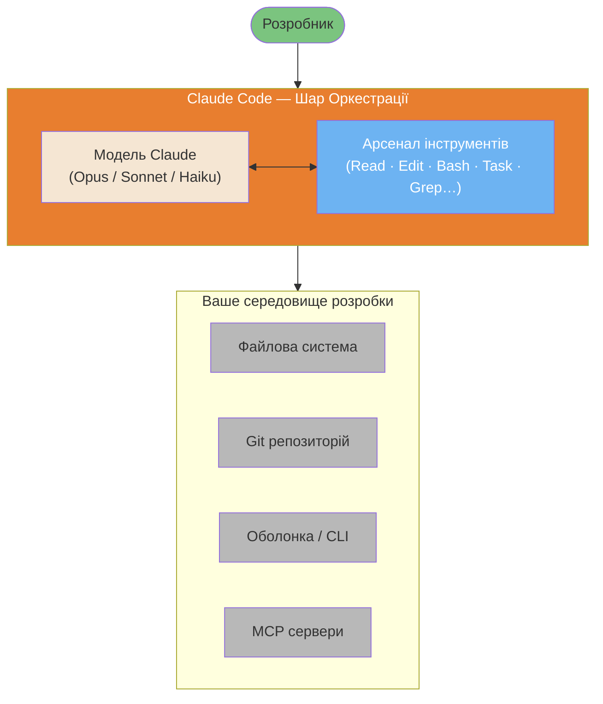

# Як працює Claude Code: Архітектура та внутрішня будова

> Технічне занурення у внутрішні механізми Claude Code, засноване на офіційній документації Anthropic та перевіреному аналізі спільноти.

**Автор**: Florian BRUNIAUX | Внесок від Claude (Anthropic)
**Час читання**: ~25 хвилин (повний) | ~5 хвилин (лише TL;DR)
**Востаннє перевірено**: Лютий 2026 (Claude Code v2.1.34)

---

## Прозорість джерел

Цей документ поєднує три рівні джерел:

| Рівень | Опис | Довіра | Приклад |
|--------|-------------|------------|---------|
| **Рівень 1** | Офіційна документація Anthropic | 100% | anthropic.com/engineering/* |
| **Рівень 2** | Перевірений реверс-інжиніринг | 70-90% | Аналіз PromptLayer, поведінка code.claude.com |
| **Рівень 3** | Висновки спільноти | 40-70% | Спостереження, не підтверджені офіційно |

Кожне твердження позначене рівнем довіри. **Завжди віддавайте перевагу офіційній документації**, якщо вона доступна.

---

## TL;DR — 5 головних фактів

1.  **Простий цикл (Simple Loop)**: Claude Code працює в циклі `while(tool_call)` — без складних графів (DAG), класифікаторів або RAG. Модель вирішує все сама.
2.  **Вісім базових інструментів**: Bash (універсальний адаптер), Read, Edit, Write, Grep, Glob, Task (під-агенти), TodoWrite. Це весь арсенал.
    *   **Еволюція стратегії пошуку**: Ранні версії експериментували з RAG для семантичного пошуку коду. Anthropic перейшла на пошук через grep (ripgrep) після того, як тести показали кращу продуктивність при меншій складності — не потрібна синхронізація індексів та немає ризиків безпеки. Філософія "Шукай, а не індексуй" жертвує токенами заради простоти та безпеки.
3.  **Бюджет у 200K токенів**: Вікно контексту ділиться між системним промптом, історією, результатами інструментів та буфером відповіді. Автостиснення відбувається при заповненні на ~75-92%.
4.  **Під-агенти = Ізоляція**: Інструмент `Task` створює під-агентів із власним контекстом. Вони не можуть створювати інших під-агентів (глибина=1). Повертається лише їхнє коротке резюме.
5.  **Філософія**: "Менше каркаса, більше моделі" — довіряйте міркуванням Claude замість того, щоб будувати складні системи оркестрації навколо нього.

---

## Візуальний огляд

Claude Code — це не нова модель ШІ. Це шар оркестрації, який надає Claude (Opus/Sonnet/Haiku) можливість читати файли, запускати команди оболонки, навігувати по репозиторіях та створювати під-агентів — у безперервному циклі до завершення завдання.



---

## Зміст

1.  [Основний цикл (The Master Loop)](#1-основний-цикл)
2.  [Арсенал інструментів](#2-арсенал-інструментів)
3.  [Внутрішнє керування контекстом](#3-внутрішнє-керування-контекстом)
4.  [Архітектура під-агентів](#4-архітектура-під-агентів)
5.  [Модель дозволів та безпеки](#5-модель-дозволів-та-безпеки)
6.  [Інтеграція MCP](#6-інтеграція-mcp)
7.  [Просунуті патерни використання інструментів (API)](#7-просунуті-патерни-використання-інструментів-api)
8.  [Інструмент Edit: як він працює насправді](#8-інструмент-edit-як-він-працює-насправді)
9.  [Збереження сесій](#9-збереження-сесій)
10. [Філософія: Менше каркаса, більше моделі](#10-філософія-менше-каркаса-більше-моделі)
11. [Claude Code проти альтернатив](#11-claude-code-проти-альтернатив)

---

## 1. Основний цикл (The Master Loop)

**Довіра**: 100% (Рівень 1 - Офіційно)
**Джерело**: [Anthropic Engineering Blog](https://www.anthropic.com/engineering/claude-code-best-practices)

В основі Claude Code лежить надзвичайна простота:

```
┌─────────────────────────────────────────────────────────────┐
│                ОСНОВНИЙ ЦИКЛ CLAUDE CODE (MASTER LOOP)      │
│                                                             │
│   ┌──────────────┐                                          │
│   │ Ваш промпт   │                                          │
│   └──────┬───────┘                                          │
│          │                                                  │
│          ▼                                                  │
│   ┌──────────────────────────────────────────────────────┐  │
│   │                                                      │  │
│   │                  CLAUDE МІРКУЄ                       │  │
│   │      (Без класифікаторів, без шарів маршрутизації)   │  │
│   │                                                      │  │
│   └────────────────────────┬─────────────────────────────┘  │
│                            │                                │
│                            ▼                                │
│                   ┌────────────────┐                        │
│                   │ Виклик інструмента?│                    │
│                   └───────┬────────┘                        │
│                           │                                 │
│              ТАК          │           НІ                    │
│         ┌─────────────────┴─────────────────┐               │
│         │                                   │               │
│         ▼                                   ▼               │
│  ┌────────────┐                      ┌────────────┐         │
│  │ Виконати   │                      │ Текстова   │         │
│  │ інструмент │                      │ відповідь  │         │
│  │            │                      │ (ЗАВЕРШЕНО)│         │
│  └─────┬──────┘                      └────────────┘         │
│        │                                                    │
│        ▼                                                    │
│  ┌─────────────┐                                            │
│  │ Передати    │                                            │
│  │ результат   │──────────────────┐                         │
│  │ до Claude   │                  │                         │
│  └─────────────┘                  │                         │
│                                   │                         │
│                                   ▼                         │
│                          ┌────────────────┐                 │
│                          │ ПЕРЕХІД НА     │                 │
│                          │ НАСТУПНИЙ КРОК │                 │
│                          └────────────────┘                 │
│                                                             │
└─────────────────────────────────────────────────────────────┘
```

### Що це означає

Вся архітектура — це простий цикл `while`:

```python
while (claude_response.has_tool_call):
    result = execute_tool(tool_call)
    claude_response = send_to_claude(result)
return claude_response.text
```

**Тут немає:**
-   Класифікатора намірів
-   Маршрутизатора завдань
-   RAG/векторного пошуку
-   Розподілу на Планувальника та Виконавця

Модель сама вирішує, коли викликати інструменти, які саме та коли завдання виконано. Це і є "агентний цикл" (agentic loop).

### Чому обрано такий дизайн?
1.  **Простота**: менше компонентів = менше точок відмови.
2.  **Керованість моделлю**: міркування Claude кращі за написані вручну евристики.
3.  **Гнучкість**: жодних жорстких рамок, що обмежують дії моделі.

---

## 2. Арсенал інструментів

Claude Code має рівно 8 базових інструментів:

| Інструмент | Призначення | Поведінка | Вартість токенів |
|----------|------------|------------|------------------|
| `Bash` | Запуск shell-команд | Універсальний адаптер | Низька (команда) + Змінна (вивід) |
| `Read` | Читання файлів | Макс 2000 рядків, підтримує скорочення | Висока для великих файлів |
| `Edit` | Модифікація файлів | На основі diff, потребує точного збігу | Середня |
| `Write` | Створення файлів | Потребує попереднього читання | Середня |
| `Grep` | Пошук у файлах | На основі ripgrep (regex) | Низька |
| `Glob` | Пошук за патерном | Пошук шляхів, сортування за часом | Низька |
| `Task` | Створення під-агентів | Ізольований контекст, глибина=1 | Висока (новий контекст) |
| `TodoWrite` | Відстеження прогресу | Структуроване керування завданнями | Низька |

### Універсальний адаптер Bash
Bash — це швейцарський ніж Claude. Він може: запуск будь-якого CLI (git, npm, docker), виконання скриптів, використання pipe-ів, доступ до стану системи. Модель навчена на величезній кількості даних shell-команд, що робить її дуже ефективною.

### Матриця вибору інструментів пошуку
| Потреба | Нативний інструмент | Альтернатива (MCP) | Коли переходити |
|---------|---------------------|--------------------|-----------------|
| Точний текст | `Grep` (ripgrep) | - | Ніколи (найшвидший) |
| Назва функції | `Grep` | Serena `find_symbol` | Великий рефакторинг |
| За значенням | - | grepai `search` | Не знаєте точного тексту |
| Структура | - | ast-grep | Масштабні міграції |

---

## 3. Внутрішнє керування контекстом

Claude Code працює у фіксованому вікні контексту (~200K токенів).

### Розподіл бюджету контексту
-   **Системний промпт (~5-15K)**: визначення інструментів, правила безпеки.
-   **Файли CLAUDE.md (~1-10K)**: правила проекту та глобальні налаштування.
-   **Історія розмови (змінна)**: ваші запити та відповіді Claude.
-   **Результати інструментів (змінна)**: вміст файлів, вивід команд.
-   **Резерв на відповідь (~40-45K)**: міркування моделі та генерація коду.

### Автоматичне стиснення (Auto-Compaction)
При заповненні контексту Claude Code автоматично підсумовує старі частини розмови.
**Важливо**: якість роботи може впасти на 50-70% при сильному заповненні контексту. Рекомендується використовувати `/compact` вручну на логічних етапах або робити **Session Handoff** (передачу контексту в нову сесію).

---

## 4. Архітектура під-агентів

Інструмент `Task` створює під-агентів для паралельної або ізольованої роботи.

### Модель ізоляції
-   **Власний контекст**: під-агент починає "з чистого аркуша".
-   **Обмежений доступ**: отримує лише опис завдання.
-   **Глибина = 1**: під-агенти не можуть створювати інших під-агентів.
-   **Результат**: в основну сесію повертається лише текстове резюме виконаної роботи.

---

## 5. Модель дозволів та безпеки

Claude Code має багаторівневу систему безпеки:
1.  **Інтерактивні запити**: Claude запитує дозвіл перед кожною дією.
2.  **Правила Allow/Deny**: налаштування в `settings.json`.
3.  **Хуки (Hooks)**: перевірка до (`PreToolUse`) та після (`PostToolUse`) виконання.
4.  **Нативна пісочниця (Native Sandbox)**: ізоляція на рівні ОС (Seatbelt на macOS, bubblewrap на Linux). Обмежує доступ до файлів поза робочою директорією та фільтрує мережевий трафік.

---

## 6. Інтеграція MCP

MCP (Model Context Protocol) дозволяє підключати зовнішні інструменти та бази даних.

### Ключові факти про MCP
-   **JSON-RPC 2.0**: протокол обміну даними.
-   **Ізоляція**: сервери бачать лише параметри інструментів, а не всю історію розмови.
-   **Lazy Loading (Ледаче завантаження)**: з версії v2.1.7 визначення інструментів завантажуються лише тоді, коли вони потрібні, що економить до 85% токенів.

---

## 7. Просунуті патерни використання інструментів (API)

Доступні для розробників, що будують власні системи на базі Anthropic API (не в CLI):
-   **Programmatic Tool Calling (PTC)**: модель пише Python-код для оркестрації багатьох інструментів за один крок.
-   **Динамічна фільтрація**: ШІ фільтрує результати пошуку в мережі перед тим, як вони потраплять у контекст.
-   **Приклади використання**: додавання `input_examples` до схем інструментів підвищує точність до 90%.

---

## 8. Інструмент Edit: як він працює насправді

Інструмент Edit складніший, ніж здається:
1.  **Точний збіг**: шукає ідентичний рядок у файлі.
2.  **Fuzzy Match (Неточний збіг)**: якщо точного збігу немає, ігнорує зайві пробіли та переноси рядків.
3.  **Валідація**: перевіряє унікальність рядка перед заміною, щоб не змінити код у випадковому місці.

---

## 9. Збереження сесій

Сесії можна відновлювати за допомогою:
-   `claude --continue`: продовжити останню сесію.
-   `claude --resume <id>`: відкрити конкретну сесію.

Зберігаються: історія, результати інструментів, чекпоінти. Не зберігаються: живий стан інструментів та змінні оточення.

---

## 10. Філософія: Менше каркаса, більше моделі

Головний принцип Anthropic: довіряти інтелекту моделі більше, ніж жорстко прописаним алгоритмам.
-   Замість складних маршрутизаторів — одна розумна модель.
-   Замість RAG — швидкий Grep.
-   Замість складних машин стану — розмова як стан.

Це робить Claude Code швидшим, гнучкішим та простішим у відлагодженні.

---

---

**Локалізація**: [Serhii (MacPlus Software)](https://macplus-software.com) | **Остання синхронізація**: Травень 2026

---

*Далі: [Методології розробки](./methodologies.md) | [Глосарій](./glossary.uk.md) | [На головну](../README.md)*
