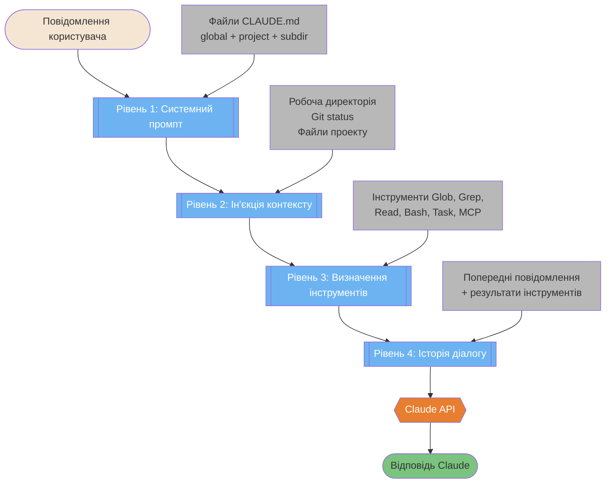
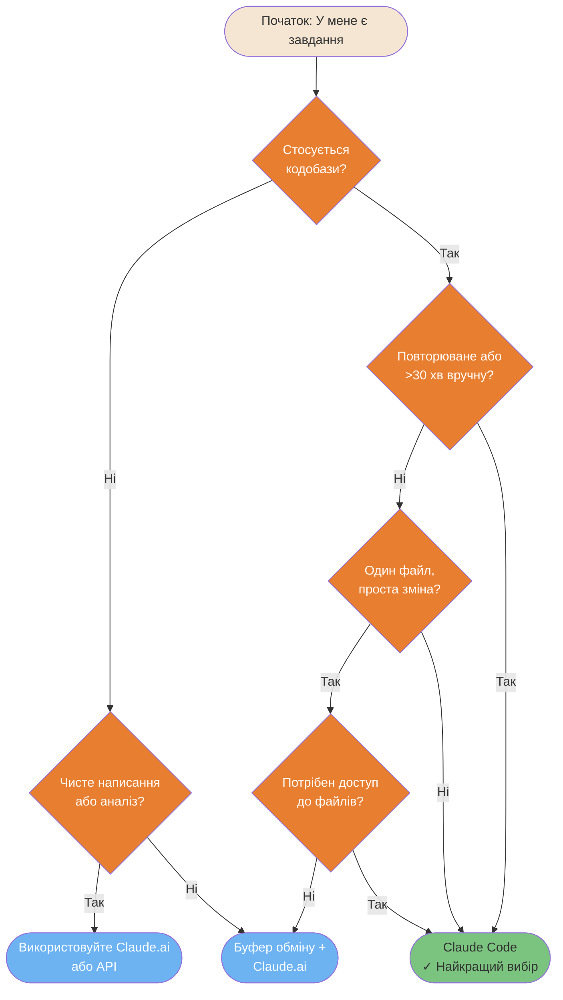

# Основи

Основні концепції, що пояснюють, чим є Claude Code та як він фундаментально працює.

---

### "Від чатбота до системи контексту" — 4-рівнева модель

Claude Code — це не чатбот, а система контексту, яка перетворює ваше повідомлення на насичений багатошаровий промпт перед викликом API. Ця діаграма показує 4-рівневе доповнення, яке відбувається невидимо для кожного запиту.



<details>
<summary>ASCII версія</summary>

```
Повідомлення користувача
     │
     ▼
┌─────────────────────────────────┐
│ Рівень 1: Системний промпт      │ ← Файли CLAUDE.md
│ Рівень 2: Ін'єкція контексту    │ ← Робоча папка, git status
│ Рівень 3: Визначення інструментів│ ← Усі доступні інструменти
│ Рівень 4: Історія діалогу       │ ← Попередні повідомлення
└─────────────────┬───────────────┘
                  │
                  ▼
           Виклик Claude API
                  │
                  ▼
           Відповідь Claude
```

</details>

> **Джерело**: [Як працює Claude Code](../ultimate-guide.uk.md#how-claude-code-works)

---

### 9-кроковий пайплайн воркфлоу

Кожен запит до Claude Code проходить через цей пайплайн — від аналізу вашого наміру до відображення фінальної відповіді. Розуміння цього циклу допомагає писати кращі інструкції та швидше діагностувати проблеми.

```mermaid
flowchart LR
    A([Повідомлення користувача]) --> B(Аналіз наміру)
    B --> C(Завантаження контексту)
    C --> D(Планування дій)
    D --> E(Виконання інструментів)
    E --> F{Потрібні ще<br/>інструменти?}
    F -->|Так| G(Збір результатів)
    G --> E
    F -->|Ні| H(Оновлення контексту)
    H --> I(Генерація відповіді)
    I --> J([Показ користувачеві])

    style A fill:#F5E6D3,color:#333
    style B fill:#6DB3F2,color:#fff
    style C fill:#6DB3F2,color:#fff
    style D fill:#E87E2F,color:#fff
    style E fill:#E87E2F,color:#fff
    style F fill:#E87E2F,color:#fff
    style G fill:#B8B8B8,color:#333
    style H fill:#B8B8B8,color:#333
    style I fill:#6DB3F2,color:#fff
    style J fill:#7BC47F,color:#333

    click A href "../ultimate-guide.uk.md#12-перший-воркфлоу" "Перший воркфлоу"
    click B href "../core/architecture.uk.md#1-головний-цикл" "Аналіз наміру — Головний цикл"
    click C href "../ultimate-guide.uk.md#22-управління-контекстом" "Завантаження контексту"
    click D href "../ultimate-guide.uk.md#23-режим-планування-plan" "Планування дій — Режим /plan"
    click E href "../core/architecture.uk.md#2-арсенал-інструментів" "Виконання інструментів"
    click F href "../core/architecture.uk.md#1-головний-цикл" "Ще інструменти? — Головний цикл"
    click G href "../core/architecture.uk.md#1-головний-цикл" "Збір результатів"
    click H href "../ultimate-guide.uk.md#22-управління-контекстом" "Оновлення контексту"
    click I href "../core/architecture.uk.md#1-головний-цикл" "Генерація відповіді"
    click J href "../ultimate-guide.uk.md#12-перший-воркфлоу" "Показ користувачеві"
```



<details>
<summary>ASCII версія</summary>

```
Повідомлення → Аналіз наміру → Завантаження контексту → Планування дій
                                                          │
                         ┌────────────────────────────────┘
                         ▼
                  Виконання інструментів ◄────────────────┐
                         │                                │
                  Ще інструменти?  ──── Так ─── Збір результатів
                         │ Ні
                         ▼
                  Оновлення контексту → Генерація відповіді → Показ
```

</details>

---

### Швидке дерево рішень — "Чи варто мені використовувати Claude Code?"

Не кожне завдання потребує Claude Code. Це дерево рішень допоможе вам обрати правильний інструмент — Claude Code CLI, Claude.ai або підхід через буфер обміну.



<details>
<summary>ASCII версія</summary>

```
Завдання стосується кодобази?
├── Ні → Написання/аналіз? → Так → Claude.ai
│                          → Ні  → Буфер обміну + Claude.ai
└── Так → Повторюване або >30 хв?
          ├── Так → ✓ Claude Code
          └── Ні  → Один файл, проста зміна?
                    ├── Так → Потрібен доступ? → Ні → Буфер обміну
                    │                          → Так → Claude Code
                    └── Ні  → ✓ Claude Code
```

</details>

---

### Порівняння режимів дозволів

Claude Code має 5 режимів дозволів, які контролюють, що він може робити автоматично, а що потребує вашого схвалення. Вибір неправильного режиму — це помилка безпеки №1.

```mermaid
flowchart TD
    subgraph DEFAULT["🔒 Режим DEFAULT (Рекомендовано)"]
        D1(Читання файлів) --> D2([Авто-схвалено])
        D3(Запис у файли) --> D4([Запит дозволу])
        D5(Shell команди) --> D6([Запит дозволу])
        D7(Ризиковані операції) --> D8([Запит дозволу])
    end

    subgraph ACCEPT["✏️ Режим acceptEdits"]
        A1(Читання файлів) --> A2([Auto-approved])
        A3(Запис у файли) --> A4([Auto-approved])
        A5(Shell команди) --> A6([Запит дозволу])
        A7(Ризиковані операції) --> A8([Запит дозволу])
    end

    subgraph BYPASS["⚠️ Режим bypassPermissions"]
        B1(УСІ операції) --> B2([Авто-схвалено])
        B3["Тільки для:<br/>CI/CD, пісочниць"] --> B2
    end

    subgraph PLAN["🔍 Режим Plan (Тільки читання)"]
        PL1(Читання файлів) --> PL2([Авто-схвалено])
        PL3(Запис у файли) --> PL4([Заблоковано])
        PL5(Shell команди) --> PL6([Заблоковано])
        PL7["Вихід через /execute<br/>або Shift+Tab"] --> PL2
    end

    subgraph DONTASK["🚫 Режим dontAsk"]
        DA1(УСІ операції) --> DA2([Авто-відмова])
        DA3["Крім попередньо схвалених<br/>через /permissions add"] --> DA2
    end

    style D2 fill:#7BC47F,color:#333
    style D4 fill:#E87E2F,color:#fff
    style D6 fill:#E87E2F,color:#fff
    style D8 fill:#E87E2F,color:#fff
    style A2 fill:#7BC47F,color:#333
    style A4 fill:#7BC47F,color:#333
    style A6 fill:#E87E2F,color:#fff
    style A8 fill:#E87E2F,color:#fff
    style B2 fill:#E85D5D,color:#fff
    style B3 fill:#F5E6D3,color:#333
    style PL2 fill:#7BC47F,color:#333
    style PL4 fill:#E85D5D,color:#fff
    style PL6 fill:#E85D5D,color:#fff
    style DA2 fill:#E85D5D,color:#fff
    style DA3 fill:#F5E6D3,color:#333

    click D1 href "../ultimate-guide.uk.md#14-режими-дозволів" "Режими дозволів"
    click D2 href "../ultimate-guide.uk.md#14-режими-дозволів" "Авто-схвалено"
    click D3 href "../ultimate-guide.uk.md#14-режими-дозволів" "Запис у файли"
    click D4 href "../ultimate-guide.uk.md#14-режими-дозволів" "Запит дозволу"
    click A1 href "../ultimate-guide.uk.md#14-режими-дозволів" "Режим acceptEdits"
    click B1 href "../ultimate-guide.uk.md#14-режими-дозволів" "Режим bypassPermissions"
    click PL1 href "../ultimate-guide.uk.md#14-режими-дозволів" "Режим Plan"
    click DA1 href "../ultimate-guide.uk.md#14-режими-дозволів" "Режим dontAsk"
```



<details>
<summary>ASCII версія</summary>

```
DEFAULT (Рекомендовано)       acceptEdits               bypassPermissions
─────────────────────        ───────────               ─────────────────
Читання файлів → АВТО ✓      Читання файлів → АВТО ✓   УСІ операції → АВТО ⚠️
Запис у файли  → ЗАПИТ       Запис у файли  → АВТО ✓
Shell команди  → ЗАПИТ       Shell команди  → ЗАПИТ    Використовувати:
Ризиковані оп. → ЗАПИТ       Ризиковані оп. → ЗАПИТ    тільки в пісочницях

Режим Plan (Тільки читання)   Режим dontAsk
─────────────────────        ────────────
Читання файлів → АВТО ✓      УСІ операції → АВТО ВІДМОВА ✗
Запис у файли  → ЗАБЛОК. ✗   Крім попередньо схвалених
Shell команди  → ЗАБЛОК. ✗   через /permissions add
Вихід: /execute або Shift+Tab
```

</details>

---

**Локалізація**: [Serhii (MacPlus Software)](https://macplus-software.com)
*Остання синхронізація: Травень 2026*
