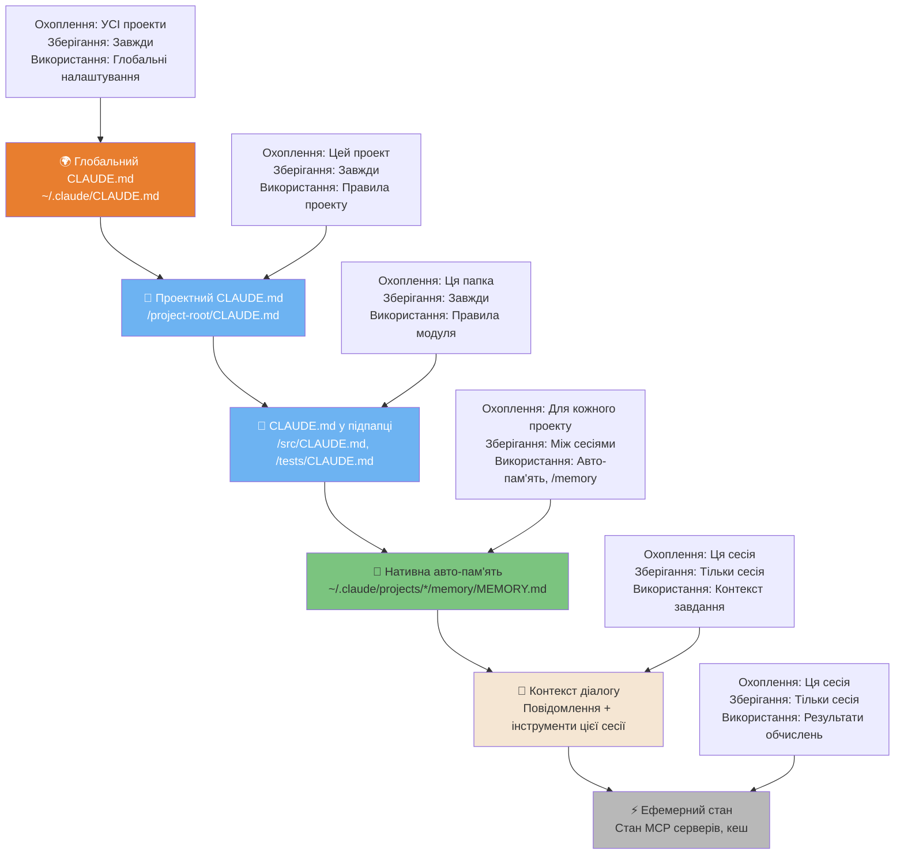
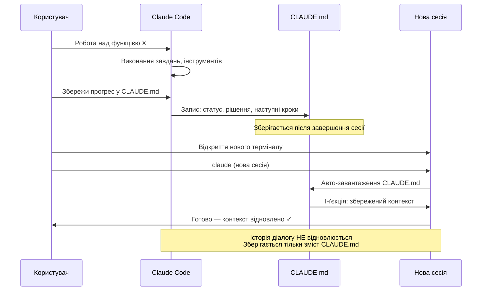

# Контекст та сесії

Як Claude Code керує контекстом, пам'яттю та сесіями під час вашої роботи.

---

### Зони управління контекстом

Ваше вікно контексту має 4 окремі зони, кожна з яких потребує різних стратегій. Розуміння того, в якій зоні ви перебуваєте, запобігає роздуванню контексту та підтримує якість відповідей протягом довгих сесій.

```mermaid
flowchart LR
    subgraph GREEN["🟢 0–50% — Комфортно"]
        G1(Повні можливості<br/>доступні)
        G2(Усі інструменти активні)
        G3(Насичені відповіді)
    end

    subgraph BLUE["🔵 50–75% — Норма"]
        B1(Моніторинг використання)
        B2(Розгляньте /compact<br/>для старих гілок)
        B3(Нормальна робота)
    end

    subgraph ORANGE["🟠 75–85% — Обережно"]
        O1(Пропонуйте /compact<br/>проактивно)
        O2(Зменште багатослівність)
        O3(Відкладіть некритичні<br/>операції)
    end

    subgraph RED["🔴 85–100% — Критично"]
        R1(Авто-компакт<br/>спрацьовує на 80%)
        R2(Тільки основні операції)
        R3(Нова сесія для<br/>нових завдань)
    end

    GREEN --> BLUE --> ORANGE --> RED

    style G1 fill:#7BC47F,color:#333
    style G2 fill:#7BC47F,color:#333
    style G3 fill:#7BC47F,color:#333
    style B1 fill:#6DB3F2,color:#fff
    style B2 fill:#6DB3F2,color:#fff
    style B3 fill:#6DB3F2,color:#fff
    style O1 fill:#E87E2F,color:#fff
    style O2 fill:#E87E2F,color:#fff
    style O3 fill:#E87E2F,color:#fff
    style R1 fill:#E85D5D,color:#fff
    style R2 fill:#E85D5D,color:#fff
    style R3 fill:#E85D5D,color:#fff

    click G1 href "../ultimate-guide.uk.md#22-управління-контекстом" "0-50%: Повні можливості"
    click B2 href "../ultimate-guide.uk.md#22-управління-контекстом" "50-75%: Розгляньте /compact"
    click O1 href "../ultimate-guide.uk.md#22-управління-контекстом" "75-85%: Пропонуйте /compact"
    click R1 href "../ultimate-guide.uk.md#22-управління-контекстом" "85-100%: Авто-компакт"
```



<details>
<summary>ASCII версія</summary>

```
0%──────50%──────75%──85%──100%
│ Зелена  │ Блакитна│ Оранж │ Черв │
│ Повний  │ Норма   │Запит  │Авто  │
│ доступ  │Монітор. │compact│cmp   │
│         │         │Зменш. │Тільки│
│         │         │слів   │основі│
```

</details>

---

### Ієрархія пам'яті — 6 типів

Claude Code має 6 окремих типів пам'яті з різним охопленням та тривалістю зберігання.



<details>
<summary>ASCII версія</summary>

```
ПОСТІЙНО ──────────────────────────────── ТІЛЬКИ СЕСІЯ

~/.claude/CLAUDE.md              Контекст діалогу
      │                                 │
/project/CLAUDE.md               Ефемерний стан MCP
      │
/subdir/CLAUDE.md
      │
Авто-пам'ять (MEMORY.md)  ← між сесіями, для проекту
```

</details>

---

### Безперервність сесій — збереження та відновлення стану

Сесії не відновлюють автоматично контекст діалогу. Ця діаграма показує, як зберегти стан у `CLAUDE.md` та відновити його в новій сесії.



---

### Анти-патерн "Свіжий контекст" vs Найкраща практика

Довгі сесії накопичують "шум", що погіршує якість відповідей. Ми рекомендуємо підхід "фокусованих сесій".

```mermaid
flowchart TD
    subgraph BAD["❌ Анти-патерн: Монолітна сесія"]
        B1([Старт великої сесії]) --> B2(Додавання завдання A)
        B2 --> B3(Додавання завдання B)
        B3 --> B4(Додавання завдання C)
        B4 --> B5{Контекст роздутий<br/>>75%}
        B5 --> B6(Якість відповідей<br/>деградує)
        B6 --> B7(Примусовий перезапуск<br/>втрачає весь контекст)
        style B1 fill:#E85D5D,color:#fff
        style B5 fill:#E85D5D,color:#fff
        style B6 fill:#E85D5D,color:#fff
        style B7 fill:#E85D5D,color:#fff
    end

    subgraph GOOD["✅ Найкраща практика: Фокусовані сесії"]
        G1([Старт фокусованої сесії]) --> G2(Виконання завдання A)
        G2 --> G3{Природна<br/>точка зупинки?}
        G3 -->|Так| G4(Збереження в CLAUDE.md)
        G4 --> G5([Нова сесія для завд. B])
        G3 -->|Ні| G6{Контекст >75%?}
        G6 -->|Так| G7(/compact)
        G7 --> G2
        G6 -->|Ні| G2
        style G1 fill:#7BC47F,color:#333
        style G4 fill:#7BC47F,color:#333
        style G5 fill:#7BC47F,color:#333
        style G3 fill:#E87E2F,color:#fff
        style G6 fill:#E87E2F,color:#fff
        style G7 fill:#6DB3F2,color:#fff
    end

    click B1 href "../ultimate-guide.uk.md#22-управління-контекстом" "Анти-патерн: Монолітна сесія"
    click G1 href "../ultimate-guide.uk.md#22-управління-контекстом" "Найкраща практика: Фокусовані сесії"
```



<details>
<summary>ASCII версія</summary>

```
ПОГАНО: Одна гігантська сесія
Завд. A → Завд. B → Завд. C → Роздуття → Деградація → Рестарт → Втрачено!

ДОБРЕ: Фокусовані сесії
Завд. A ──► Зупинка? ──Так──► Запис CLAUDE.md ──► Нова сесія для B
             │
             Ні
             │
          Контекст >75%? ──Так──► /compact ──► Продовжити
             │
             Ні
             │
          Продовжити завдання
```

</details>

---

**Локалізація**: [Serhii (MacPlus Software)](https://macplus-software.com)
*Остання синхронізація: Травень 2026*
