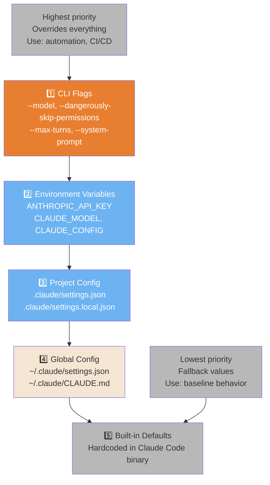
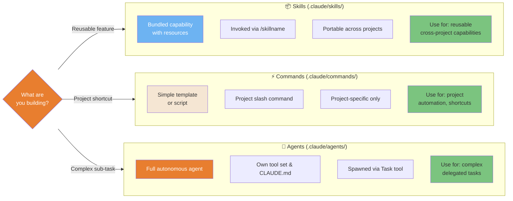
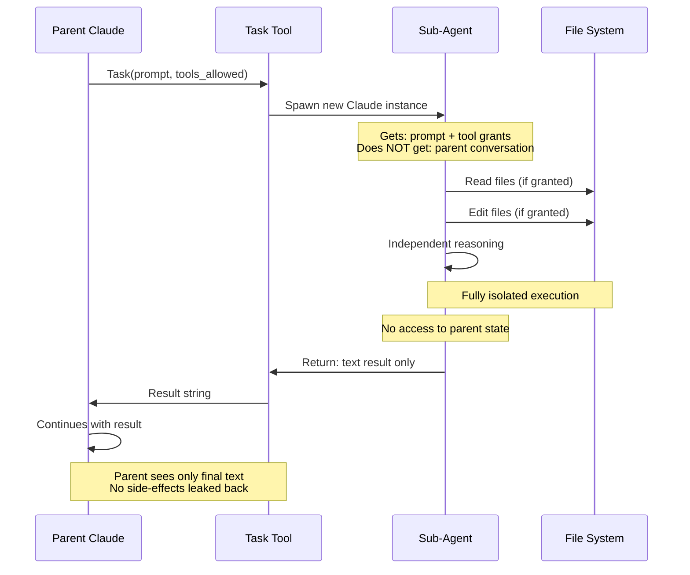

# Configuration System

How Claude Code loads settings, resolves conflicts, and orchestrates extensibility.

---

### Configuration Precedence (5 Levels)

Claude Code resolves settings through a strict priority hierarchy. Higher layers override lower ones. Knowing this prevents "why isn't my config working?" bugs.



<details>
<summary>ASCII version</summary>

```
PRIORITY (highest to lowest)
═══════════════════════════
1. CLI Flags            ← --model, --system-prompt
2. Environment Vars     ← ANTHROPIC_API_KEY
3. Project .claude/     ← settings.json, settings.local.json
4. Global ~/.claude/    ← settings.json, CLAUDE.md
5. Built-in defaults    ← hardcoded fallbacks
```

</details>

> **Source**: [Configuration System](../ultimate-guide.md#configuration) — Line ~3760

---

### Skills vs. Commands vs. Agents — When to Use Each

Three extensibility mechanisms with different purposes and tradeoffs. Choosing the wrong abstraction leads to over-engineering or under-powered automation.



<details>
<summary>ASCII version</summary>

```
                    Skills              Commands           Agents
Location:      .claude/skills/     .claude/commands/  .claude/agents/
Trigger:       /skillname          /commandname       Task tool
Scope:         Cross-project       This project       Any context
Complexity:    Medium (bundled)    Low (template)     High (autonomous)
Use when:      Reusable caps       Quick shortcuts    Complex tasks
```

</details>

> **Source**: [Extensibility System](../ultimate-guide.md#extensibility) — Line ~4495, ~5025, ~3900

---

### Agent Lifecycle & Scope Isolation

Sub-agents run in complete isolation from the parent. They receive a copy of context but share no state. Understanding this prevents "why can't my sub-agent see X?" confusion.



<details>
<summary>ASCII version</summary>

```
Parent ──Task(prompt, tools)──► Sub-Agent
                                    │
                               [isolated exec]
                               - read files
                               - edit files
                               - bash (if allowed)
                                    │
Parent ◄───── text result ──────────┘
(no state sharing, no side effects back)
```

</details>

> **Source**: [Sub-Agents](../ultimate-guide.md#sub-agents) — Line ~3900

---

### Hooks Event Pipeline

Hooks let you run custom code at key points in Claude Code's lifecycle — for security scanning, logging, enforcement, or notifications. The execution order matters.

```mermaid
flowchart TD
    INIT([Session starts]) -.->|v2.1.69+| INST{InstructionsLoaded Hook}
    INST -.-> A

    A([User sends message]) --> UPS{UserPromptSubmit Hook}
    UPS -->|Exit 0: proceed| B{PreToolUse Hook}
    UPS -->|Exit 2: feedback| A
    B -->|Exit 0: allow| C[Tool executes]
    B -->|Exit 1: block| D([Tool blocked<br/>Claude stops])
    C --> E{PostToolUse Hook}
    E --> F[Next tool or response]
    F --> G{More tool calls?}
    G -->|Yes| B
    G -->|No| H([Session ends])
    H --> I{Stop / SessionEnd Hook}
    I --> J([Complete])

    K{PreCompact Hook} -.->|Before /compact| L[/compact runs]
    L --> M{PostCompact Hook}

    NOTE["Hook types:<br/>bash (exit 0/1/2)<br/>http (POST JSON → URL, v2.1.63+)"] -.-> B

    style INST fill:#6DB3F2,color:#fff
    style UPS fill:#6DB3F2,color:#fff
    style B fill:#E87E2F,color:#fff
    style D fill:#E85D5D,color:#fff
    style E fill:#E87E2F,color:#fff
    style I fill:#E87E2F,color:#fff
    style K fill:#6DB3F2,color:#fff
    style M fill:#6DB3F2,color:#fff
    style C fill:#7BC47F,color:#333
    style J fill:#7BC47F,color:#333
    style NOTE fill:#F5E6D3,color:#333

    click INIT href "https://github.com/FlorianBruniaux/claude-code-ultimate-guide/blob/main/guide/ultimate-guide.md#71-the-event-system" "Session starts"
    click INST href "https://github.com/FlorianBruniaux/claude-code-ultimate-guide/blob/main/guide/ultimate-guide.md#71-the-event-system" "InstructionsLoaded Hook — v2.1.69+"
    click A href "https://github.com/FlorianBruniaux/claude-code-ultimate-guide/blob/main/guide/ultimate-guide.md#71-the-event-system" "User sends message"
    click UPS href "https://github.com/FlorianBruniaux/claude-code-ultimate-guide/blob/main/guide/ultimate-guide.md#71-the-event-system" "UserPromptSubmit Hook"
    click B href "https://github.com/FlorianBruniaux/claude-code-ultimate-guide/blob/main/guide/ultimate-guide.md#71-the-event-system" "PreToolUse Hook"
    click C href "https://github.com/FlorianBruniaux/claude-code-ultimate-guide/blob/main/guide/architecture.md#2-the-tool-arsenal" "Tool executes"
    click D href "https://github.com/FlorianBruniaux/claude-code-ultimate-guide/blob/main/guide/ultimate-guide.md#71-the-event-system" "Tool blocked"
    click E href "https://github.com/FlorianBruniaux/claude-code-ultimate-guide/blob/main/guide/ultimate-guide.md#71-the-event-system" "PostToolUse Hook"
    click F href "https://github.com/FlorianBruniaux/claude-code-ultimate-guide/blob/main/guide/ultimate-guide.md#71-the-event-system" "Next tool or response"
    click G href "https://github.com/FlorianBruniaux/claude-code-ultimate-guide/blob/main/guide/ultimate-guide.md#71-the-event-system" "More tool calls?"
    click H href "https://github.com/FlorianBruniaux/claude-code-ultimate-guide/blob/main/guide/ultimate-guide.md#71-the-event-system" "Session ends"
    click I href "https://github.com/FlorianBruniaux/claude-code-ultimate-guide/blob/main/guide/ultimate-guide.md#71-the-event-system" "Stop / SessionEnd Hook"
    click J href "https://github.com/FlorianBruniaux/claude-code-ultimate-guide/blob/main/guide/ultimate-guide.md#72-creating-hooks" "Complete"
    click K href "https://github.com/FlorianBruniaux/claude-code-ultimate-guide/blob/main/guide/ultimate-guide.md#71-the-event-system" "PreCompact Hook"
    click L href "https://github.com/FlorianBruniaux/claude-code-ultimate-guide/blob/main/guide/ultimate-guide.md#71-the-event-system" "/compact runs"
    click M href "https://github.com/FlorianBruniaux/claude-code-ultimate-guide/blob/main/guide/ultimate-guide.md#71-the-event-system" "PostCompact Hook"
```

<details>
<summary>ASCII version</summary>

```
Session starts
     │ (InstructionsLoaded Hook — v2.1.69+)
User message
     │
 UserPromptSubmit ──exit 2──► feedback to Claude (loop)
     │ exit 0
 PreToolUse ──exit 1──► BLOCKED
     │ exit 0
     ▼
Tool executes
     │
PostToolUse
     │
More tools? ──yes──► PreToolUse (loop)
     │ no
Session ends
     │
  Stop / SessionEnd Hook
     │
 Complete

Separately: PreCompact ──► /compact ──► PostCompact

Hook types: bash (exit 0/1/2) | http POST JSON (v2.1.63+)
```

</details>

> **Source**: [Hooks System](../ultimate-guide.md#hooks) — Line ~5350 | UserPromptSubmit + HTTP hooks: v2.1.63+ | InstructionsLoaded: v2.1.69+
