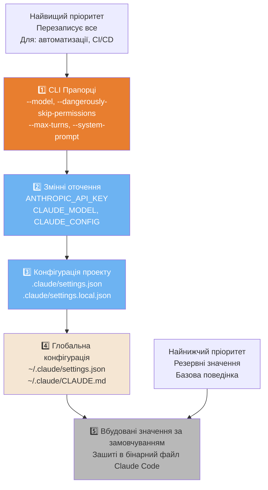
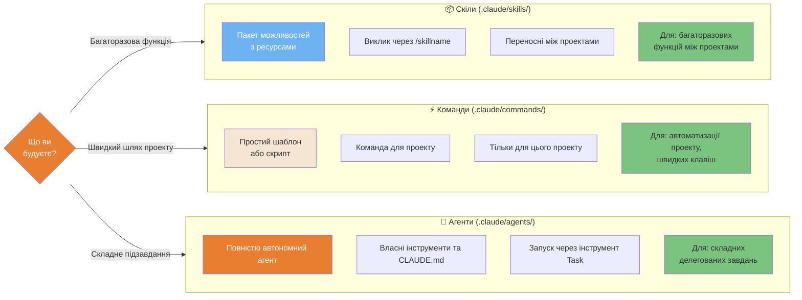
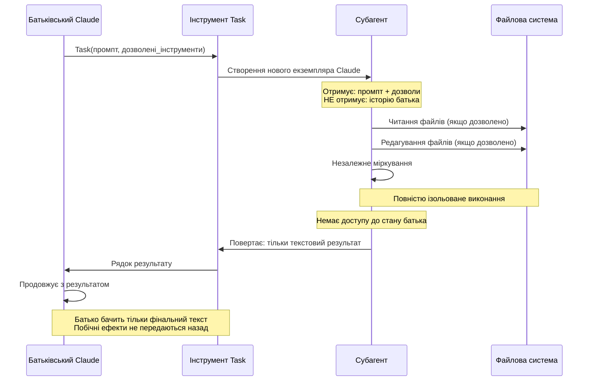

# Система конфігурації

Як Claude Code завантажує налаштування, вирішує конфлікти та організовує розширюваність.

---

### Пріоритетність конфігурацій (5 рівнів)

Claude Code вирішує конфлікти налаштувань через сувору ієрархію пріоритетів. Вищі рівні перезаписують нижчі.



<details>
<summary>ASCII версія</summary>

```
ПРІОРИТЕТ (від найвищого до найнижчого)
═══════════════════════════
1. CLI Прапорці         ← --model, --system-prompt
2. Змінні оточення      ← ANTHROPIC_API_KEY
3. Проект .claude/      ← settings.json, settings.local.json
4. Глобальна ~/.claude/ ← settings.json, CLAUDE.md
5. Вбудовані значення   ← зашиті в код
```

</details>

---

### Скіли vs Команди vs Агенти — коли що використовувати

Три механізми розширення з різними цілями та компромісами.



<details>
<summary>ASCII версія</summary>

```
                    Скіли               Команди            Агенти
Розташування:  .claude/skills/     .claude/commands/  .claude/agents/
Тригер:        /skillname          /commandname       Інструмент Task
Масштаб:       Міжпроекти          Цей проект         Будь-який контекст
Складність:    Середня (пакет)     Низька (шаблон)    Висока (автономія)
Коли:          Багат. функції      Швидкі команди     Складні завдання
```

</details>

---

### Життєвий цикл агента та ізоляція контексту

Субагенти працюють у повній ізоляції від батьківського процесу. Вони отримують копію контексту, але не ділять стан.



---

### Пайплайн подій Хуків (Hooks)

Хуки дозволяють запускати ваш код у ключові моменти життєвого циклу Claude Code — для сканування безпеки, логування або сповіщень.

```mermaid
flowchart TD
    INIT([Початок сесії]) -.->|v2.1.69+| INST{InstructionsLoaded Hook}
    INST -.-> A

    A([Повідомлення користувача]) --> UPS{UserPromptSubmit Hook}
    UPS -->|Exit 0: продовжити| B{PreToolUse Hook}
    UPS -->|Exit 2: фідбек| A
    B -->|Exit 0: дозволити| C[Інструмент виконується]
    B -->|Exit 1: блок| D([Блокування<br/>Claude зупиняється])
    C --> E{PostToolUse Hook}
    E --> F[Наступний інструмент або відповідь]
    F --> G{Ще виклики?}
    G -->|Так| B
    G -->|Ні| H([Кінець сесії])
    H --> I{Stop / SessionEnd Hook}
    I --> J([Завершено])

    K{PreCompact Hook} -.->|Перед /compact| L[/compact запускається]
    L --> M{PostCompact Hook}

    style INST fill:#6DB3F2,color:#fff
    style UPS fill:#6DB3F2,color:#fff
    style B fill:#E87E2F,color:#fff
    style D fill:#E85D5D,color:#fff
    style E fill:#E87E2F,color:#fff
    style I fill:#E87E2F,color:#fff
    style K fill:#6DB3F2,color:#fff
    style M fill:#6DB3F2,color:#fff
    style C fill:#7BC47F,color:#333
    style J fill:#7BC47F,color:#333

    click INIT href "../ultimate-guide.uk.md#71-система-подій" "Початок сесії"
    click B href "../ultimate-guide.uk.md#71-система-подій" "PreToolUse Hook"
    click C href "../core/architecture.uk.md#2-арсенал-інструментів" "Інструмент виконується"
    click D href "../ultimate-guide.uk.md#71-система-подій" "Інструмент заблоковано"
```

<details>
<summary>ASCII версія</summary>

```
Початок сесії
     │ (InstructionsLoaded Hook)
Повідомлення
     │
 UserPromptSubmit ──exit 2──► фідбек Claude (цикл)
     │ exit 0
 PreToolUse ──exit 1──► ЗАБЛОКОВАНО
     │ exit 0
     ▼
Інструмент виконується
     │
PostToolUse
     │
Ще інструменти? ──так──► PreToolUse (цикл)
     │ ні
Кінець сесії
     │
 Stop / SessionEnd Hook
     │
 Завершено
```

</details>

---

**Локалізація**: [Serhii (MacPlus Software)](https://macplus-software.com)
*Остання синхронізація: Травень 2026*
