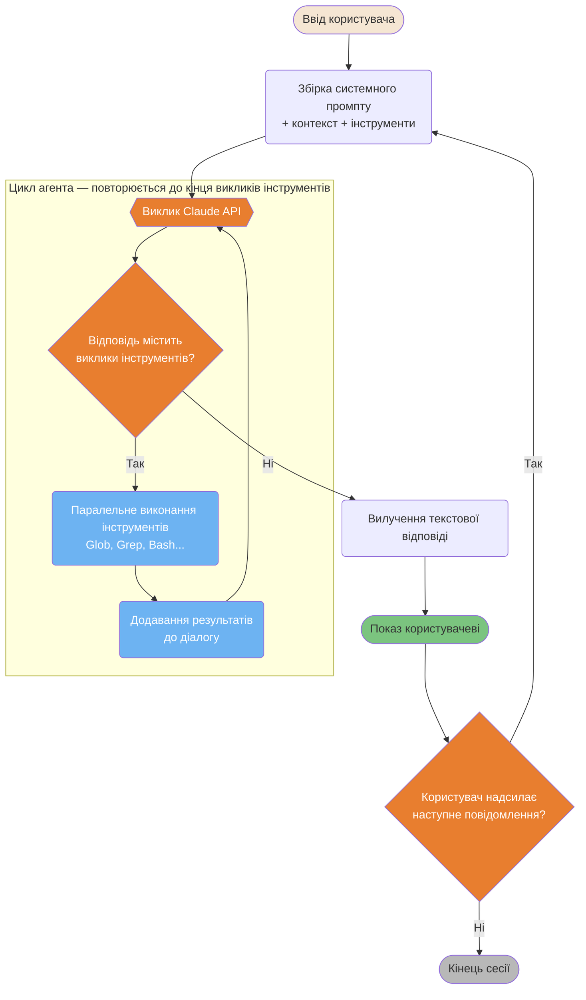
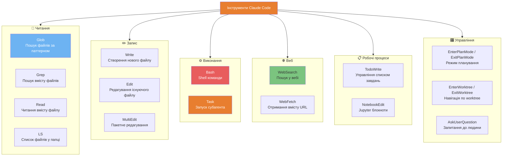
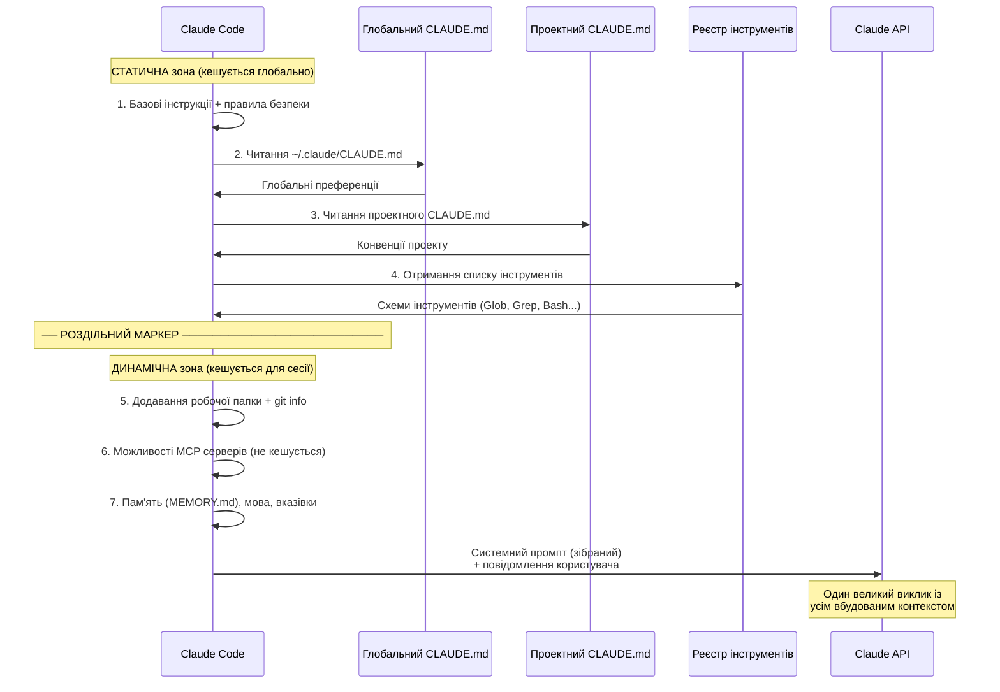
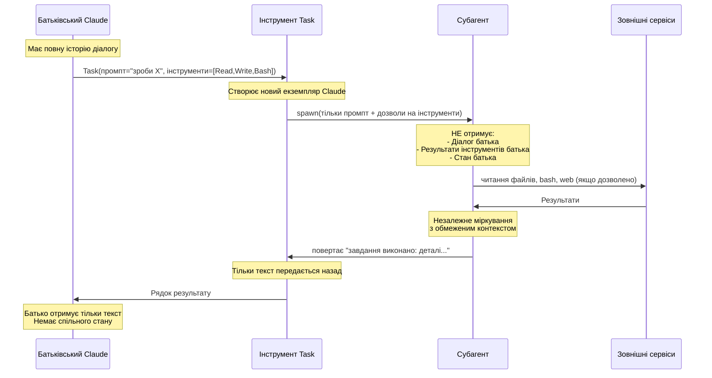

# Внутрішня архітектура

Що відбувається "під капотом" під час роботи Claude Code.

---

### Головний цикл (The Master Loop)

Ядро виконання Claude Code складається з двох вкладених циклів: **внутрішній цикл агента**, який продовжує викликати API, поки повертаються виклики інструментів, та **зовнішній цикл діалогу**, який починає новий хід, коли користувач відповідає.



<details>
<summary>ASCII версія</summary>

```
Ввід користувача
     │
Збірка промпту (система + контекст + інструменти)
     │
 ┌── Цикл агента ─────────────────────┐
  │ Claude API ◄────────────────────┐  │
  │      │                          │  │
  │ Виклики інструментів?           │  │
  │  ├─ Так → Виконати інструменти ─┘  │
  │  └─ Ні  → вихід з циклу            │
  └────────────────────────────────────┘
                │
         Показ відповіді
                │
         Наступне повід.? ──► Так → збірка промпту → цикл
                └─ Ні → Кінець сесії
```

</details>

---

### Категорії інструментів та їх вибір

Claude Code має 6 категорій інструментів, кожна з яких оптимізована для різних операцій.



<details>
<summary>ASCII версія</summary>

```
ЧИТАННЯ:  Glob, Grep, Read, LS
ЗАПИС:    Write, Edit, MultiEdit
ВИКОНАННЯ: Bash (shell), Task (субагент) ← найпотужніші/ризиковані
ВЕБ:      WebSearch, WebFetch
ПРОЦЕСИ:  TodoWrite, NotebookEdit
УПРАВЛІННЯ: Режими Plan, Worktree, AskUserQuestion
```

</details>

---

### Збірка системного промпту

Перед кожним викликом API Claude Code збирає системний промпт із декількох джерел.



---

### Ізоляція контексту субагентів

Субагенти повністю ізольовані від батьківського процесу — вони не можуть читати історію діалогу батька або змінювати його стан.



---

**Локалізація**: [Serhii (MacPlus Software)](https://macplus-software.com)
*Остання синхронізація: Травень 2026*
