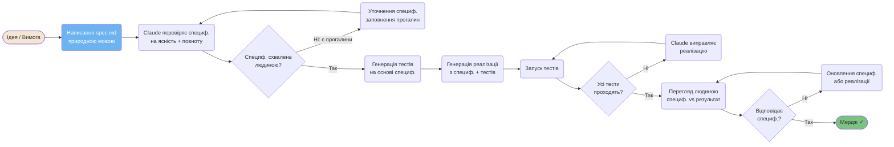
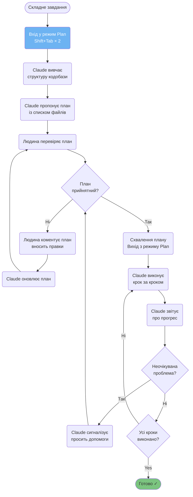
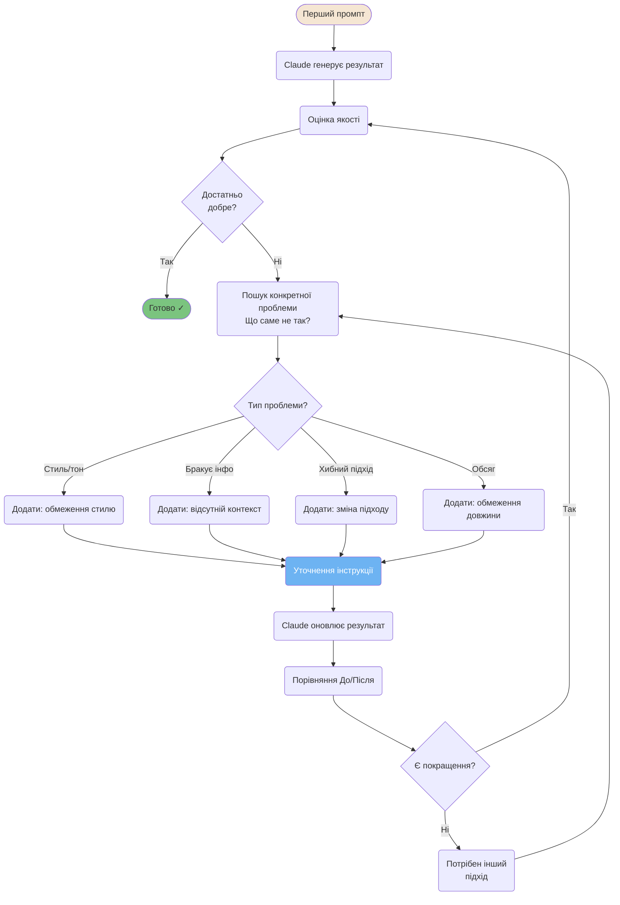
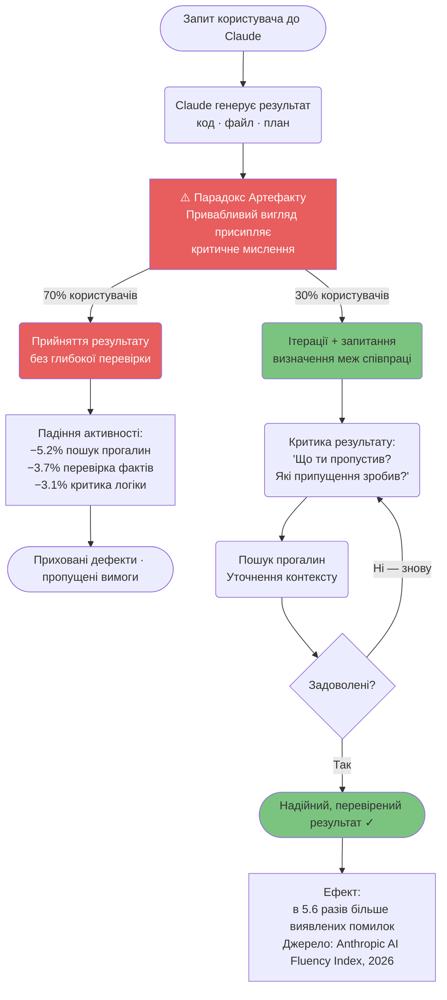

# Воркфлоу розробки

Перевірені патерни для структурування сесій розробки з допомогою ШІ.

---

### TDD (Red-Green-Refactor) з Claude

Розробка через тестування (TDD), адаптована для Claude Code: спочатку пишемо тест, що не проходить, потім просимо Claude реалізувати мінімум коду для його успішного виконання.

```mermaid
flowchart TD
    A([Початок: Нова функція]) --> B(Написання тесту, що не<br/>проходить (людина))
    B --> C(Запуск тестів)
    C --> D{Тести не проходять<br/>як очікувалося?}
    D -->|Ні: проходять!| E(Виправте тест — він заслабкий)
    E --> B
    D -->|Так: RED ✓| F(Просимо Claude реалізувати<br/>мінімальний код)
    F --> G(Запуск тестів знову)
    G --> H{Тести проходять?}
    H -->|Ні| I(Діагностика з Claude<br/>виправлення реалізації)
    I --> G
    H -->|Так: GREEN ✓| J{Код потребує<br/>рефакторингу?}
    J -->|Так| K(Рефакторинг з Claude)
    K --> L(Запуск тестів: все ще зелені?)
    L -->|Ні| I
    L -->|Так: REFACTOR ✓| M{Потрібні ще<br/>функції?}
    J -->|No| M
    M -->|Так| B
    M -->|Ні| N([Функція готова ✓])

    style B fill:#E85D5D,color:#fff
    style F fill:#E85D5D,color:#fff
    style G fill:#7BC47F,color:#333
    style N fill:#7BC47F,color:#333

    click A href "../workflows/tdd-with-claude.uk.md" "TDD — Нова функція"
```

<details>
<summary>ASCII версія</summary>

```
Пишемо тест (RED)
        │
   Запуск тестів
        │
   Не проходять?
   ├─ Ні  → Виправте тест
   └─ Так → Просимо Claude: мінімальний код
                 │
            Запуск тестів
                 │
            Проходять? (GREEN)
            ├─ Ні  → Діагностика
            └─ Так → Рефакторинг?
                     ├─ Так → Рефакторинг (REFACTOR)
                     └─ Ні  → Далі
```

</details>

---

### Пайплайн розробки Spec-First

Специфікація пишеться перед кодом. Claude використовує її як єдине джерело істини.



<details>
<summary>ASCII версія</summary>

```
Ідея → Пишемо spec.md → Claude перевіряє
                              │
                        Схвалено? ─Ні→ Уточнення
                              │ Так
                        Генерація тестів
                              │
                        Генерація коду
                              │
                        Тести → Проходять? ─Ні→ Claude фіксить
                              │ Так
                        Перегляд → Ок? ─Ні→ Виправлення
                              │ Так
                            Мердж ✓
```

</details>

---

### Воркфлоу на основі планів (Plan-Driven)

Для складних завдань: Claude вивчає код, пропонує план, ви його коментуєте, а потім Claude виконує тільки схвалені кроки.



---

### Цикл ітераційного вдосконалення

Результат рідко буває ідеальним з першої спроби. Цей цикл допомагає систематично покращувати результати через точний фідбек.



---

### AI Fluency — Шляхи Високої та Низької Майстерності

Згідно з індексом AI Fluency (Anthropic, 2026), 70% користувачів потрапляють у "Парадокс Артефакту" — приймають перший результат без перевірки. Висока майстерність (30%) полягає в ітераціях та критичному аналізі.



---

**Локалізація**: [Serhii (MacPlus Software)](https://macplus-software.com)
*Остання синхронізація: Травень 2026*
