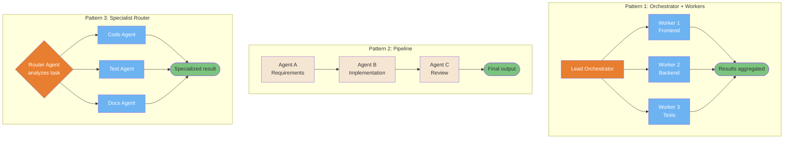
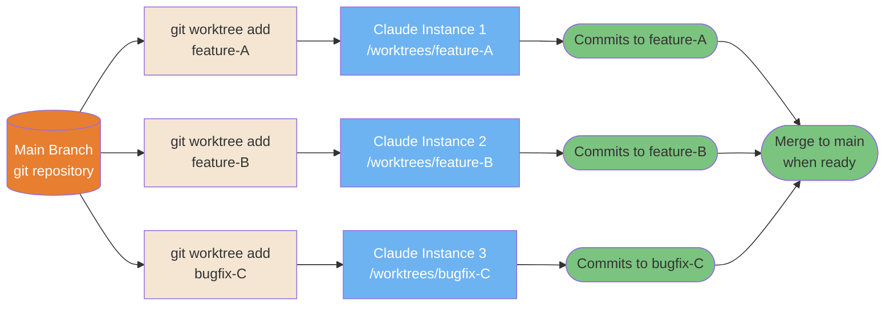
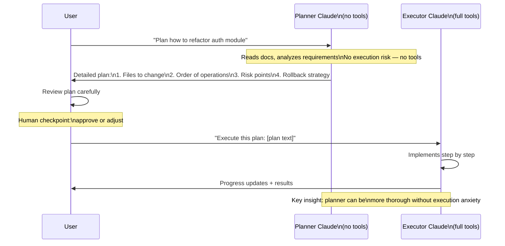
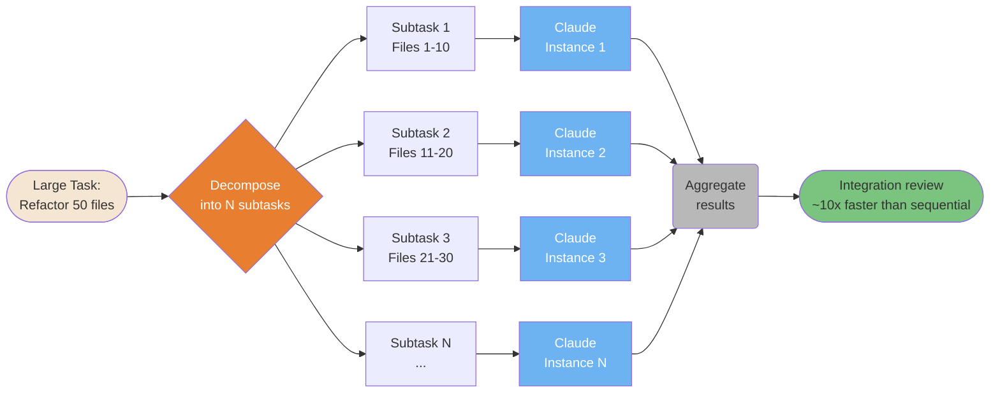
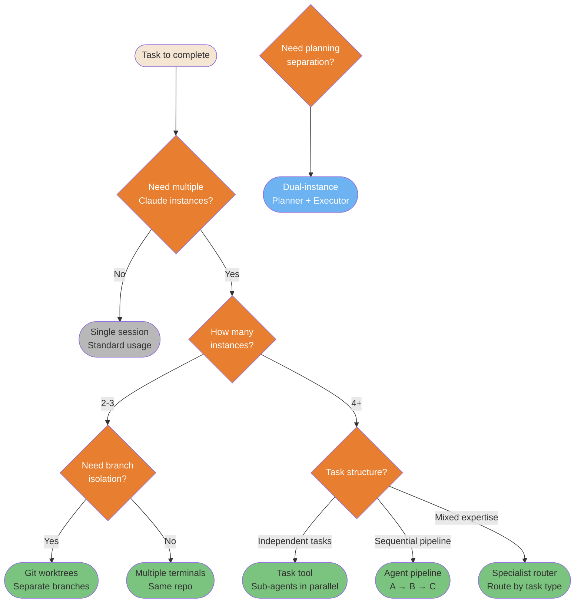

# Multi-Agent Patterns

Patterns for coordinating multiple Claude instances for parallel and complex work.

---

### Agent Teams — 3 Orchestration Topologies

Three proven topologies for multi-agent coordination. Choose based on task independence, ordering requirements, and specialization needs.



<details>
<summary>ASCII version</summary>

```
ORCHESTRATOR + WORKERS:      PIPELINE:               ROUTER:

   Lead Agent                Agent A (requirements)   Router
  /    |     \                    │                  /  |  \
W1    W2     W3              Agent B (implement)   Code Test Docs
  \   |     /                    │                  \  |  /
   Aggregate                Agent C (review)        Result
                                 │
                             Final output
```

</details>

> **Source**: [Agent Teams](../workflows/agent-teams.md) — Line ~59

---

### Git Worktree Multi-Instance Pattern

Git worktrees enable true parallel development: each Claude instance works in an isolated branch with its own working tree. No conflicts, no context mixing.



<details>
<summary>ASCII version</summary>

```
Main repo
├── git worktree add feature-A → Claude 1 → commits to feature-A
├── git worktree add feature-B → Claude 2 → commits to feature-B
└── git worktree add bugfix-C  → Claude 3 → commits to bugfix-C

No conflicts: separate working trees, separate branches
All merge back to main when done
```

</details>

> **Source**: [Git Worktrees](../ultimate-guide.md#git-worktrees) — Line ~10634

---

### Dual-Instance Planning Pattern (Jon Williams)

Separating planning from execution using two Claude instances prevents costly mistakes: the planner Claude has no tools, so it can't accidentally execute anything during analysis.



<details>
<summary>ASCII version</summary>

```
User → Planner (no tools): "Plan X"
         │
    [safe analysis, no execution risk]
         │
Planner → User: detailed plan
         │
User reviews + approves
         │
User → Executor (full tools): "Execute: [plan]"
         │
    [implements with full context]
         │
Executor → User: results
```

</details>

> **Source**: [Dual-Instance Planning](../workflows/dual-instance-planning.md)

---

### Boris Cherny Horizontal Scaling Pattern

When tasks can be parallelized, spawn N Claude instances simultaneously instead of running them sequentially. The speedup is proportional to task independence.



<details>
<summary>ASCII version</summary>

```
Large task
     │
Decompose into N independent subtasks
     │
┌────┼────┐
│    │    │
I1  I2  I3... (parallel)
│    │    │
└────┼────┘
     │
Aggregate → Integration review
(~10x faster than sequential)
```

</details>

> **Source**: [Horizontal Scaling](../ultimate-guide.md#horizontal-scaling) — Line ~9617

---

### Multi-Instance Decision Matrix

Not every task needs multiple instances. This decision tree guides you to the right pattern based on task characteristics.



<details>
<summary>ASCII version</summary>

```
Need multiple instances?
├─ No → Single session
└─ Yes → How many?
         ├─ 2-3 → Need branch isolation?
         │        ├─ Yes → Git worktrees
         │        └─ No  → Multiple terminals
         └─ 4+  → Task structure?
                  ├─ Independent → Task tool (parallel sub-agents)
                  ├─ Sequential  → Agent pipeline A→B→C
                  └─ Mixed       → Specialist router

Special case: Need planning separation? → Dual-instance (Planner + Executor)
```

</details>

> **Source**: [Multi-Instance Patterns](../ultimate-guide.md#multi-instance-patterns) — Line ~11176
