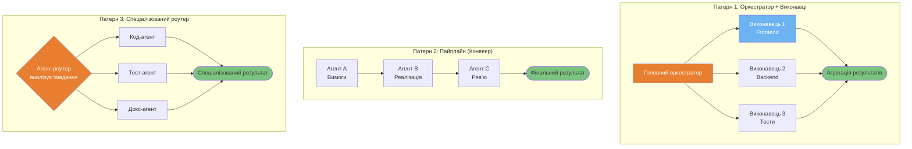
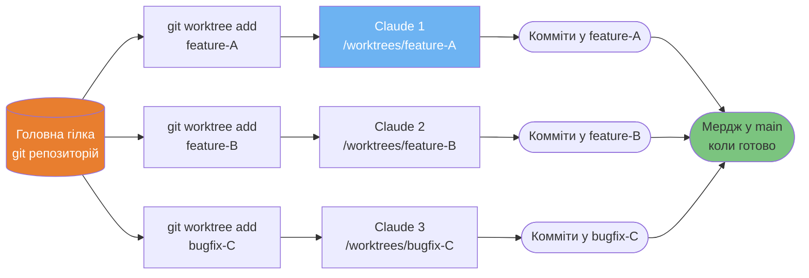
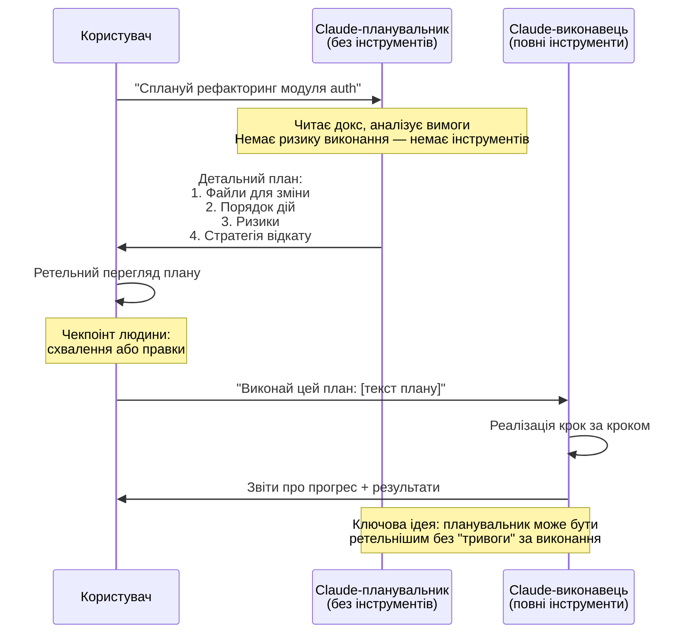
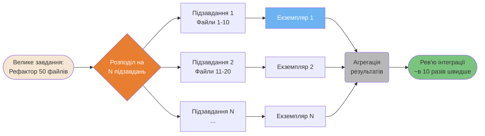
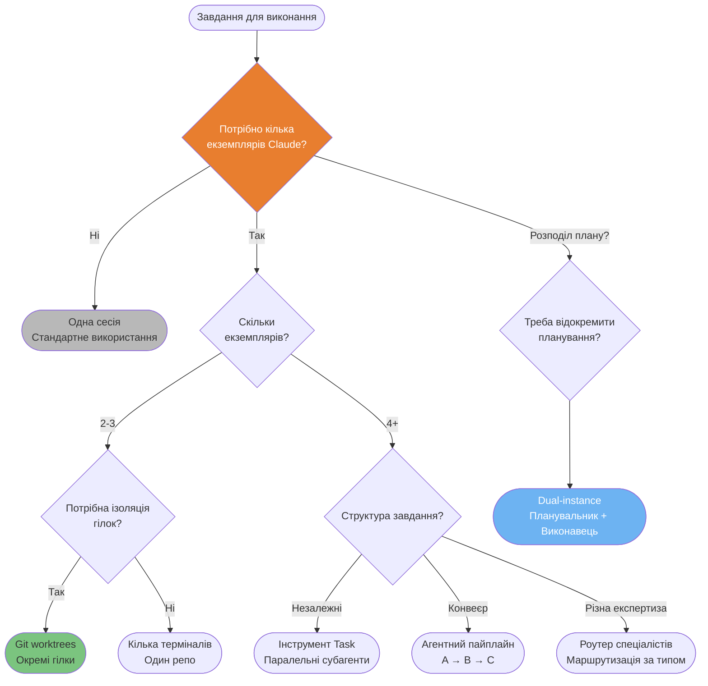

# Мультиагентні патерни

Патерни для координації декількох екземплярів Claude для паралельної та складної роботи.

---

### Команди агентів — 3 топології оркестрації

Три перевірені топології для координації декількох агентів. Обирайте залежно від незалежності завдань та потреби у спеціалізації.



<details>
<summary>ASCII версія</summary>

```
ОРКЕСТРАТОР + ВИКОНАВЦІ:     ПАЙПЛАЙН:               РОУТЕР:

   Головний агент           Агент A (вимоги)         Роутер
  /    |     \                   │                  /  |  \
В1    В2     В3             Агент B (код)        Код Тест Докс
  \    |     /                   │                  \  |  /
    Агрегація               Агент C (рев'ю)        Результат
                                 │
                           Фінальний результат
```

</details>

---

### Патерн Git Worktree для декількох екземплярів

Git worktrees дозволяють справжню паралельну розробку: кожен екземпляр Claude працює в ізольованій гілці.



---

### Патерн планування з двома екземплярами (Dual-Instance)

Відокремлення планування від виконання запобігає помилкам: Claude-планувальник не має інструментів, тому не може випадково нічого змінити.



<details>
<summary>ASCII версія</summary>

```
Користувач → Планувальник (без ікс.): "План X"
               │
      [безпечний аналіз, без ризику]
               │
Планувальник → Користувач: детальний план
               │
Користувач перевіряє + схвалює
               │
Користувач → Виконавець (з інструм.): "Виконай: [план]"
               │
      [реалізація з повним контекстом]
               │
Виконавець → Користувач: результати
```

</details>

---

### Горизонтальне масштабування (Борис Черний)

Якщо завдання можна паралелізувати, запускайте N екземплярів Claude одночасно.



---

### Матриця прийняття рішень для декількох екземплярів

Не кожне завдання потребує декількох екземплярів. Ця схема допоможе обрати правильний патерн.



---

**Локалізація**: [Serhii (MacPlus Software)](https://macplus-software.com)
*Остання синхронізація: Травень 2026*
