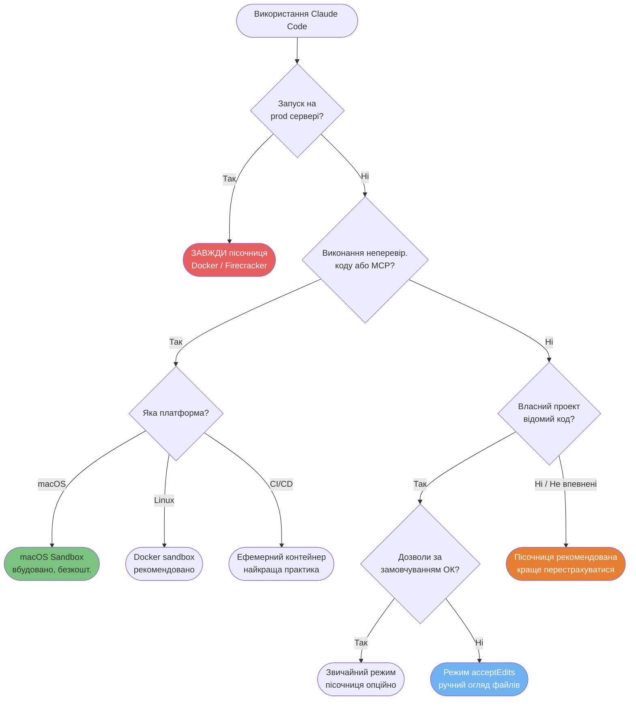
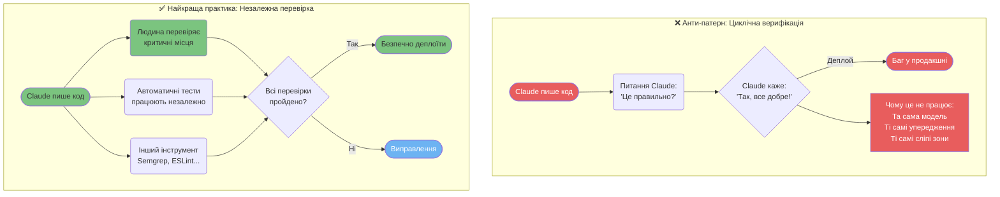

# Безпека та продакшн

Патерни для безпечного використання Claude Code у чутливих та виробничих середовищах.

---

### 3-рівнева модель захисту

Ешелонована оборона для Claude Code: запобігання зупиняє більшість загроз, виявлення ловить те, що пройшло, а реагування обмежує радіус ураження.

```mermaid
flowchart LR
    THREAT([Загроза / Атака]) --> L1

    subgraph L1["🛡️ Рівень 1: Запобігання"]
        P1[Перевірка MCP серверів<br/>читайте код перед інстал.]
        P2[Обмеження CLAUDE.md<br/>заборонені дії]
        P3[.claudeignore<br/>приховайте файли]
        P4[Мінімальні дозволи<br/>bypassPermissions тільки в CI]
    end

    subgraph L2["🔍 Рівень 2: Виявлення"]
        D1[Хуки PreToolUse<br/>логування викликів]
        D2[Аудит-логи<br/>повна історія]
        D3[Сповіщення про аномалії<br/>неочікуваний доступ]
    end

    subgraph L3["🔒 Рівень 3: Реагування"]
        R1[Ізоляція в пісочниці<br/>Docker / Firecracker]
        R2[Шлюзи дозволів<br/>схвалення людиною]
        R3[Можливість відкату<br/>git revert, бекапи]
    end

    L1 -->|Пройдено| L2
    L2 -->|Пройдено| L3
    L3 --> BLOCKED([Загрозу локалізовано])

    style THREAT fill:#E85D5D,color:#fff
    style P1 fill:#7BC47F,color:#333
    style D1 fill:#6DB3F2,color:#fff
    style R1 fill:#E87E2F,color:#fff
    style BLOCKED fill:#7BC47F,color:#333

    click THREAT href "../security/security-hardening.uk.md" "Загроза / Атака"
```



<details>
<summary>ASCII версія</summary>

```
Загроза
  │
Рівень 1: ЗАПОБІГАННЯ
  - Перевірка MCP + Правила CLAUDE.md + .claudeignore
  │ (пройдено) →
Рівень 2: ВИЯВЛЕННЯ
  - Логування хуків + аудит + аномалії
  │ (пройдено) →
Рівень 3: РЕАГУВАННЯ
  - Пісочниця + схвалення людиною + відкат
  │
Локалізовано
```

</details>

---

### Дерево рішень для пісочниці (Sandbox)

Пісочниця додає накладних витрат. Ця схема допоможе вирішити, коли вона обов'язкова.



---

### Парадокс верифікації

Модель, яка створила баг, часто пропускає його під час перевірки. Просити Claude перевірити свій же код — це помилковий шлях.



<details>
<summary>ASCII версія</summary>

```
ПОГАНО: Claude пише → Claude перевіряє → "Все ок" → Деплой → Баг
       (та сама модель, ті самі сліпі зони)

ДОБРЕ: Claude пише → Людина (критичний код)
                   → Авто-тести (незалежно)
                   → Статичний аналіз (інші інструменти)
                   → Все ок? → Деплой ✓
```

</details>

---

### Пайплайн інтеграції CI/CD

Claude Code може працювати в неінтерактивному режимі для автоматичного рев'ю, документації та перевірок у кожному PR.

```mermaid
flowchart LR
    PR([Створено PR]) --> GH{Тригер<br/>GitHub Actions}
    GH --> ENV[Налаштування оточення<br/>ANTHROPIC_API_KEY]
    ENV --> CC[claude --print --headless<br/>'Запуск перевірок']

    CC --> subgraph TASKS["Паралельні перевірки"]
        T1[Лінтер<br/>ESLint / Prettier]
        T2[Набір тестів<br/>Vitest / Jest]
        T3[Скан безпеки<br/>Semgrep MCP]
        T4[Повнота докс<br/>перевірка експортів]
    end

    T1 & T2 & T3 & T4 --> AGG{Всі тести<br/>пройшли?}
    AGG -->|Так| OK([✓ Тести зелені<br/>далі рев'ю людини])
    AGG -->|Ні| FAIL([✗ Звіт про помилки<br/>у PR])
    FAIL --> FIX([Розробник фіксить<br/>ре-тригер CI])
    FIX --> CC

    style PR fill:#F5E6D3,color:#333
    style CC fill:#E87E2F,color:#fff
    style OK fill:#7BC47F,color:#333
    style FAIL fill:#E85D5D,color:#fff

    click PR href "../ultimate-guide.uk.md#93-інтеграція-cicd" "Створено PR"
```

---

**Локалізація**: [Serhii (MacPlus Software)](https://macplus-software.com)
*Остання синхронізація: Травень 2026*
