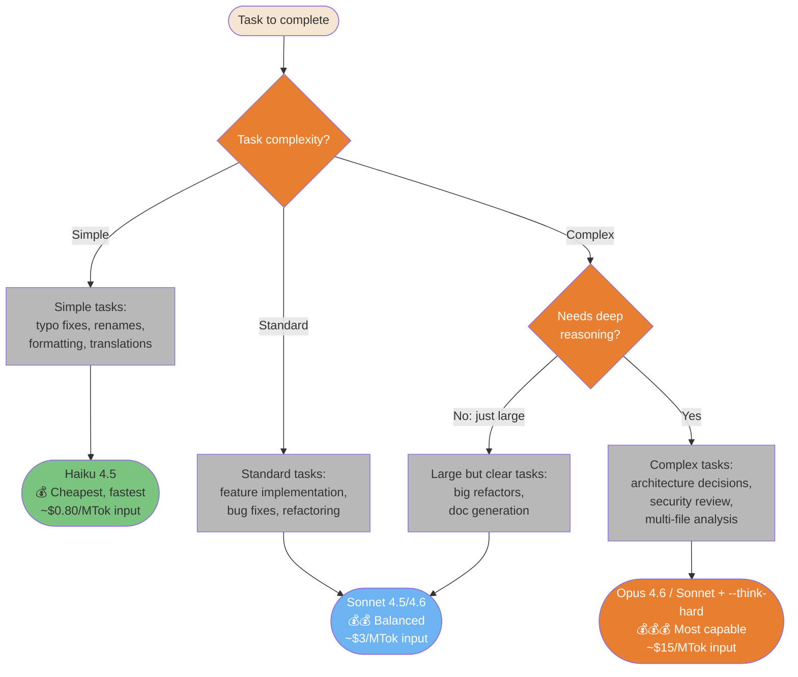
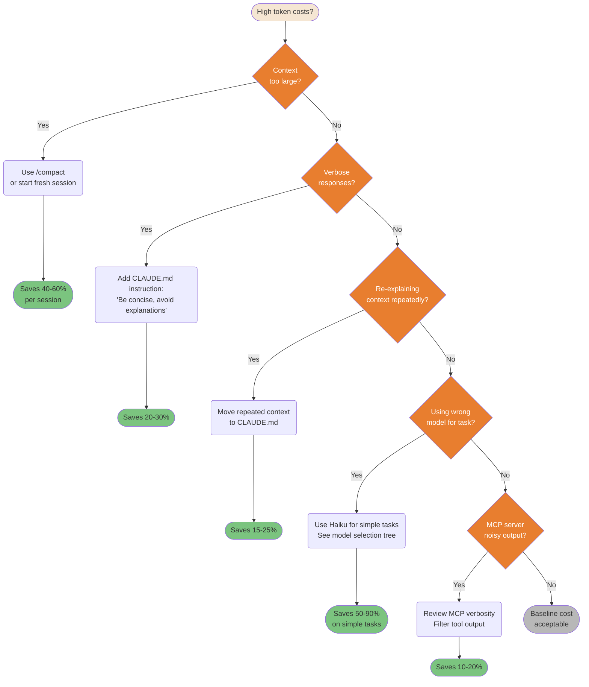
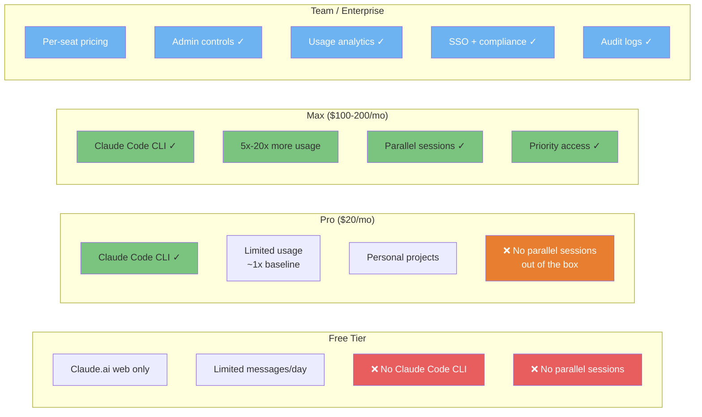

# Cost & Optimization

How to get maximum value from Claude Code while controlling token consumption and costs.

---

### Model Selection Decision Flow

Not all tasks need the most powerful model. Using the right model for the right task cuts costs by 5-10x without sacrificing quality.



<details>
<summary>ASCII version</summary>

```
Task complexity?
├─ Simple (typos, format, rename) → Haiku 4.5    ($  — ~5x cheaper)
├─ Standard (features, bugs)      → Sonnet 4.5/4.6 ($$ — balanced)
└─ Complex (architecture, sec.)
   ├─ Needs deep reasoning?        → Opus 4.6      ($$$ — most capable)
   └─ Just large/clear?            → Sonnet 4.6    ($$ — handles it)
```

</details>

> **Source**: [Model Selection](../ultimate-guide.md#model-selection) — Line ~2634

---

### Cost Optimization Decision Tree

High token costs are usually fixable. This systematic tree identifies the root cause and points to the right fix for each waste pattern.



<details>
<summary>ASCII version</summary>

```
High costs?
├─ Context too large?      → /compact or new session    (40-60% saving)
├─ Verbose responses?      → CLAUDE.md: be concise      (20-30% saving)
├─ Repeating context?      → Move to CLAUDE.md          (15-25% saving)
├─ Wrong model?            → Use Haiku for simple tasks (50-90% saving)
├─ Noisy MCP output?       → Filter tool output         (10-20% saving)
└─ None of the above?      → Baseline cost, acceptable
```

</details>

> **Source**: [Cost Optimization](../ultimate-guide.md#cost-optimization) — Line ~8878

---

### Subscription Tiers — What Each Unlocks

Different tiers unlock different Claude Code capabilities. Knowing the limits helps you plan usage and justify upgrades.



<details>
<summary>ASCII version</summary>

```
FREE         PRO ($20)        MAX ($100-200)   TEAM/Enterprise
────         ─────────        ──────────────   ───────────────
Web only     CLI ✓            CLI ✓            Per-seat
Limited msgs Limited usage    5-20x usage      Admin controls
No CLI       Personal use     Parallel ✓       Analytics
             No parallel      Priority ✓       SSO + compliance
```

</details>

> **Source**: [Subscription Tiers](../ultimate-guide.md#subscription-tiers) — Line ~1933

---

### Token Reduction Strategies Pipeline

Multiple strategies stack for cumulative token savings. Apply them in order from highest impact to lowest effort.

```mermaid
flowchart LR
    BASE([Baseline:\n100% tokens]) --> RTK

    subgraph RTK["Strategy 1: RTK Proxy"]
        R1[Raw CLI output\n→ filtered output]
        R2["git status, cargo test,\npnpm list → compressed"]
        R3[Saves 60-90%\non CLI commands]
    end

    RTK --> COMP

    subgraph COMP["Strategy 2: /compact"]
        C1[Long conversation\n→ summarized]
        C2[Keep decisions,\ndrop verbose reasoning]
        C3[Saves 40-60%\nat checkpoint]
    end

    COMP --> CLAUDE_MD

    subgraph CLAUDE_MD["Strategy 3: CLAUDE.md"]
        CM1[Repeated context\n→ persistent instructions]
        CM2[No re-explaining\nproject conventions]
        CM3[Saves 15-25%\nper session]
    end

    CLAUDE_MD --> MODEL

    subgraph MODEL["Strategy 4: Model Selection"]
        MO1[Haiku for simple tasks\ninstead of Sonnet]
        MO2[Same quality output\nat fraction of cost]
        MO3[Saves 50-90%\non simple tasks]
    end

    MODEL --> RESULT([Optimized:\n10-20% of baseline\nfor typical usage])

    style BASE fill:#E85D5D,color:#fff
    style R3 fill:#7BC47F
    style C3 fill:#7BC47F
    style CM3 fill:#7BC47F
    style MO3 fill:#7BC47F
    style RESULT fill:#7BC47F
```



<details>
<summary>ASCII version</summary>

```
100% baseline
    │
RTK proxy (CLI output compression)  → -60-90% on CLI ops
    │
/compact (conversation summarization) → -40-60% at checkpoint
    │
CLAUDE.md (avoid repeated context)    → -15-25% per session
    │
Model selection (Haiku for simple)    → -50-90% on simple tasks
    │
~10-20% of baseline for typical usage
```

</details>

> **Source**: [Token Optimization](../ultimate-guide.md#token-optimization) — Line ~13355
