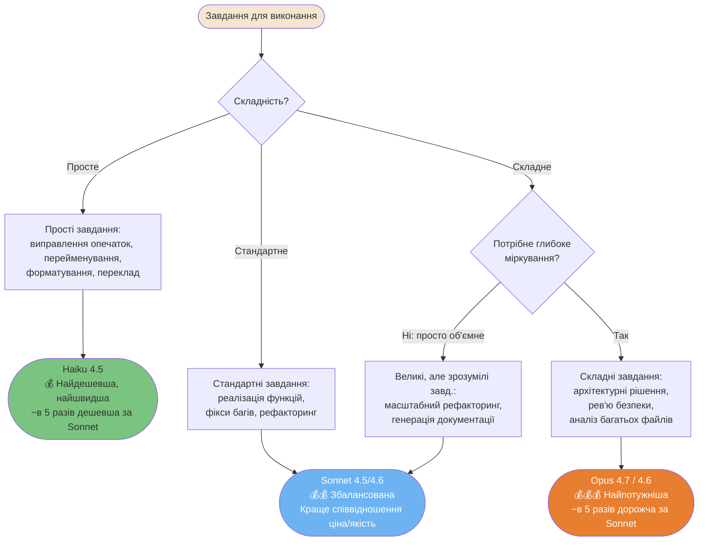
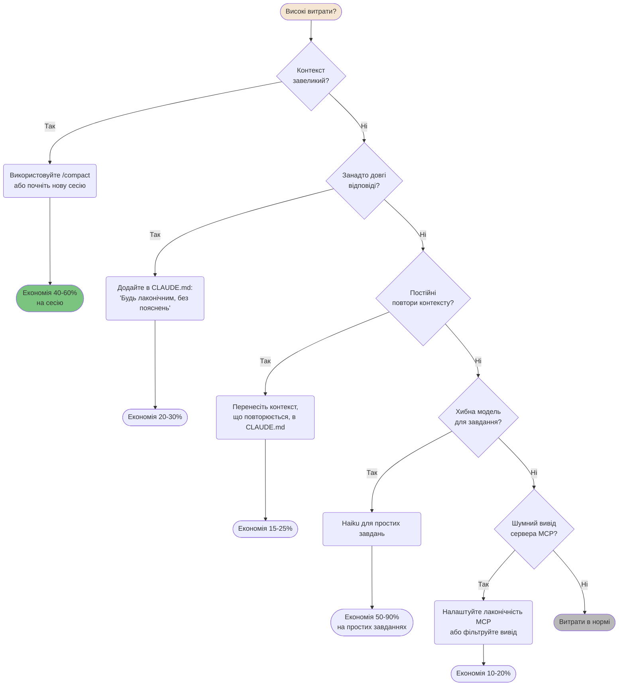

# Витрати та оптимізація

Як отримати максимум від Claude Code, контролюючи споживання токенів та витрати.

---

### Схема вибору моделі

Не всі завдання потребують найпотужнішої моделі. Вибір правильної моделі може зменшити витрати в 5-10 разів без втрати якості.



**Модифікатор бюджету** — на обмежених планах знижуйте рівень моделі на один крок:

| План | Фаза планування | Фаза реалізації |
|------|-----------------|-----------------|
| **Max / API (без обмежень)** | Opus 4.7 | Sonnet |
| **Max / API** | Opus 4.6 | Sonnet |
| **Pro / Teams Standard** | Sonnet | Haiku (механічні завдання) |
| **API (обмежений бюджет)** | Sonnet | Haiku |

---

### Дерево рішень для оптимізації витрат

Високі витрати зазвичай можна виправити. Ця схема допоможе знайти причину та шлях до економії.



<details>
<summary>ASCII версія</summary>

```
Високі витрати?
├─ Завеликий контекст?   → /compact або нова сесія   (економія 40-60%)
├─ Довгі відповіді?      → CLAUDE.md: будь лаконічним (економія 20-30%)
├─ Повтори контексту?    → Перенесіть у CLAUDE.md    (економія 15-25%)
├─ Хибна модель?         → Haiku для простих завдань  (економія 50-90%)
├─ Шумний MCP?           → Фільтруйте вивід інструм.  (економія 10-20%)
└─ Нічого з цього?       → Витрати в нормі
```

</details>

---

### Рівні підписки — що розблоковує кожен

Різні рівні відкривають різні можливості Claude Code.

```mermaid
flowchart LR
    subgraph FREE["Безкоштовно"]
        F1[Тільки веб-версія]
        F2[Обмежена кількість повід.]
        F3[❌ Без Claude Code CLI]
        F4[❌ Без паралельних сесій]
    end

    subgraph PRO["Pro ($20/міс)"]
        P1[Claude Code CLI ✓]
        P2[Обмежене використання]
        P3[Особисті проекти]
        P4[❌ Без паралельних сесій<br/>"з коробки"]
    end

    subgraph MAX["Max ($100-200/міс)"]
        M1[Claude Code CLI ✓]
        M2[В 5-20 разів більше використ.]
        M3[Паралельні сесії ✓]
        M4[Пріоритетний доступ ✓]
    end

    subgraph TEAM["Team / Enterprise"]
        T1[Ціна за місце]
        T2[Адмін-панель ✓]
        T3[Аналітика використ. ✓]
        T4[SSO + відповідність ✓]
        T5[Аудит-логи ✓]
    end

    style F3 fill:#E85D5D,color:#fff
    style P1 fill:#7BC47F,color:#333
    style M3 fill:#7BC47F,color:#333
    style T1 fill:#6DB3F2,color:#fff

    click F1 href "../ultimate-guide.uk.md#тарифні-плани-та-ліміти" "Безкоштовно"
```

---

### Пайплайн стратегій зменшення токенів

Кілька стратегій разом дають кумулятивну економію.

```mermaid
flowchart LR
    BASE([Базовий рівень:<br/>100% токенів]) --> RTK

    subgraph RTK["1: RTK Проксі"]
        R1[Сирий вивід CLI<br/>→ фільтрований вивід]
        R2["git status, cargo test,<br/>pnpm list → стиснуто"]
        R3[Економія 60-90%<br/>на командах CLI]
    end

    RTK --> COMP

    subgraph COMP["2: /compact"]
        C1[Довгий діалог<br/>→ резюме]
        C2[Залишає рішення,<br/>видаляє довгі роздуми]
        C3[Економія 40-60%<br/>на чекпоінті]
    end

    COMP --> CLAUDE_MD

    subgraph CLAUDE_MD["3: CLAUDE.md"]
        CM1[Повторюваний контекст<br/>→ постійні інструкції]
        CM2[Без перепояснень<br/>конвенцій проекту]
        CM3[Економія 15-25%<br/>на сесію]
    end

    CLAUDE_MD --> MODEL

    subgraph MODEL["4: Вибір моделі"]
        MO1[Haiku для простих завдань<br/>замість Sonnet]
        MO2[Та сама якість<br/>за меншу ціну]
        MO3[Економія 50-90%<br/>на простих завд.]
    end

    MODEL --> RESULT([Оптимізовано:<br/>10-20% від бази<br/>для типового використ.])

    style BASE fill:#E85D5D,color:#fff
    style RESULT fill:#7BC47F,color:#333

    click BASE href "../ultimate-guide.uk.md#913-стратегії-оптимізації-витрат" "Базовий рівень"
```



---

**Локалізація**: [Serhii (MacPlus Software)](https://macplus-software.com)
*Остання синхронізація: Травень 2026*
