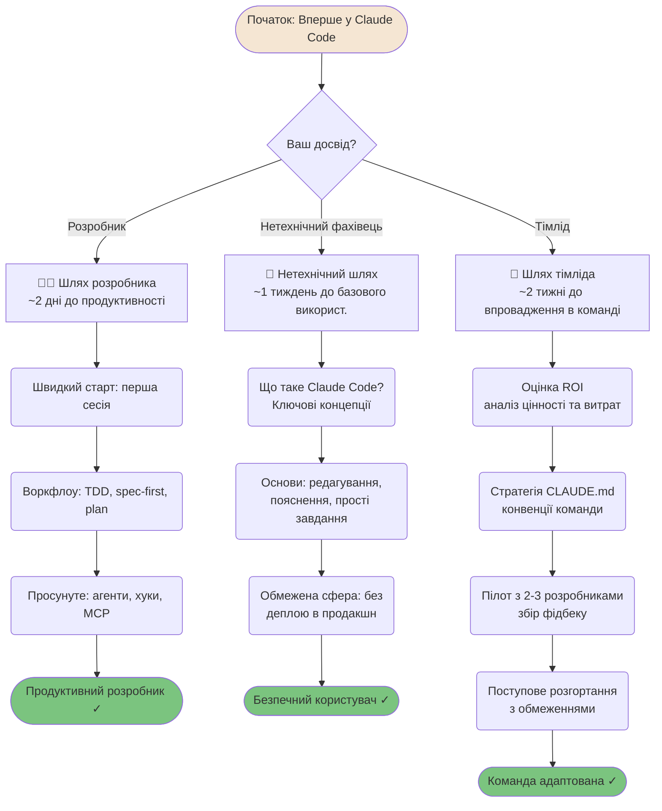
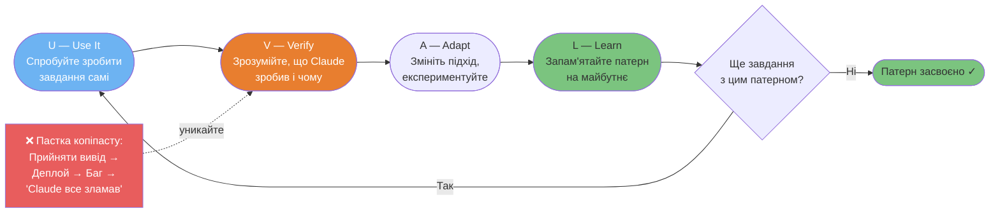
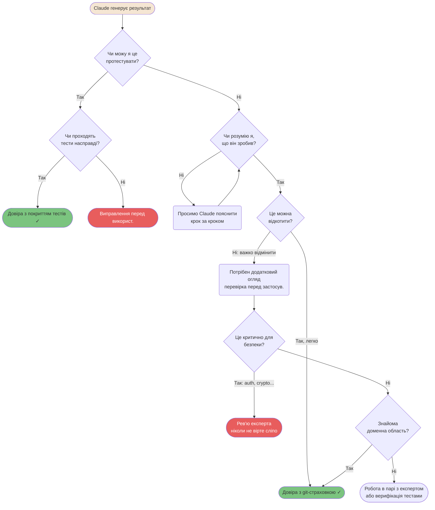

# Впровадження та навчання

Як окремі розробники та команди успішно впроваджують Claude Code, не втрачаючи навичок та контролю.

---

### Адаптивні шляхи адаптації (Onboarding)

Різний досвід потребує різних підходів до навчання.



---

### Протокол навчання UVAL

Протокол UVAL запобігає "пастці копіпасту" — коли ви використовуєте Claude Code, не розуміючи, що він зробив.



---

### Матриця калібрування довіри

Розуміння того, коли довіряти виводу Claude, а коли перевіряти — найважливіша навичка.



<details>
<summary>ASCII версія</summary>

```
Чи можу протестувати?
├─ Так → Тести проходять? → Так → Довіра з тестами ✓
│                         → Ні  → Виправлення
└─ Ні  → Чи розумію я це?
          ├─ Ні  → Просимо пояснити → розуміння → далі
          └─ Так → Чи можна відкотити?
                    ├─ Так  → Довіра з git-страховкою ✓
                    └─ Ні   → Критично для безпеки?
                              ├─ Так → Рев'ю експерта (обов'язково)
                              └─ Ні  → Знайома область?
                                       ├─ Так → Довіра з обережністю ✓
                                       └─ Ні  → Робота в парі з експертом
```

</details>

---

**Локалізація**: [Serhii (MacPlus Software)](https://macplus-software.com)
*Остання синхронізація: Травень 2026*
