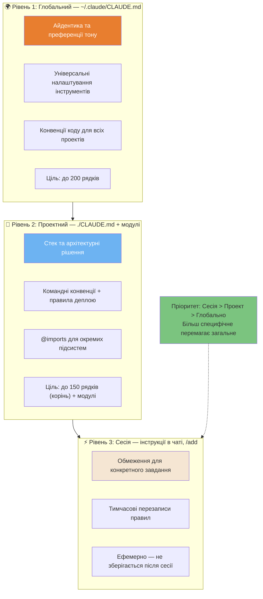
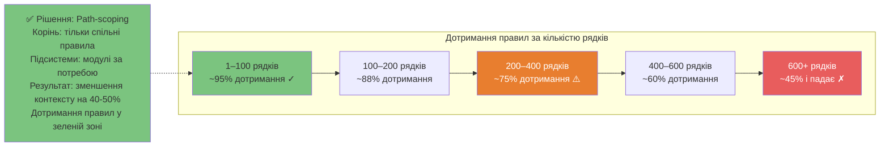
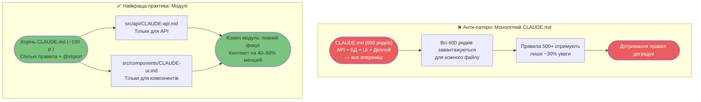

# Контекстна інженерія

Як заповнити вікно контексту Claude правильною інформацією в потрібний час.

---

### 3-рівнева система контексту

Контекстна інженерія працює на 3 окремих рівнях. Розуміння того, який рівень обрати, запобігає перевантаженню контексту.



---

### Бюджет контексту та деградація дотримання правил

Дотримання правил `CLAUDE.md` погіршується зі зростанням об'єму файлу. Після ~150 правил моделі починають вибірково ігнорувати інструкції.



---

### Монолітна vs Модульна архітектура

Монолітний `CLAUDE.md` — найпоширеніша помилка. Модулі з прив'язкою до шляхів (path-scoping) завантажують тільки те, що актуально для завдання.



---

### Дерево рішень для розміщення правил

Кожне нове правило має опинитися на правильному рівні.

```mermaid
flowchart TD
    A([Нове правило для розміщення]) --> B{Актуально для\nкожного вашого\nпроекту?}
    B -->|Так| C([Глобальний CLAUDE.md<br/>~/.claude/CLAUDE.md])

    B -->|Ні| D{Стосується\nокремих файлів\nчи підсистем?}
    D -->|Так| E([Модуль підсистеми<br/>напр. src/api/CLAUDE-api.md])

    D -->|Ні| F{Це процедурний\nпокроковий\nворкфлоу?}
    F -->|Так| G([Файл скіла (Skill)<br/>.claude/skills/task.md<br/>Завантажується за запитом])

    F -->|Ні: стандарт/правило| H{Стосується\nвсього проекту?}
    H -->|Так| I([Корінь CLAUDE.md проекту<br/>./CLAUDE.md])
    H -->|Ні: на один раз| J([Інструкція в сесії<br/>Скажіть Claude прямо зараз])

    RULE["Золоте правило:<br/>Якщо пишете це вдруге —<br/>час перенести в постійний рівень"] -.-> J

    style B fill:#E87E2F,color:#fff
    style C fill:#E87E2F,color:#fff
    style E fill:#6DB3F2,color:#fff
    style J fill:#F5E6D3,color:#333
    style RULE fill:#7BC47F,color:#333

    click A href "../core/context-engineering.uk.md#3-ієрархія-конфігурації" "Розміщення правил"
```

---

**Локалізація**: [Serhii (MacPlus Software)](https://macplus-software.com)
*Остання синхронізація: Травень 2026*
