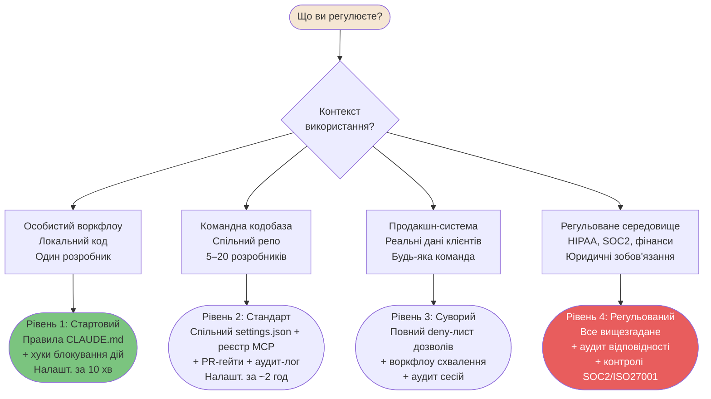
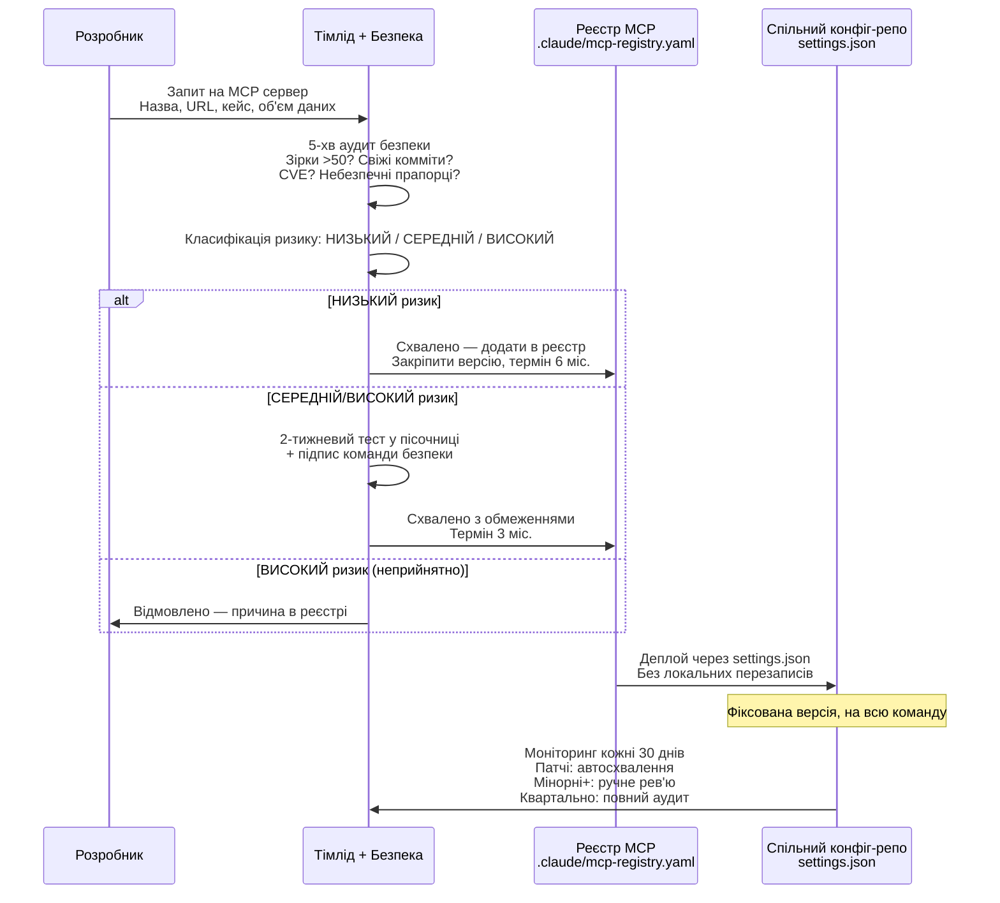
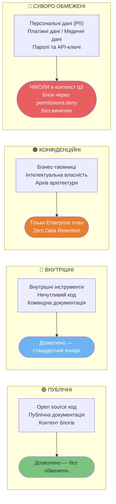

# Корпоративне управління

Патерни рівня організації для команд, що впроваджують Claude Code масштабно — рівні використання, воркфлоу схвалення MCP та конфігурації обмежень.

---

### Рівні ризику управління — що і коли контролювати

Не все потребує жорсткого контролю. Ця схема допоможе обрати рівень контролю залежно від ризику — від особистого воркфлоу до регульованих середовищ.



<details>
<summary>ASCII версія</summary>

```
Контекст використання?
├─ Особистий воркфлоу       → Рівень 1: Стартовий (CLAUDE.md + хуки)
├─ Командна кодобаза        → Рівень 2: Стандарт (settings.json + реєстр MCP)
├─ Продакшн-система         → Рівень 3: Суворий (deny-лист + схвалення + аудит)
└─ Регульоване середовище   → Рівень 4: Регульований (все + аудит відповідності)

Ви МОЖЕТЕ контролювати: settings.json в репо, CLAUDE.md, хуки, CI/CD, реєстр MCP.
Ви НЕ МОЖЕТЕ контролювати: особисті ~/.claude, особисті API-ключі.
```

</details>

---

### Воркфлоу управління MCP

Корпоративне управління MCP — це 5-кроковий пайплайн, який гарантує безпеку серверів та контроль версій.



---

### Класифікація даних та правила доступу Claude Code

Класифікація даних визначає, що Claude Code дозволено читати. Це найважливіший аспект управління.



<details>
<summary>ASCII версія</summary>

```
ПУБЛІЧНІ       → Дозволено, без обмежень
ВНУТРІШНІ      → Дозволено, стандартний конфіг
КОНФІДЕНЦІЙНІ  → Тільки Enterprise (Zero Data Retention)
СУВОРО ОБМЕЖЕНІ → НІКОЛИ в контекст ШІ (PII, PCI, ключі)
                 Блокувати через: permissions.deny Read(.env, *.key, secrets/**)

Залізне правило: СУВОРО ОБМЕЖЕНІ дані ніколи не потрапляють у вікно контексту.
Ні в промпти, ні у файли, ні як приклади.
```

</details>

---

**Локалізація**: [Serhii (MacPlus Software)](https://macplus-software.com)
*Остання синхронізація: Травень 2026*
