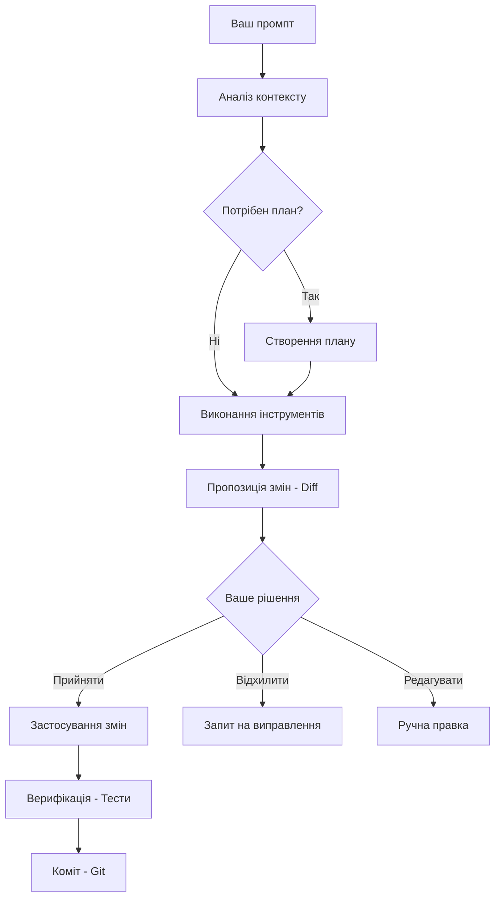

# Повний посібник з Claude Code (The Ultimate Claude Code Guide)

> Вичерпний, автономний посібник для опанування Claude Code — від нуля до досвідченого користувача.

**Автор**: Florian BRUNIAUX | Founding Engineer [@Méthode Aristote](https://methode-aristote.fr)

**Написано з**: Claude (Anthropic)

**Час на читання**: ~30-40 годин (повністю) | ~15 хвилин (тільки Quick Start)

**Останнє оновлення**: Січень 2026

**Версія**: 3.40.0

---

## Перед початком

**Цей посібник не є офіційною документацією Anthropic.** Це ресурс спільноти, заснований на моєму багатомісячному досвіді дослідження Claude Code.

**Що ви тут знайдете:**
- Патерни, які спрацювали для мене.
- Спостереження, які можуть не бути універсальними для вашого воркфлоу.
- Оцінки часу та відсотки, які є приблизними, а не точними вимірюваннями.

**Що ви тут не знайдете:**
- Остаточних відповідей (інструмент занадто новий).
- Заяв про продуктивність на основі бенчмарків.
- Гарантій, що будь-яка техніка спрацює саме у вас.

**Користуйтеся критично. Експериментуйте. Діліться тим, що працює для вас.**

> **⚠️ Примітка (Січень 2026)**: Якщо ви нещодавно чули про **ClawdBot**, це **інший інструмент**. ClawdBot — це чат-бот асистент на власному хостингу, доступний через месенджери (Telegram, WhatsApp тощо), розроблений для персональної автоматизації та розумного дому. Claude Code — це CLI-інструмент для розробників (інтеграція в термінал/IDE), зосереджений на воркфлоу розробки ПЗ. Обидва використовують моделі Claude, але призначені для різних аудиторій та кейсів. [Більше деталей у Додатку Б: FAQ](#appendix-b-faq).

---

## TL;DR - 5-хвилинне резюме

Якщо у вас є лише 5 хвилин, ось що вам потрібно знати:

### Основні команди
```bash
claude                    # Запустити Claude Code
/help                     # Показати всі команди
/powerup                  # Інтерактивні уроки: CLAUDE.md, /rewind, пам'ять, режими зусиль
/status                   # Перевірити використання контексту
/compact                  # Стиснути контекст, коли >70%
/clear                    # Почати з чистого аркуша
/plan                     # Безпечний режим тільки для читання
Ctrl+C                    # Скасувати операцію
```

### Воркфлоу
```
Опис → Claude аналізує → Огляд Diff → Прийняти/Відхилити → Перевірка
```

### Управління контекстом (Критично!)
| % Контексту | Дія |
|-----------|--------|
| 0-50% | Працюйте вільно |
| 50-70% | Будьте вибірковими |
| 70-90% | `/compact` зараз |
| 90%+ | Необхідно `/clear` |

*Ці пороги базуються на моєму досвіді. Ваш оптимальний воркфлоу може відрізнятися залежно від складності завдання та стилю роботи.*

### Ієрархія пам'яті
```
~/.claude/CLAUDE.md       → Глобальна (всі проекти)
/project/CLAUDE.md        → Проектна (комітиться)
/project/.claude/         → Особиста (не комітиться)
```

### Потужні функції
| Функція | Що вона робить |
|---------|--------------|
| **Agents** | Спеціалізовані AI-персони для конкретних завдань |
| **Skills** | Багаторазові модулі знань |
| **Hooks** | Скрипти автоматизації, що запускаються подіями |
| **MCP Servers** | Зовнішні інструменти (Serena, Context7, Playwright...) |
| **Plugins** | Пакети розширень, створені спільнотою |

### Золоті правила
1. **Завжди переглядайте diff** перед прийняттям змін.
2. **Використовуйте `/compact`**, перш ніж контекст стане критичним.
3. **Будьте конкретними** у ваших запитах (ЩО, ДЕ, ЯК, ПЕРЕВІРКА).
4. **Починайте з режиму планування (Plan Mode)** для складних/ризикованих завдань.
5. **Створюйте CLAUDE.md** для кожного проекту.

### Дерево швидких рішень
```
Просте завдання → Просто запитайте Claude
Складне завдання → Використовуйте TodoWrite для планування
Ризикована зміна → Спочатку увійдіть у режим планування
Повторюване завдання → Створіть агента або команду
Контекст заповнений → /compact або /clear
```

**Тепер прочитайте Розділ 1 для повного швидкого старту або перейдіть до будь-якого потрібного розділу.**

---

## Оберіть свій шлях

Посібник має 11 розділів та 22 000+ рядків. Вам не потрібно читати все — ось що важливо для вашої ситуації:

| Я... | Читайте це | Пропустіть це | Час |
|---------|-----------|-----------|------|
| **Розробник, початківець** | Розд.1 → Розд.2 → Розд.3 | Розд.9, Розд.11, Додаток | 3 год |
| **Розробник, середній рівень** | Розд.2.6 → Розд.4 → Розд.5 → Розд.7 | Розд.1, Розд.10 тільки довідка | 4 год |
| **Досвідчений користувач / Senior** | Розд.9 (Advanced) → Розд.4-8 | Розд.1 Quick Start | 2 год |
| **Tech Lead / EM** | Розд.3.5 → Розд.9.17 → Розд.9.20 → Розд.11 | Розд.5-6 деталі | 1.5 год |
| **Потрібна лише довідка** | [Розд.10.5 Шпаргалка](#105-cheatsheet) | Все інше | 5 хв |

---

## Топ-5 розділів за ROI

Якщо у вас є час лише на 5 розділів:

1. **[2.6 Ментальна модель](#26-mental-model)** — Зрозумійте, як думає Claude Code (20 хв)
2. **[3.1 CLAUDE.md](#31-memory-files-claudemd)** — Постійна пам'ять, що переживає сесії (30 хв)
3. **[9.1 Трійця](#91-the-trinity)** — Базовий патерн для агентної роботи (20 хв)
4. **[7.4 Security Hooks](#74-security-hooks)** — Автоматизуйте захисні бар'єри, про які ви не забудете (30 хв)
5. **[10.5 Шпаргалка](#105-cheatsheet)** — Щоденна довідка, додайте в закладки (5 хв)

---

## Зміст

- [1. Швидкий старт (День 1)](#1-quick-start-day-1) `🟢 Початківець` `⏱ 45 хв`
  - [1.1 Встановлення](#11-installation)
  - [1.2 Перший воркфлоу](#12-first-workflow)
  - [1.3 Основні команди](#13-essential-commands)
  - [1.4 Режими дозволів](#14-permission-modes)
  - [1.5 Чек-лист продуктивності](#15-productivity-checklist)
  - [1.6 Міграція з інших AI-інструментів для кодингу](#16-migrating-from-other-ai-coding-tools)
  - [1.7 Калібрування довіри](#17-trust-calibration-when-and-how-much-to-verify)
  - [1.8 Вісім помилок початківців](#18-eight-beginner-mistakes-and-how-to-avoid-them)
- [2. Основні концепції](#2-core-concepts) `🟡 Середній рівень` `⏱ 60 хв`
  - [2.1 Цикл взаємодії](#21-the-interaction-loop)
  - [2.2 Управління контекстом](#22-context-management)
  - [2.3 Режим планування (Plan Mode)](#23-plan-mode) (вкл. [Ultraplan](#ultraplan), [OpusPlan](#opusplan-mode))
  - [2.4 Rewind](#24-rewind)
  - [2.5 Вибір моделі та посібник з мислення](#25-model-selection--thinking-guide)
  - [2.6 Ментальна модель](#26-mental-model)
  - [2.7 Посібник з прийняття рішень щодо конфігурації](#27-configuration-decision-guide)
  - [2.8 Структуроване промптування з XML-тегами](#28-structured-prompting-with-xml-tags)
  - [2.9 Семантичні якорі](#29-semantic-anchors)
  - [2.10 Потік даних та конфіденційність](#210-data-flow--privacy)
  - [2.11 Під капотом](#211-under-the-hood)
- [3. Пам'ять та налаштування](#3-memory--settings) `🟢 Початківець` `⏱ 30 хв`
  - [3.1 Файли пам'яті (CLAUDE.md)](#31-memory-files-claudemd)
  - [3.2 Структура папки .claude/](#32-the-claude-folder-structure)
  - [3.3 Налаштування та дозволи](#33-settings--permissions)
  - [3.4 Правила пріоритетності](#34-precedence-rules)
  - [3.5 Конфігурація команди в масштабі](#35-team-configuration-at-scale)
- [4. Агенти (Agents)](#4-agents) `🟡 Середній рівень` `⏱ 45 хв`
  - [4.1 Що таке агенти](#41-what-are-agents)
  - [4.2 Створення кастомних агентів](#42-creating-custom-agents)
  - [4.3 Шаблон агента](#43-agent-template)
  - [4.4 Кращі практики](#44-best-practices)
  - [4.5 Пам'ять агента](#45-agent-memory)
  - [4.6 Приклади агентів](#46-agent-examples)
  - [4.7 Просунуті патерни агентів](#47-advanced-agent-patterns)
- [5. Скіли (Skills)](#5-skills) `🟡 Середній рівень` `⏱ 30 хв`
  - [5.1 Розуміння скілів](#51-understanding-skills)
  - [5.2 Створення скілів](#52-creating-skills)
  - [5.3 Шаблон скіла](#53-skill-template)
  - [5.4 Приклади скілів](#54-skill-examples)
- [6. Команди (Commands)](#6-commands) `🟡 Середній рівень` `⏱ 30 хв`
  - [6.1 Слеш-команди](#61-slash-commands)
  - [6.2 Створення кастомних команд](#62-creating-custom-commands)
  - [6.3 Шаблон команди](#63-command-template)
  - [6.4 Приклади команд](#64-command-examples)
- [7. Хуки (Hooks)](#7-hooks) `🟡 Середній рівень` `⏱ 45 хв`
  - [7.1 Система подій](#71-the-event-system)
  - [7.2 Створення хуків](#72-creating-hooks)
  - [7.3 Шаблони хуків](#73-hook-templates)
  - [7.4 Security Hooks](#74-security-hooks)
  - [7.5 Приклади хуків](#75-hook-examples)
- [8. MCP сервери](#8-mcp-servers)  
  - [8.1 Що таке MCP](#81-what-is-mcp)
  - [8.2 Доступні сервери](#82-available-servers)
  - [8.3 Конфігурація](#83-configuration)
  - [8.4 Посібник з вибору серверів](#84-server-selection-guide)
  - [8.5 Система плагінів](#85-plugin-system)
  - [8.6 Безпека MCP](#86-mcp-security)
- [9. Просунуті патерни](#9-advanced-patterns)  
  - [9.1 Трійця](#91-the-trinity)
  - [9.2 Патерни композиції](#92-composition-patterns)
  - [9.3 Інтеграція CI/CD](#93-cicd-integration)
  - [9.4 Інтеграція з IDE](#94-ide-integration)
  - [9.5 Щільні цикли фідбеку](#95-tight-feedback-loops)
  - [9.6 TODO як дзеркала інструкцій](#96-todo-as-instruction-mirrors)
  - [9.7 Стилі виводу](#97-output-styles)
  - [9.8 Vibe Coding та скелетні проекти](#98-vibe-coding--skeleton-projects)
  - [9.9 Патерн пакетних операцій (Batch Operations)](#99-batch-operations-pattern)
  - [9.10 Мислення безперервного вдосконалення](#910-continuous-improvement-mindset)
  - [9.11 Поширені пастки та кращі практики](#911-common-pitfalls--best-practices)
  - [9.12 Кращі практики Git та воркфлоу](#912-git-best-practices--workflows)
  - [9.13 Стратегії оптимізації витрат](#913-cost-optimization-strategies)
  - [9.14 Методології розробки](#914-development-methodologies)
  - [9.15 Патерни іменованого промптування](#915-named-prompting-patterns)
  - [9.16 Телепортація сесій](#916-session-teleportation)
  - [9.17 Патерни масштабування: багатоінстансні воркфлоу](#917-scaling-patterns-multi-instance-workflows)
  - [9.18 Проектування кодобази для продуктивності агентів](#918-codebase-design-for-agent-productivity)
  - [9.19 Фреймворки перестановок (Permutation Frameworks)](#919-permutation-frameworks)
  - [9.20 Agent Teams (Багатоагентна координація)](#920-agent-teams-multi-agent-coordination)
  - [9.21 Модернізація застарілих кодобаз (Legacy Code)](#921-legacy-codebase-modernization)
  - [9.22 Дистанційне керування (Mobile Access)](#922-remote-control-mobile-access)
  - [9.23 Життєвий цикл конфігурації та цикл оновлення](#923-configuration-lifecycle--the-update-loop)
  - [9.24 Безперервне навчання на основі інстинктів](#924-instinct-based-continuous-learning)
  - [9.25 Harness Engineering](#925-harness-engineering)
- [10. Довідник](#10-reference)  
  - [10.1 Таблиця команд](#101-commands-table)
  - [10.2 Клавіатурні скорочення](#102-keyboard-shortcuts)
  - [10.3 Довідник конфігурації](#103-configuration-reference)
  - [10.4 Усунення несправностей](#104-troubleshooting)
  - [10.5 Шпаргалка](#105-cheatsheet)
  - [10.6 Щоденний воркфлоу та чек-листи](#106-daily-workflow--checklists)
- [11. AI екосистема: додаткові інструменти](#11-ai-ecosystem-complementary-tools)  
  - [11.1 Чому взаємодоповнюваність важлива](#111-why-complementarity-matters)
  - [11.2 Матриця інструментів](#112-tool-matrix)
  - [11.3 Практичні воркфлоу](#113-practical-workflows)
  - [11.4 Патерни інтеграції](#114-integration-patterns)
  - [Для не-розробників: Claude Cowork](#for-non-developers-claude-cowork)
- [Додаток: Колекція шаблонів](#appendix-templates-collection)
  - [Додаток А: Довідник розташування файлів](#appendix-a-file-locations-reference)
  - [Додаток Б: FAQ](#appendix-b-faq)

- [12. Висновки](#12-висновки-від-оператора-до-архітектора)
- [13. Ресурси та спільнота](#13-ресурси-та-спільнота)

---

# 1. Швидкий старт (День 1)

_Швидкий перехід:_ [Встановлення](#11-installation) · [Перший воркфлоу](#12-first-workflow) · [Основні команди](#13-essential-commands) · [Режими дозволів](#14-permission-modes) · [Чек-лист продуктивності](#15-productivity-checklist) · [Міграція з інших інструментів](#16-migrating-from-other-ai-coding-tools) · [Помилки початківців](#17-eight-beginner-mistakes-and-how-to-avoid-them)

---

**Час на читання**: 15 хвилин

**Рівень навичок**: Початківець

**Мета**: Пройти шлях від нуля до продуктивності

> **Вже використовуєте Claude Code?** Перейдіть до [1.6 Посібник з міграції](#16-migrating-from-other-ai-coding-tools) або одразу до [Розд.2 Основні концепції](#2-core-concepts).

## 1.1 Встановлення

Оберіть бажаний метод встановлення залежно від вашої операційної системи:

```bash
/*──────────────────────────────────────────────────────────────*/
/* Універсальний метод    */ npm install -g @anthropic-ai/claude-code
/*──────────────────────────────────────────────────────────────*/
/* Windows (CMD)          */ npm install -g @anthropic-ai/claude-code
/* Windows (PowerShell)   */ irm https://claude.ai/install.ps1 | iex
/*──────────────────────────────────────────────────────────────*/
/* macOS (npm)            */ npm install -g @anthropic-ai/claude-code
/* macOS (Homebrew)       */ brew install claude-code
/* macOS (Shell Script)   */ curl -fsSL https://claude.ai/install.sh | sh
/*──────────────────────────────────────────────────────────────*/
/* Linux (npm)            */ npm install -g @anthropic-ai/claude-code
/* Linux (Shell Script)   */ curl -fsSL https://claude.ai/install.sh | sh
/*──────────────────────────────────────────────────────────────*/
```

### Перевірка встановлення

```bash
claude --version
```

### Оновлення Claude Code

Тримайте Claude Code в актуальному стані для отримання нових функцій, виправлень багів та покращень моделей:

```bash
# Перевірка наявності оновлень
claude update

# Альтернатива: Оновлення через npm
npm update -g @anthropic-ai/claude-code

# Перевірка версії
claude --version

# Перевірка стану системи після оновлення
claude doctor
```

**Доступні команди обслуговування:**

| Команда | Призначення | Коли використовувати |
|:---|:---|:---|
| `claude update` | Перевірка та встановлення оновлень | Щотижня або при виникненні проблем |
| `claude doctor` | Перевірка стану автооновлювача | Після змін у системі або збою оновлень |
| `claude --version` | Відображення поточної версії | Перед повідомленням про баги |
| `claude auth login` | Автентифікація через командний рядок | CI/CD, devcontainers, автоматизовані налаштування |
| `claude auth status` | Перевірка поточного стану автентифікації | Перевірка активного облікового запису/методу |
| `claude auth logout` | Видалення збережених облікових даних | Спільні машини, очищення з міркувань безпеки |

**Рекомендації щодо частоти оновлень:**
- **Щотижня**: Перевіряйте оновлення під час звичайної розробки.
- **Перед великим завданням**: Переконайтеся, що маєте останні виправлення.
- **Після змін у системі**: Запустіть `claude doctor` для перевірки стану.
- **При неочікуваній поведінці**: Спочатку оновіть, потім шукайте причину.

### Desktop App: Claude Code без терміналу

Claude Code доступний у двох формах: CLI (на якому зосереджений цей посібник) та вкладка **Code** у додатку Claude Desktop. Той самий рушій, але графічний інтерфейс замість терміналу. Доступно на macOS та Windows — встановлення Node.js не потрібне.

**Що десктоп додає поверх стандартного Claude Code:**

| Функція | Деталі |
|:---|:---|
| Візуальний огляд diff | Перегляд змін у файлах з коментарями перед прийняттям |
| Live app preview | Claude запускає ваш dev-сервер, відкриває вбудований браузер, перевіряє зміни |
| GitHub PR моніторинг | Автовиправлення помилок CI, автозлиття після проходження перевірок |
| Паралельні сесії | Кілька сесій на бічній панелі, кожна з автоматичною ізоляцією Git worktree |
| Конектори | GitHub, Slack, Linear, Notion — GUI налаштування, без ручного конфігу MCP |
| Вкладення файлів | Прикріплення зображень та PDF безпосередньо до промптів |
| Дистанційні сесії | Запуск довгих завдань у хмарі Anthropic, продовження після закриття додатка |
| SSH сесії | Підключення до віддалених машин, хмарних VM, dev-контейнерів |

**Коли обирати Desktop vs CLI:**

| Обирайте Desktop, коли... | Обирайте CLI, коли... |
|:---|:---|
| Потрібен візуальний огляд diff | Потрібні скрипти або автоматизація (`--print`, пайпінг виводу) |
| Ви проводите онбординг колег | Ви використовуєте сторонніх провайдерів (Bedrock, Vertex, Foundry) |
| Хочете керувати сесіями на бічній панелі | Потрібен режим дозволів `dontAsk` |
| Проводите демо або спільний огляд | Потрібна оркестрація Agent Teams |
| Потрібні вкладення (зображення, PDF) | Ви на Linux (Desktop тільки для macOS + Windows) |

**Що НЕ доступно у Desktop** (тільки в CLI): сторонні API провайдери, прапорці для скриптів (`--print`, `--output-format`), `--allowedTools`/`--disallowedTools`, agent teams, `--verbose`, Linux.

**Спільна конфігурація**: Desktop та CLI читають ті самі файли — CLAUDE.md, MCP сервери (через `~/.claude.json` або `.mcp.json`), хуки, скіли та налаштування. Ваші налаштування CLI переносяться автоматично.

> **Порада для міграції**: запустіть `/desktop` у терміналі, щоб перенести активну CLI-сесію в додаток Desktop. Тільки для macOS та Windows.

> **Примітка щодо MCP серверів**: MCP сервери, налаштовані в `claude_desktop_config.json` (вкладка Chat), відокремлені від Claude Code. Щоб використовувати MCP сервери у вкладці Code, налаштуйте їх у `~/.claude.json` або у `.mcp.json` вашого проекту. Див. [Розділ 8.1 — MCP](#81-what-is-mcp).

> **Повна довідка**: [code.claude.com/docs/en/desktop](https://code.claude.com/docs/en/desktop)

---

### Шляхи, специфічні для платформ

| Платформа | Глобальний шлях конфігу | Конфіг оболонки |
|:---|:---|:---|
| **macOS/Linux** | `~/.claude/` | `~/.zshrc` або `~/.bashrc` |
| **Windows** | `%USERPROFILE%\.claude\` | Профіль PowerShell |

> **Для користувачів Windows**: Протягом цього посібника, коли ви бачите `~/.claude/`, використовуйте `%USERPROFILE%\.claude\` або `C:\Users\YourName\.claude\`.

### Перший запуск

```bash
cd your-project
claude
```

При першому запуску:

1. Вам буде запропоновано автентифікуватися через ваш обліковий запис Anthropic.
2. Прийміть умови надання послуг.
3. Claude Code проіндексує ваш проект (це може зайняти кілька секунд для великих кодобаз).

> **Примітка**: Claude Code потребує активної підписки Anthropic. Див. [claude.com/pricing](https://claude.com/pricing) щодо актуальних планів та лімітів токенів.

## 1.2 Перший воркфлоу

Давайте разом виправимо баг. Це демонструє базовий цикл взаємодії.

### Крок 1: Опишіть проблему

```
Ви: У функції логіну є баг — користувачі не можуть увійти з email-адресами, що містять знак плюс
```

### Крок 2: Claude аналізує

Claude виконає такі дії:
- Пошукає у вашій кодобазі відповідні файли.
- Прочитає код, пов'язаний з логіном.
- Виявить проблему.
- Запропонує виправлення.

### Крок 3: Огляд Diff

```diff
- const emailRegex = /^[a-zA-Z0-9._-]+@[a-zA-Z0-9.-]+\.[a-zA-Z]{2,}$/;
+ const emailRegex = /^[a-zA-Z0-9._%+-]+@[a-zA-Z0-9.-]+\.[a-zA-Z]{2,}$/;
```

💡 **Критично**: Завжди читайте diff перед прийняттям. Це ваша сітка безпеки.

### Крок 4: Прийняти або Відхилити

- Натисніть `y`, щоб прийняти зміну.
- Натисніть `n`, щоб відхилити та попросити альтернативу.
- Натисніть `e`, щоб відредагувати зміну вручну.

### Крок 5: Перевірка

```
Ви: Запусти тести, щоб переконатися, що це працює
```

Claude запустить ваші тести та повідомить результати.

### Крок 6: Коміт (опціонально)

```
Ви: Закоміть це виправлення
```

Claude створить коміт із відповідним повідомленням.

## 1.3 Основні команди

Ці 7 команд я використовую найчастіше:

| Команда | Дія | Коли використовувати |
|:---|:---|:---|
| `/help` | Показати всі команди | Коли ви розгублені |
| `/clear` | Очистити розмову | Почати з чистого аркуша |
| `/compact` | Стиснути контекст | Коли контекст закінчується |
| `/status` | Інфо про сесію | Перевірка використання контексту |
| `/exit` або `Ctrl+D` | Вийти з Claude Code | Завершення роботи |
| `/plan` | Увійти в Plan Mode | Безпечне дослідження |
| `/rewind` | Скасувати зміни | Зробили помилку |
| `/voice` | Увімкнути голос | Говорити замість того, щоб писати |

### Швидкі дії та скорочення

| Скорочення | Дія | Приклад |
|:---|:---|:---|
| `!команда` | Запустити shell-команду напряму | `!git status`, `!npm test` |
| `@назва_файлу` | Послатися на конкретний файл | `@src/app.tsx`, `@README.md` |
| `Ctrl+C` | Скасувати поточну операцію | Зупинити довгий аналіз |
| `Ctrl+R` | Пошук в історії команд | Знайти попередні промпти |
| `Esc` | Зупинити Claude під час виконання | Перервати поточну операцію |

#### Shell-команди з `!`

Виконуйте команди миттєво, не просячи Claude зробити це:

```bash
# Швидка перевірка статусу
!git status
!npm run test
!docker ps

# Перегляд логів
!tail -f logs/app.log
!cat package.json

# Швидкий пошук
!grep -r "TODO" src/
!find . -name "*.test.ts"
```

**Коли використовувати `!` замість запиту до Claude**:

| Використовуйте `!` для... | Запитуйте Claude про... |
|:---|:---|
| Швидких перевірок статусу (`!git status`) | Операцій Git, що потребують рішень |
| Команд перегляду (`!cat`, `!ls`) | Аналізу та розуміння файлів |
| Вже відомих вам команд | Складних конструкцій команд |
| Швидкої ітерації в терміналі | Команд, у яких ви не впевнені |

#### Посилання на файли з `@`

Посилайтеся на конкретні файли у ваших промптах для точних операцій:

```bash
# Один файл
Review @src/auth/login.tsx for security issues

# Кілька файлів
Refactor @src/utils/validation.ts and @src/utils/helpers.ts to remove duplication

# З використанням масок (у певних контекстах)
Analyze all test files @src/**/*.test.ts

# Відносні шляхи працюють
Check @./CLAUDE.md for project conventions
```

**Чому варто використовувати `@`**:
- **Точність**: Націлюйтеся на конкретні файли замість того, щоб дозволяти Claude шукати їх.
- **Швидкість**: Пропускайте фазу виявлення файлів.
- **Контекст**: Сигналізує Claude прочитати ці файли за запитом через інструменти.
- **Ясність**: Робить ваші наміри очевидними.

#### Робота із зображеннями та скріншотами

Claude Code підтримує **пряме введення зображень** для візуального аналізу, реалізації макетів та фідбеку щодо дизайну.

**Як використовувати зображення**:

1. **Вставити безпосередньо в термінал** (macOS/Linux/Windows з сучасним терміналом):
   - Скопіюйте скріншот або зображення в буфер обміну (`Cmd+Shift+4` на macOS, `Win+Shift+S` на Windows).
   - У сесії Claude Code вставте за допомогою `Cmd+V` / `Ctrl+V`.
   - Claude отримує зображення і може його аналізувати.

2. **Drag and drop** (деякі термінали):
   - Перетягніть файл зображення у вікно терміналу.
   - Claude завантажує та обробляє зображення.

3. **Посилання через шлях**:
   ```bash
   Analyze this mockup: /path/to/design.png
   ```

**Поширені кейси**:

```bash
# Реалізація UI за макетом
Ви: [Вставте скріншот дизайну Figma]
Implement this login screen in React with Tailwind CSS

# Дебаг візуальних проблем
Ви: [Вставте скріншот зламаної верстки]
The button is misaligned. Fix the CSS.

# Аналіз діаграм
Ви: [Вставте архітектурну діаграму]
Explain this system architecture and identify potential bottlenecks

# Код з дошки (whiteboard)
Ви: [Вставте фото алгоритму з дошки]
Convert this algorithm to Python code
```

**Підтримувані формати**: PNG, JPG, JPEG, WebP, GIF (статичні).

**Найкращі практики**:
- **Високий контраст**: Переконайтеся, що текст/діаграми чітко видно.
- **Релевантне обрізання**: Видаліть непотрібні елементи інтерфейсу для сфокусованого аналізу.
- **Комбінуйте з текстом**: "Зосередься на секції заголовка" надає додатковий контекст.

> **💡 Порада**: Робіть скріншоти повідомлень про помилки, макетів дизайну та документації замість того, щоб описувати їх текстом. Візуальне введення часто швидше та точніше.

##### Інструменти прототипування для AI-розробки

При проектуванні UI перед реалізацією низькодеталізовані вайрфрейми допомагають Claude зрозуміти намір, не переобтяжуючи результат зайвими обмеженнями.

| Інструмент | Тип | MCP підтримка | Найкраще для |
|:---|:---|:---|:---|
| **Excalidraw** | Стиль "від руки" | ✓ Community | Швидкі вайрфрейми, діаграми |
| **tldraw** | Мінімалістичне полотно | Експериментально | Колаборація, кастомні інтеграції |
| **Pencil** | Нативне полотно для IDE | ✓ Нативна | Інтеграція з Claude Code, git-based |
| **Frame0** | Low-fi + AI | ✓ | Сучасна альтернатива Balsamiq |

##### Інтеграція Figma MCP

Figma надає **офіційний MCP-сервер**, який дає Claude прямий доступ до ваших файлів дизайну, значно скорочуючи використання токенів порівняно зі скріншотами.

```bash
# Додати Figma MCP
claude mcp add --transport http figma https://mcp.figma.com/mcp
```

**Доступні інструменти**:
- `get_design_context`: Витягує структуру React+Tailwind з фреймів.
- `get_variable_defs`: Отримує дизайн-токени (кольори, відступи, типографіка).
- `get_code_connect_map`: Пов'язує компоненти Figma з вашою кодобазою.

#### Продовження та відновлення сесій

Claude Code дозволяє **продовжувати попередні розмови** між сесіями терміналу, зберігаючи повний контекст та історію.

1. **Продовжити останню сесію** (`--continue` або `-c`):
   ```bash
   claude --continue
   ```

2. **Відновити конкретну сесію** (`--resume <id>` або `-r <id>`):
   ```bash
   claude --resume abc123def
   ```

3. **Зв'язати з GitHub PR** (`--from-pr <number>`, v2.1.49+):
   ```bash
   claude --from-pr 123
   ```

**Пошук ID сесій**:
Використовуйте `claude --resume` без аргументів, щоб відкрити інтерактивний список останніх сесій.

## 1.4 Режими дозволів

Claude Code має три режими дозволів, які визначають рівень його автономності:

| Режим | Прапорець | Поведінка |
|:---|:---|:---|
| **Default** | (немає) | Запитує дозвіл на кожну потенційно небезпечну дію. |
| **Notify** | `--notify` | Виконує дії автоматично, але сповіщає вас. |
# 2. Основні концепції (Core Concepts)

## 2.1 Цикл взаємодії (The Interaction Loop)

Кожна взаємодія з Claude Code слідує детермінованому патерну, який максимізує безпеку та точність.



### Ключові етапи
1. **Аналіз**: Claude читає `CLAUDE.md`, індексує проект та шукає релевантні файли.
2. **Інструменти**: Використання `ls`, `grep`, `read_file` для збору інформації.
3. **Diff**: Візуальне відображення змін. **Ніколи не пропускайте цей крок.**
4. **Верифікація**: Claude може сам запустити `npm test` або `pytest`, щоб підтвердити успіх.

## 2.2 Управління контекстом (Context Management)

🔴 **Це найважливіша технічна концепція.** Claude Code працює в межах "вікна контексту".

### 📌 Швидка довідка з контексту

| % Контексту | Стан | Дія |
|:---|:---|:---|
| **0-50%** | 🟢 Свіжий | Працюйте вільно, додавайте нові файли. |
| **50-75%** | 🟡 Наповнений | Будьте вибірковими, не згадуйте непотрібні файли. |
| **75-90%** | 🟠 Критичний | **Використовуйте `/compact` негайно.** |
| **90%+** | 🔴 Переповнений | Claude почне помилятися. Потрібен `/clear`. |

### Як працює `/compact`
Команда `/compact` не просто видаляє історію. Вона створює стисле резюме попередньої розмови, зберігаючи ключові рішення та поточний стан, але видаляючи сирий код та логи.

### Поради щодо економії контексту:
- Використовуйте `@файл` замість "прочитай весь проект".
- Уникайте вставки величезних логів у чат (краще дати шлях до файлу логів).
- Використовуйте `/clear` для непов'язаних завдань.

## 2.3 Режим планування (Plan Mode)

Plan Mode (`/plan`) — це пісочниця. Claude може думати, читати і планувати, але **не може змінювати файли**.

### Коли використовувати:
- Перед складним рефакторингом.
- Для обговорення архітектурних рішень.
- Для дослідження незнайомої кодобази.
- Коли ви хочете отримати `implementation-plan.md` перед кодингом.

### Ultraplan (v2.1.20+)
Режим Ultraplan активується автоматично для складних завдань. Він змушує Claude створювати детальний покроковий чек-лист у форматі Markdown перед будь-якою правкою коду.

## 2.4 Rewind (Скасування)

Команда `/rewind` — це ваша "машина часу". Вона дозволяє скасувати останні зміни, внесені Claude, якщо вони призвели до помилок.

- **`/rewind`**: Скасовує останню операцію редагування.
- **`/rewind all`**: Скасовує всі зміни в поточній сесії.

> **⚠️ Примітка**: Rewind працює на основі внутрішнього кешу Claude Code. Якщо ви вийшли з сесії, використовуйте `git checkout`, щоб повернутися назад.

## 2.5 Вибір моделі та посібник з мислення

З початку 2026 року Claude Code підтримує динамічне перемикання моделей:

| Модель | Коли використовувати | Сильні сторони |
|:---|:---|:---|
| **Claude 3.7 Sonnet** | Щоденна робота | Швидкість, логіка, відмінний кодинг. |
| **Claude 3.5 Opus** | Архітектура | Найглибше розуміння складних систем. |
| **Claude 4.0 (🆕)** | Критичні завдання | Надійна логіка, мінімум галюцинацій. |

### Режими мислення (Thinking Modes)
Використовуйте `/thinking` або **Alt+T**, щоб надати Claude більше часу на роздуми перед відповіддю. Це підвищує якість коду за рахунок збільшення часу очікування.

## 2.6 Ментальна модель (Mental Model)

Щоб ефективно працювати з Claude, уявляйте його як **дуже талановитого, але втомленого джуніора**, який має доступ до всієї вашої документації.

- Він знає все, що написано в `CLAUDE.md`.
- Він слідує вашим інструкціям буквально.
- Він може пропустити деталі, якщо ви дасте занадто багато інформації одночасно.

**Золоте правило**: Одне завдання — одна сесія (або один `/compact`).

## 2.7 Посібник з прийняття рішень щодо конфігурації

Claude Code може бути налаштований через `~/.claude/settings.json` (глобально) або `.claude/settings.json` (локально).

**Що варто налаштовувати:**
- `preferred_model`: Яку модель використовувати за замовчуванням.
- `auto_compact_threshold`: На якому рівні (%) автоматично запускати `/compact`.
- `editor_command`: Який редактор відкривати для ручних правок.

## 2.8 Структуроване промптування з XML-тегами

Claude найкраще розуміє структуру через XML-теги. Використовуйте їх у своїх промптах:

```xml
<context>
  Я працюю над рефакторингом API.
</context>
<rules>
  - Не змінюй існуючі тести.
  - Використовуй тільки TypeScript.
</rules>
<task>
  Додай новий ендпоінт для завантаження файлів.
</task>
```

## 2.9 Семантичні якорі (Semantic Anchors)

Семантичні якорі — це коментарі в коді, які допомагають Claude швидше орієнтуватися.

```typescript
// @anchor: auth-logic-start
// Це місце, де починається обробка JWT
```

Якщо ви згадаєте такий якір у промпті, Claude миттєво знайде потрібну ділянку коду.

## 2.10 Потік даних та конфіденційність

- **Індексація**: Відбувається локально на вашій машині.
- **Промпти**: Надсилаються на сервери Anthropic.
- **Дані**: Ваш код **не використовується** для навчання моделей Claude, якщо ви не надали явну згоду (для корпоративних акаунтів це вимкнено за замовчуванням).
- **Секрети**: Використовуйте `.gitignore` та `.claudeignore`, щоб Claude не бачив ваші ключі та токени.

## 2.11 Під капотом (Under the Hood)

Claude Code — це не просто обгортка над API. Це складний агент, який:
1. Керує локальною базою даних SQLite для пошуку.
2. Використовує дерево-парсери для розуміння структури коду.
3. Оркеструє виклики інструментів через протокол MCP.

---

# 3. Пам'ять та налаштування (Memory & Settings)

_Швидкий перехід:_ [CLAUDE.md](#31-memory-files-claudemd) · [Папка .claude](#32-the-claude-folder-structure) · [Налаштування](#33-settings--permissions) · [Правила пріоритетності](#34-precedence-rules) · [Командна робота](#35-team-configuration-at-scale)

---

## 3.1 Файли пам'яті (CLAUDE.md)

Файл `CLAUDE.md` — це **зовнішня пам'ять** вашого проекту. Він повідомляє Claude про ваші вподобання, не перевантажуючи кожен промпт.

### Що має бути в CLAUDE.md:
- **Команди збірки та тестів**: Наприклад, `npm run build`, `pytest`.
- **Стандарти коду**: "Використовуй тільки функціональні компоненти", "Крапки з комою обов'язкові".
- **Архітектурні особливості**: "Ми використовуємо Redux для стейту", "API знаходиться в /api/v1".
- **Термінологія**: Як називати певні сутності в проекті.

### Приклад CLAUDE.md:
```markdown
# Проект: Awesome App

## Команди
- Збірка: `npm run build`
- Тести: `npm test`
- Лінтер: `npm run lint`

## Стандарти
- TypeScript, суворий режим.
- Компоненти в `src/components`, хуки в `src/hooks`.
- Використовуй Tailwind CSS для стилізації.
```

## 3.2 Структура папки .claude/

Папка `.claude/` створюється автоматично і містить локальні дані сесії.

- **`history.json`**: Історія ваших повідомлень (локально).
- **`settings.json`**: Налаштування, специфічні для проекту.
- **`mcp.json`**: Конфігурація MCP серверів для цього проекту.

> **💡 Порада**: Додайте `.claude/` у свій `.gitignore`, щоб не ділитися історією сесій з іншими, але закомітьте `.claude/mcp.json`, якщо хочете поділитися налаштуваннями MCP серверів з командою.

## 3.3 Налаштування та дозволи

Ви можете змінити глобальні налаштування за допомогою команди:
```bash
claude config set <key> <value>
```

### Основні ключі:
- `model`: Модель за замовчуванням.
- `theme`: Тема терміналу.
- `auto_apply_diff`: Чи застосовувати зміни автоматично (рекомендується `false`).

## 3.4 Правила пріоритетності

Коли Claude отримує інструкції, він слідує такій ієрархії (від найвищого до найнижчого пріоритету):
1. **Ваш поточний промпт** (те, що ви написали щойно).
2. **CLAUDE.md** у корені проекту.
3. **Файли пам'яті агента** (якщо використовується кастомний агент).
4. **Глобальні налаштування** (`~/.claude/settings.json`).

## 3.5 Конфігурація команди в масштабі

Для великих команд рекомендується:
- Створити спільний `CLAUDE.md` і закомітити його.
- Використовувати `.claudeignore` для ігнорування папок, які не потребують індексації (наприклад, `dist/`, `build/`, `logs/`).
- Налаштувати спільні MCP сервери в `.mcp.json`.

---

# 4. Агенти (Agents)

_Швидкий перехід:_ [Що таке агенти](#41-what-are-agents) · [Створення](#42-creating-custom-agents) · [Шаблон](#43-agent-template) · [Кращі практики](#44-best-practices) · [Пам'ять](#45-agent-memory) · [Приклади](#46-agent-examples)

---

## 4.1 Що таке агенти (What Are Agents)

Агенти в Claude Code — це спеціалізовані конфігурації Claude, які мають власні інструкції, набір інструментів та пам'ять. Вони дозволяють перетворити Claude з загального помічника на вузькопрофільного експерта.

## 4.2 Створення кастомних агентів

Агенти визначаються у папці `.claude/agents/`. Кожен файл `.md` у цій папці стає новим агентом.

**Як викликати агента:**
```bash
claude --agent <agent-name>
```

## 4.3 Шаблон агента

Створіть файл `.claude/agents/reviewer.md`:

```markdown
# Agent: Code Reviewer

## Role
Ти — експерт з якості коду. Твоя мета — шукати баги та пропонувати покращення продуктивності.

## Instructions
- Завжди перевіряй обробку помилок.
- Звертай увагу на зайві ререндери в React.
- Будь лаконічним у своїх коментарях.

## Tools
- Дозволено: `read_file`, `ls`, `grep`.
- Заборонено: `run_command` (тільки перегляд, без змін).
```

## 4.4 Кращі практики

- **Вузька спеціалізація**: Один агент для тестів, інший для документації.
- **Обмеження інструментів**: Не давайте агенту зайвих дозволів.
- **Чіткі інструкції**: Використовуйте списки для кроків.

## 4.5 Пам'ять агента

Агенти можуть мати свій власний файл пам'яті, схожий на `CLAUDE.md`, але специфічний для їхньої ролі. Він завантажується автоматично при виклику агента.

## 4.6 Приклади агентів

1. **QA-Agent**: Автоматично пише Unit-тести для нових функцій.
2. **Docs-Agent**: Оновлює `README.md` та JSDoc коментарі.
3. **Security-Agent**: Сканує код на наявність вразливостей.

## 4.7 Просунуті патерни агентів

- **Agent Teams**: Виклик одного агента іншим (оркестрація).
- **Conditional Agents**: Агенти, що активуються залежно від мови програмування.

---


# 5. Скіли (Skills) [Середній рівень] [30 хв]

_Швидкий перехід:_ [Розуміння](#51-understanding-skills) · [Створення](#52-creating-skills) · [Шаблон](#53-skill-template) · [Приклади](#54-skill-examples)

---

## 5.1 Розуміння скілів (Understanding Skills)

Скіли — це виконувані скрипти або папки з інструкціями, які розширюють можливості Claude. На відміну від агентів, скіли — це **інструменти**, які Claude може викликати під час будь-якої сесії.

## 5.2 Створення скілів

Скіли зберігаються в `~/.claude/skills/` (глобально) або `.claude/skills/` (локально).

### Типи скілів:
1. **Instructional Skills**: Папка з файлом `SKILL.md` (інструкції).
2. **Executable Skills**: Скрипти на Python або JS, які Claude може запускати.

## 5.3 Шаблон скіла

Створіть файл `.claude/skills/tailwind-helper/SKILL.md`:

```markdown
# Skill: Tailwind Helper

Використовуй цей скіл, коли користувач просить стилізувати компоненти.

## Standards
- Використовуй тільки стандартні класи Tailwind.
- Уникайте інлайнових стилів.
- Групуйте класи за категоріями (layout, spacing, colors).
```

## 5.4 Приклади скілів

- **Migration-Skill**: Скрипти для автоматичної міграції БД.
- **Deploy-Skill**: Команди для пушу в стейджинг.
- **Cleanup-Skill**: Видалення тимчасових файлів та артефактів збірки.

---

# 6. Команди (Commands) [Середній рівень] [30 хв]

_Швидкий перехід:_ [Слеш-команди](#61-slash-commands) · [Створення](#62-creating-custom-commands) · [Шаблон](#63-command-template) · [Приклади](#64-command-examples)

---

## 6.1 Слеш-команди (Slash Commands)

Слеш-команди — це швидкі ярлики для частих дій. Claude Code має набір вбудованих команд (`/compact`, `/clear`, `/plan`), але ви можете створювати свої.

## 6.2 Створення кастомних команд

Команди визначаються у папці `.claude/commands/`. Кожен файл `.md` стає новою командою.

## 6.3 Шаблон команди

Файл `.claude/commands/test.md`:
```markdown
# Command: /test

## Description
Запускає тести для поточного файлу.

## Prompt
Analyze the current file and run the appropriate test command. If tests fail, suggest a fix.
```

## 6.4 Приклади команд

- **/fix**: "Знайди та виправ всі помилки лінтера в цьому файлі".
- **/doc**: "Згенеруй документацію для всіх функцій у цьому файлі".
- **/refactor**: "Запропонуй 3 варіанти рефакторингу для покращення читабельності".

---

# 7. Хуки (Hooks) [Середній рівень] [45 хв]

_Швидкий перехід:_ [Система подій](#71-the-event-system) · [Створення](#72-creating-hooks) · [Шаблони](#73-hook-templates) · [Security Hooks](#74-security-hooks) · [Приклади](#75-hook-examples)

---

## 7.1 Система подій (The Event System)

Хуки дозволяють запускати дії автоматично при настанні певних подій у Claude Code.

### Доступні події:
- `on_session_start`: При запуску Claude.
- `on_command_execute`: Перед виконанням будь-якої команди.
- `on_file_edit`: Після кожної зміни файлу.
- `on_session_stop`: Перед виходом.

## 7.2 Створення хуків

Хуки зберігаються в `.claude/hooks/`.

## 7.3 Шаблони хуків

Файл `.claude/hooks/on_file_edit.md`:
```markdown
# Hook: on_file_edit

Кожного разу, коли файл змінюється, запускай `npm run lint` для цього файлу.
```

## 7.4 Security Hooks (Хуки безпеки)

Використовуйте хуки для запобігання витоку секретів:
```markdown
# Hook: on_command_execute

Перед кожним комітом перевіряй, чи не додано в diff файли з розширенням .env або .pem.
```

## 7.5 Приклади хуків

- **Auto-Test**: Запуск тестів після кожної правки.
- **Auto-Commit**: Пропозиція зробити коміт після успішного виконання тесту.
- **Context-Auto-Compact**: Автоматичний запуск `/compact`, коли контекст > 80%.

---

# 8. MCP сервери (MCP Servers) [Середній рівень] [40 хв]

_Швидкий перехід:_ [Що таке MCP](#81-what-is-mcp) · [Доступні сервери](#82-available-servers) · [Конфігурація](#83-configuration) · [Безпека](#86-mcp-security)

---

## 8.1 Що таке MCP (Model Context Protocol)

MCP — це відкритий стандарт, який дозволяє Claude підключатися до зовнішніх інструментів та даних (GitHub, Google Drive, бази даних, Slack).

## 8.2 Доступні сервери

- **GitHub**: Керування issues, PR та репозиторіями.
- **Postgres**: Виконання SQL запитів безпосередньо з чату.
- **Slack**: Надсилання повідомлень у канали.
- **Figma**: Отримання контексту дизайну.

## 8.3 Конфігурація

Додайте сервер через CLI:
```bash
claude mcp add <server-name> <command>
```

## 8.6 Безпека MCP

Claude завжди запитує дозвіл перед першим використанням нового MCP інструменту. Ви можете обмежити доступ до певних серверів у налаштуваннях.


# 9. Просунуті патерни (Advanced Patterns) [Просунутий] [3 год]

---

## 9.1 Трійця (The Trinity)

Найпотужніший патерн для роботи з Claude Code:
1. **План** (`/plan`): Опис того, ЩО ми робимо.
2. **Виконання**: Claude пише код.
3. **Верифікація**: Автоматичні тести для перевірки результату.

## 9.2 Патерни композиції

Комбінуйте декількох агентів для вирішення великих завдань. Наприклад:
- Агент-Архітектор створює структуру.
- Агент-Розробник пише реалізацію.
- Агент-Тестувальник перевіряє код.

## 9.3 Інтеграція CI/CD

Використовуйте Claude Code у вашому пайплайні для:
- Автоматичного рев'ю PR.
- Генерації описів до релізів.
- Виправлення дрібних багів, знайдених під час тестів.

## 9.9 Патерн пакетних операцій (Batch Operations)

Обробка багатьох файлів одночасно:
```bash
claude "Додай копірайт у заголовок всіх файлів у папці src/"
```

## 9.12 Кращі практики Git та воркфлоу

- **Атомні коміти**: Одна фіча — один коміт.
- **Описові повідомлення**: Дозвольте Claude згенерувати повідомлення до коміту.
- **Робота в гілках**: Завжди створюйте нову гілку перед початком роботи з Claude.

## 9.18 Проектування кодобази для продуктивності агентів (AX)

Проектуйте свій код так, щоб AI було легше його розуміти:
- Використовуйте зрозумілі назви змінних.
- Пишіть невеликі, чисті функції.
- Додавайте JSDoc/Docstrings.

## 9.20 Агентні команди (Multi-Agent Coordination)

Використання декількох інстансів Claude для паралельного вирішення завдань.

## 9.25 Harness Engineering (Інженерна обв'язка)

Створення спеціального середовища (тести, моки, скрипти) навколо завдання, щоб Claude міг безпечно ітерувати.

---

# 10. Довідник (Reference)

## 10.1 Таблиця команд

| Команда | Опис |
|:---|:---|
| `/help` | Допомога |
| `/compact` | Стиснути контекст |
| `/clear` | Очистити сесію |
| `/plan` | Режим планування |
| `/rewind` | Скасувати зміни |

## 10.5 Шпаргалка (Cheatsheet)

- **@file**: Посилання на файл.
- **!command**: Виконання shell-команди.
- **Alt+T**: Режим мислення.

---

# 11. AI екосистема: додаткові інструменти

Claude Code найкраще працює в поєднанні з іншими інструментами, такими як Cursor, GitHub Copilot та кастомні MCP сервери.

---

# 12. Висновки: Від оператора до архітектора

Робота з Claude Code — це не просто написання коду. Це перехід від написання окремих рядків до архітектурного управління агентними системами.

---

# 13. Ресурси та спільнота

- [Офіційна документація](https://code.claude.com)
- [Discord спільнота Anthropic](https://discord.gg/anthropic)
- [GitHub репозиторій прикладів](https://github.com/anthropic-ai/claude-code-examples)

